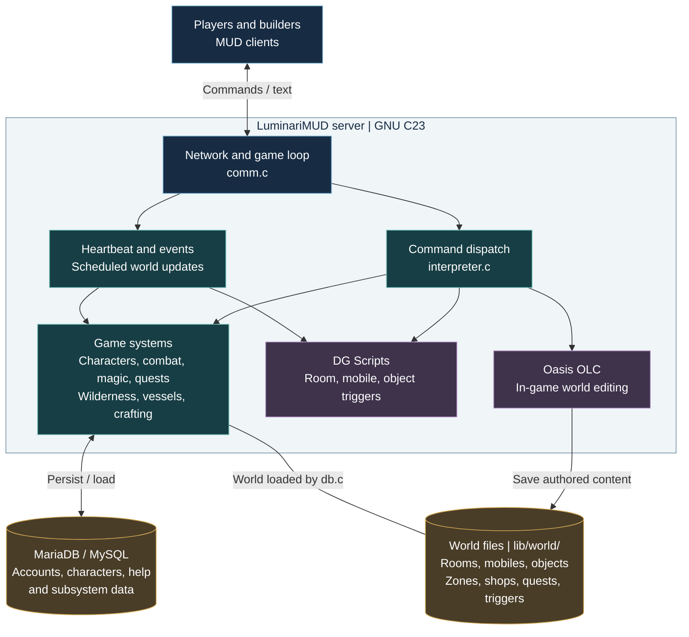

<p align="center">
  <a href="https://github.com/LuminariMUD/Luminari-Source/actions/workflows/test.yml"></a>
  <a href="https://github.com/LuminariMUD/Luminari-Source/actions/workflows/quality.yml"></a>
  <a href="https://github.com/LuminariMUD/Luminari-Source/actions/workflows/security.yml"></a>
  <a href="docs/TECHNICAL_DOCUMENTATION_MASTER_INDEX.md"></a>
</p>
<p align="center">
  <a href="src/"></a>
  <a href="sql/"></a>
  <a href="docs/guides/SETUP_AND_BUILD_GUIDE.md"></a>
  <a href="docs/development/CMAKE_BUILD_GUIDE.md"></a>
  <a href="LICENSE"></a>
</p>

# LuminariMUD

LuminariMUD is a text-based multiplayer game server implementing Pathfinder and
D&D 3.5 mechanics on the tbaMUD/CircleMUD foundation. The supported server is
written in GNU C23 and requires MariaDB or MySQL at runtime.

Current version: `2.5062-beta` (tbaMUD 3.64).

## Quick Start

On Ubuntu, Debian, or WSL2, the repository's one-command setup installs
dependencies, prepares local configuration and world data, provisions MariaDB,
builds the server, and installs `bin/luminari`:

```bash
./scripts/deployment/deploy.sh
```

Then start the server:

```bash
./bin/luminari -d lib
```

The checked-in local runtime configuration defaults to the reserved development
port 4101. Connect a MUD client to `localhost:4101`. The production systemd
unit explicitly uses port 4100. The deployment script supports noninteractive,
development, production, and managed-systemd modes; inspect the exact options
with `./scripts/deployment/deploy.sh --help`.

For a fresh clone, start with the [onboarding checklist](docs/onboarding.md) or
the [setup and build guide](docs/guides/SETUP_AND_BUILD_GUIDE.md).

## Development Check

Autotools is the preferred incremental build. The authoritative one-command
test and installation gate is:

```bash
make test && make install
```

`make test` builds the production-linked CuTest suite and shell regressions.
`make install` activates the tested immutable build under `bin/releases/` and
removes the root-level `luminari` artifact.

## Architecture

One select-based game loop connects player commands, scheduled updates, and a
shared world. Game systems run inside the server; DG Scripts add behavior to
rooms, mobiles, and objects, while Oasis OLC lets builders edit the world in game.



This overview shows the main execution and content paths, rather than every
subsystem dependency. See the [architecture guide](docs/ARCHITECTURE.md) for details.

## Repository Structure

```text
.
|-- src/          # GNU C23 server and game systems
|-- lib/          # Runtime configuration, text, and flat-file world data
|-- sql/          # Master schema and component migrations/verifiers
|-- scripts/      # Deployment, operations, debugging, and world tools
|-- unittests/    # Production-linked CuTest and focused harnesses
`-- docs/         # Maintained developer, builder, and operator documentation
```

MariaDB stores accounts, characters, help, and subsystem data. Flat files under
`lib/world/` remain the authored room, mobile, object, zone, shop, quest, and
trigger sources. The server uses a single select-based game loop; DG Scripts
provide content-local behavior and Oasis OLC provides in-game world editing.

## Documentation

- [Documentation index](docs/TECHNICAL_DOCUMENTATION_MASTER_INDEX.md)
- [Architecture](docs/ARCHITECTURE.md)
- [Development commands](docs/development.md)
- [Deployment and CI/CD](docs/deployment.md)
- [Environment boundaries](docs/environments.md)
- [Testing guide](docs/guides/TESTING_GUIDE.md)
- [Incident response](docs/runbooks/incident-response.md)
- [Operational API contracts](docs/api/README_api.md)
- [Contributing](CONTRIBUTING.md)

Player and builder orientation remains in [Getting Started](docs/GETTING_STARTED.md)
and the [builder quickstart](docs/world_game-data/BUILDER_QUICKSTART.md).

## Project Status

The special-procedure architecture initiative completed Phases 00-02: registry
safety and observability, call-site gateways, and validated declarative legacy
assignments. Content extraction, shared mechanics, typed handlers, and
conditional composition remain planned in the
[special-procedure refactor PRD](docs/ongoing-projects/spec-todo.md).

## LuminariMUD Eco-System

What we call the "Lumiverse":

- [Sage GraphRAG lore and world building](https://github.com/LuminariMUD/sage)
- [Luminari web client](https://github.com/LuminariMUD/luminariweb)
- [InterMUD-3 client](https://github.com/LuminariMUD/Intermud3)
- [Discord bridge](https://github.com/LuminariMUD/discord-mud-chat)
- [Wilderness editor](https://github.com/LuminariMUD/wildeditor)
- [Mudlet interface](https://github.com/LuminariMUD/LuminariGUI)

## Contributing and Community

Read [CONTRIBUTING.md](CONTRIBUTING.md) before opening a pull request and
[CODE_OF_CONDUCT.md](CODE_OF_CONDUCT.md) before participating in project spaces.
Questions and bug reports can be raised through
[GitHub Issues](https://github.com/LuminariMUD/Luminari-Source/issues).

## License

Custom LuminariMUD code is dedicated to the public domain under the Unlicense.
Inherited tbaMUD, CircleMUD, DikuMUD, and licensed game content retain their
respective terms. See [LICENSE](LICENSE) and the
[legal notes](docs/legal/README_legal.md) for the project's complete notice.
