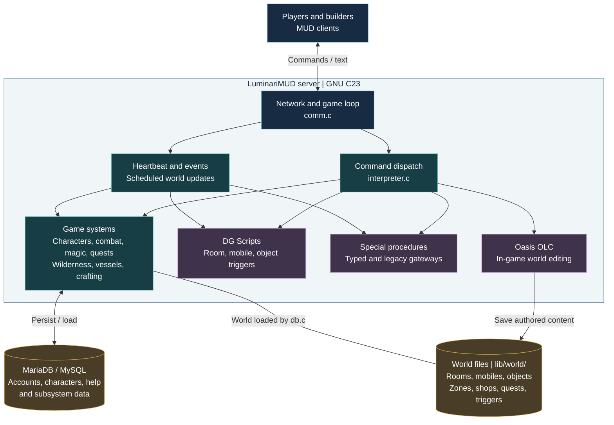

<p align="center">
  <a href="https://github.com/LuminariMUD/Luminari-Source/actions/workflows/test.yml"></a>
  <a href="https://github.com/LuminariMUD/Luminari-Source/actions/workflows/quality.yml"></a>
  <a href="https://github.com/LuminariMUD/Luminari-Source/actions/workflows/security.yml"></a>
  <a href="docs/TECHNICAL_DOCUMENTATION_MASTER_INDEX.md"></a>
</p>
<p align="center">
  <a href="src/"></a>
  <a href="sql/"></a>
  <a href="docs/guides/SETUP_AND_BUILD_GUIDE.md"></a>
  <a href="docs/development/CMAKE_BUILD_GUIDE.md"></a>
  <a href="LICENSE"></a>
</p>

# LuminariMUD

LuminariMUD is a text-based multiplayer game server implementing Pathfinder and
D&D 3.5 mechanics on the tbaMUD/CircleMUD foundation. The supported server is
written in GNU C23 and requires MariaDB or MySQL at runtime.

Current source version: `2.5062-beta` (tbaMUD 3.64), declared in
[configure.ac](configure.ac) and [src/constants.c](src/constants.c).

The game combines character classes, races, feats, spells, and d20 combat with
quests, crafting, wilderness exploration, and vessels. Builders create content
in game with Oasis OLC and attach local behavior through DG Scripts and named
special procedures. MUD clients connect over Telnet; the separate
[web client](https://github.com/LuminariMUD/luminariweb) provides browser access.

## Requirements

- Linux or a compatible environment, including Ubuntu under WSL2.
- A C compiler supporting the GNU C23 features checked by `configure`.
- Autoconf, Automake, and Make; CMake 3.21+ is a supported alternative.
- MariaDB/MySQL with client development headers, plus crypt, GD, curl, OpenSSL,
  pthread, and json-c libraries for the standard build.
- Runtime configuration and world data under `lib/`, plus an initialized
  database schema, prepared by the setup script below.

## Quick Start

On Ubuntu, Debian, or WSL2, the repository's one-command setup installs
dependencies, prepares local configuration and a minimal world, provisions MariaDB,
builds the server, and installs `bin/luminari`:

```bash
git clone https://github.com/LuminariMUD/Luminari-Source.git
cd Luminari-Source
./scripts/deployment/deploy.sh --dev
```

Run this fresh-install setup as your normal user with sudo available for package
and database setup. For local development, decline its optional systemd-service
prompt and use the repository's autorun supervisor:

```bash
./scripts/autorun/autorun.sh
./scripts/autorun/autorun.sh status
```

Autorun starts in the background and supervises server restarts. Connect a MUD
client to `localhost:4101`; stop the local supervisor and server with
`./scripts/autorun/autorun.sh stop`. For a direct foreground debugging session,
use `./bin/luminari -d lib` instead of starting autorun.

The compiled default and local autorun game port are 4101; existing runtime
configuration or `MUD_PORT` for autorun can override them. The loopback health
listener defaults to port 8182. Once the server is running, check readiness with:

```bash
./scripts/operations/healthcheck.sh
```

Production uses game port 4100 through `luminari.service`. Deployment also
supports noninteractive and managed-service modes; inspect the options with
`./scripts/deployment/deploy.sh --help`.

Local headers and credentials are untracked: preserve existing `src/campaign.h`,
`src/mud_options.h`, `src/vnums.h`, `lib/mysql_config`, and `lib/.env`.
Development tooling that checks the environment requires `APP_ENV=development`
in `lib/.env`; the tracked [environment example](lib/.env_example) defaults to
production and must be adapted for a local checkout. Ollama, InterMUD-3, and
Discord connections are not required for ordinary local development.

For a fresh clone, start with the [onboarding checklist](docs/onboarding.md) or
the [setup and build guide](docs/guides/SETUP_AND_BUILD_GUIDE.md).

## Build and Test

For an already configured checkout, Autotools is the preferred incremental build:

```bash
make -j"$(nproc)"
make test && make install
```

If `configure` or `Makefile` is missing, run `autoreconf -fvi` and `./configure`
first. `make test` runs the production-linked CuTest suite and registered shell
regressions. Always follow it with `make install`, which installs an immutable
build under `bin/releases/`, updates `bin/luminari`, and removes the root-level
`luminari` artifact. An already running process continues using its current
executable until restarted.

The focused protocol parser harness is separate:

```bash
make -C unittests/CuTest protocol-parser
```

For CMake, explicitly enable tests in a fresh build directory:

```bash
cmake -S . -B build -DBUILD_TESTS=ON
cmake --build build -j"$(nproc)"
ctest --test-dir build --output-on-failure
cmake --install build
```

See the [testing guide](docs/guides/TESTING_GUIDE.md) for fixture, database,
sanitizer, and subsystem-specific checks. The badges above report the latest
matching workflow runs on `master`; workflow path filters may skip README-only
commits.

## Architecture

One select-based game loop connects player commands, scheduled updates, and a
shared world. Game systems run inside the server; DG Scripts add behavior to
rooms, mobiles, and objects, while Oasis OLC lets builders edit the world in game.
Special-procedure gateways support typed handlers and legacy callbacks under
`src/spec/` and the owning feature directories.



This overview shows the main execution and content paths, rather than every
subsystem dependency. See the [architecture guide](docs/ARCHITECTURE.md) for details.

## Repository Structure

```text
.
|-- src/          # GNU C23 server and game systems
|-- lib/          # Runtime configuration, text, and flat-file world data
|-- sql/          # Master schema and component migrations/verifiers
|-- scripts/      # Deployment, operations, debugging, and world tools
|-- unittests/    # Production-linked CuTest and focused harnesses
`-- docs/         # Maintained developer, builder, and operator documentation
```

MariaDB/MySQL stores accounts, characters, help, and subsystem data. Flat files under
`lib/world/` remain the authored room, mobile, object, zone, shop, quest, and
trigger sources. Help content is maintained in both the database and
`lib/text/help/help.hlp`. See [environment boundaries](docs/environments.md) for
local and production data handling.

## Documentation

- [Documentation index](docs/TECHNICAL_DOCUMENTATION_MASTER_INDEX.md)
- [Architecture](docs/ARCHITECTURE.md)
- [Development commands](docs/development.md)
- [Deployment and CI/CD](docs/deployment.md)
- [Environment boundaries](docs/environments.md)
- [Testing guide](docs/guides/TESTING_GUIDE.md)
- [Incident response](docs/runbooks/incident-response.md)
- [Operational API contracts](docs/api/README_api.md)
- [Contributing](CONTRIBUTING.md)

Player and builder orientation remains in [Getting Started](docs/GETTING_STARTED.md)
and the [builder quickstart](docs/world_game-data/BUILDER_QUICKSTART.md).

## Project Status

The special-procedure architecture initiative is complete through Phase 07:
registry validation, event gateways, declarative assignments, source ownership,
shared helpers, and initial typed handlers are implemented. Legacy callback
compatibility and single-name world bindings remain supported. Phase 06 retained
the existing runtime shop/quest wrappers and closed without adding general
persisted procedure chains or new zone/world hooks.

See the [architecture guide](docs/ARCHITECTURE.md),
[Phase 06 decisions](docs/testing/SPECIAL_PROCEDURE_PHASE_06_VALIDATION.md), and
[Phase 07 validation](docs/testing/SPECIAL_PROCEDURE_PHASE_07_VALIDATION.md).
For broader development history and current work, see the
[changelog](docs/CHANGELOG.md) and
[GitHub Issues](https://github.com/LuminariMUD/Luminari-Source/issues).

## LuminariMUD Ecosystem

What we call the "Lumiverse":

- [Sage GraphRAG lore and world building](https://github.com/LuminariMUD/sage)
- [Luminari web client](https://github.com/LuminariMUD/luminariweb)
- [InterMUD-3 client](https://github.com/LuminariMUD/Intermud3)
- [Discord bridge](https://github.com/LuminariMUD/discord-mud-chat)
- [Wilderness editor](https://github.com/LuminariMUD/wildeditor)
- [Mudlet interface](https://github.com/LuminariMUD/LuminariGUI)

## Contributing and Community

Read [CONTRIBUTING.md](CONTRIBUTING.md) before opening a pull request and
[CODE_OF_CONDUCT.md](CODE_OF_CONDUCT.md) before participating in project spaces.
Questions and bug reports can be raised through
[GitHub Issues](https://github.com/LuminariMUD/Luminari-Source/issues).

## License

Custom LuminariMUD code is dedicated to the public domain under the Unlicense.
Inherited tbaMUD, CircleMUD, DikuMUD, and licensed game content retain their
respective terms. See [LICENSE](LICENSE) and the
[legal notes](docs/legal/README_legal.md) for the project's complete notice.
