# Vessel Player Guide

Ships, airships, submarines, river craft and carts: how to ride them, buy them, crew them, sail
them, trade with them, fight them, lose them and get them back.

The guide follows a new captain through the vessel system in the order a player meets it. The
screenshots were taken in play, in the Luminari Web client, most with its Ship tab open, on a
development world whose test harbor has a west pier (the Testing Dock) and an east pier (the
Harbor Sandbox East Dock) ten rooms apart. Some are cropped to the lines that matter, and lines
from the staff who staged the play are blanked. The names of ports, hull designs and goods, and
their prices, differ from world to world and are examples here; the rules, the fixed prices
(crew, weapons, fees, repairs) and the timings are the game's own. In-game help has the full
syntax of every command: start with `help vessels`, `help shipbrowse` and `help shiphire`.

Commands are shown as `command <argument>`; type them without the angle brackets. Square
brackets mark an optional argument.

## Contents

01. [Passage on public ships](#1-passage-on-public-ships)
02. [Finding a ship](#2-finding-a-ship)
03. [Buying and knowing her](#3-buying-and-knowing-her)
04. [Crew, weapons and refits](#4-crew-weapons-and-refits)
05. [Sailing](#5-sailing)
06. [Routes, autopilot and schedules](#6-routes-autopilot-and-schedules)
07. [Trade and freight](#7-trade-and-freight)
08. [Gunnery](#8-gunnery)
09. [Damage, repair and salvage](#9-damage-repair-and-salvage)
10. [Boarding and taking a prize](#10-boarding-and-taking-a-prize)
11. [Two captains](#11-two-captains)
12. [Contraband and customs](#12-contraband-and-customs)
13. [Loss and recovery](#13-loss-and-recovery)
14. [Other hulls and vehicles](#14-other-hulls-and-vehicles)
15. [The living world](#15-the-living-world)
16. [Client data](#16-client-data)
17. [Command summary](#17-command-summary)

Appendix: [Staff tools](#appendix-staff-tools)

## 1. Passage on public ships

You do not need a ship of your own to go to sea. Public ferries and merchants sail fixed routes
on a schedule, piloted by their crews, and anyone may ride.

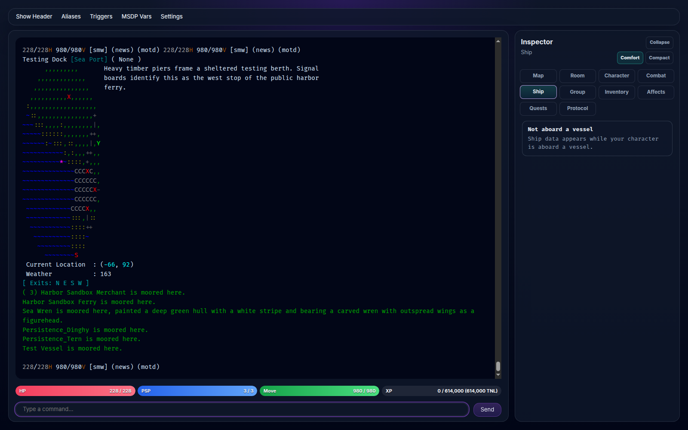

*`look` at a dock. A `[Sea Port]` room lists the hulls moored there: the Harbor Sandbox Ferry,
three test merchants, and player ships.*

To ride, `board <ship>` while she is moored in your room; any word of her name works
(`board ferry`). A ferry charges its fare as you step aboard:

```text
The purser collects 10 gold for passage aboard Harbor Sandbox Ferry.
You board the ship.
```

Without the gold you are told the fare and what you carry ("Passage aboard Harbor Sandbox Ferry
costs 10 gold; you have 4."). Some merchants carry passengers free.

Aboard, the commands that read the ship work for passengers too. From the bridge, `lookout`
shows the view from her deck: the weather, the water, the eight compass sectors to the horizon,
and the ten nearest vessels in sight, each with its two-letter contact ID (`tactical` lists the
rest).

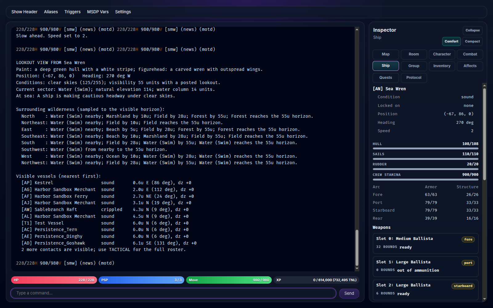

*`lookout` from a ship off the harbor (a ferry passenger's reads the same): position, heading,
weather and visibility, the water column, the compass sectors, and "[AP] Kestrel sound 0.6u E (86
deg), dz +0": contact AP, sound, 0.6 rooms to the east, at the same height.*

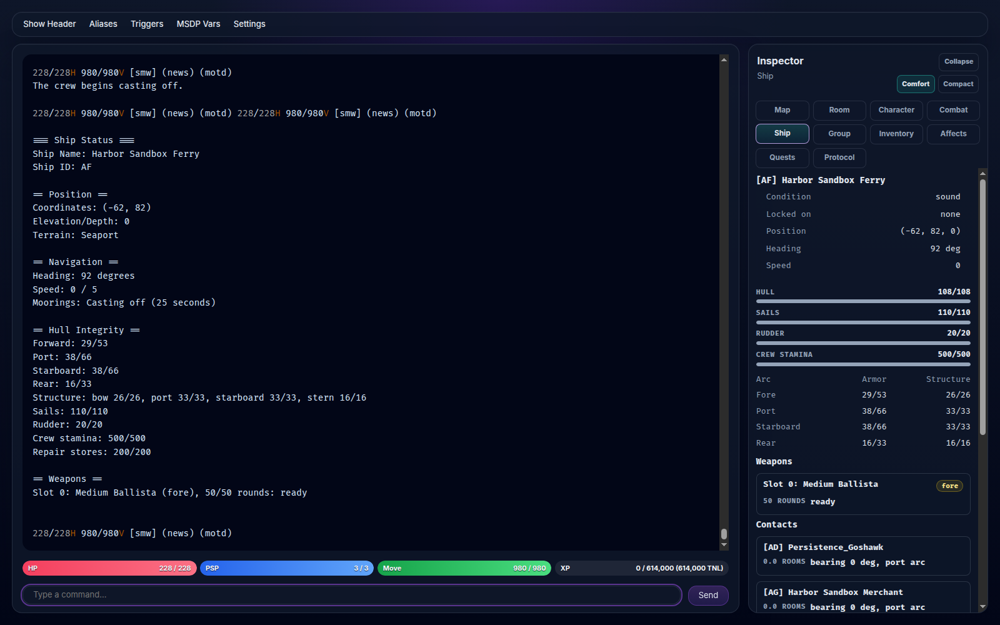

*`shipstatus` aboard the ferry at the east pier: "Moorings: Casting off (25 seconds)". She is
about to leave.*

A ferry waits at each stop, casts off, and sails on round her loop. Step off with `disembark`
while she is berthed or casting off: "You step off the vessel onto the dock." Under way you
cannot, and a passenger cannot steer, stop, anchor or reroute a public ship while her NPC pilot
holds the helm:

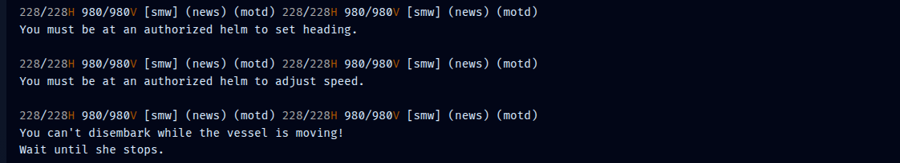

*Aboard a merchant under way: `heading` and `speed` are refused ("You must be at an authorized
helm to set heading."), and so is `disembark` ("Wait until she stops.").*

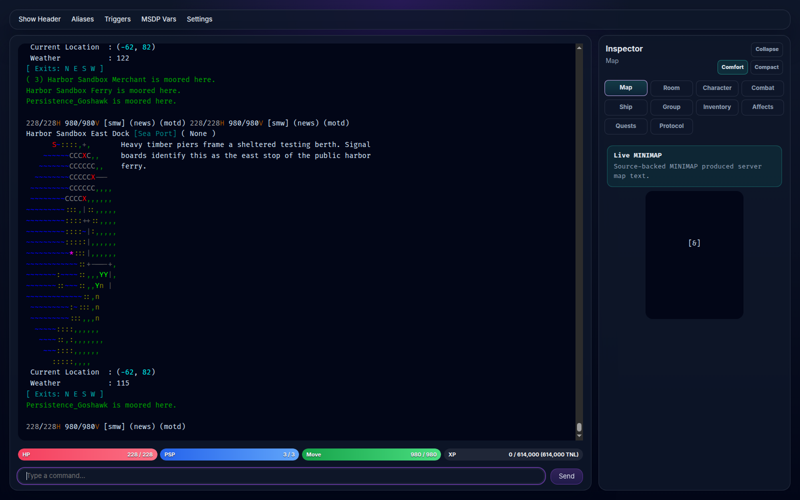

*The Harbor Sandbox East Dock, the ferry's east stop, after she has sailed on.*

`showschedule` aboard shows her next departure in MUD hours (a MUD hour is about 75 seconds),
her fare, and whether a pilot is assigned. Stay aboard through a stop and she carries you round
again.

Longer passages work the same way. The Vailand Ironwind Trader sails the Vailand Iron Passage
between North and Central Vailand, a voyage of about half an hour, and carries passengers free.

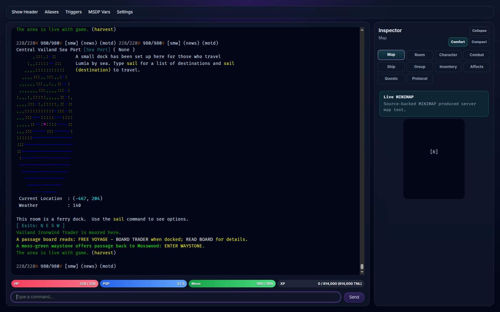

*The trader moored at Central Vailand Sea Port. The room also offers `sail`, a separate
fast-travel service between ports; it is not the vessel command `setsail`.*

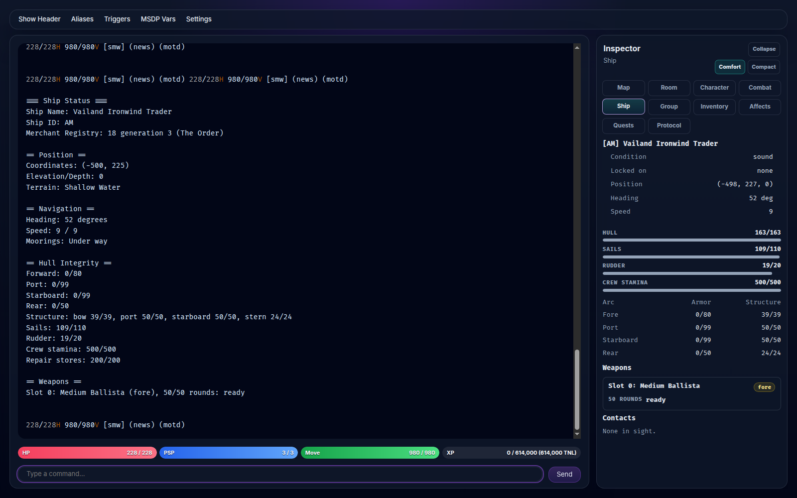

*`shipstatus` aboard the trader under way: speed 9 of 9 on her route.*

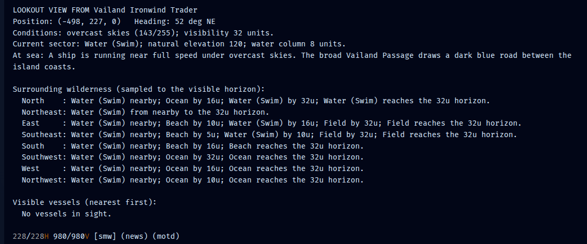

*`lookout` in the Vailand Passage. The lookout adds a line on the hull, the weather and the
waters: "A ship is running near full speed under overcast skies."*

On the way you hear the ship's life: the pilot at the helm ("The harbor ferrymaster studies the
route from the helm."), the crew casting off, and the waters she crosses ("The charts mark our
crossing into Harbor Sandbox Free Seas (free seas), under Free Captains' Compact authority.").

## 2. Finding a ship

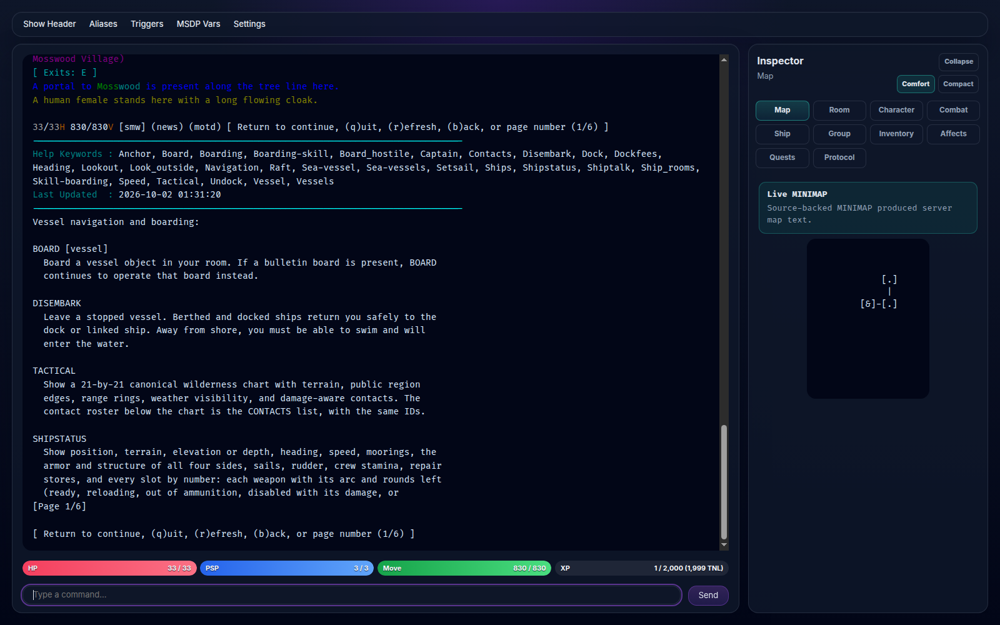

*`help vessels` (also `help ships`), the navigation and boarding entry. Its keyword line lists
every command it covers. Long help opens the pager: Return for the next page, `q` to quit, a
number to jump.*

The shipwrights' catalog is `shipbrowse`, which works anywhere; buying needs a dock.

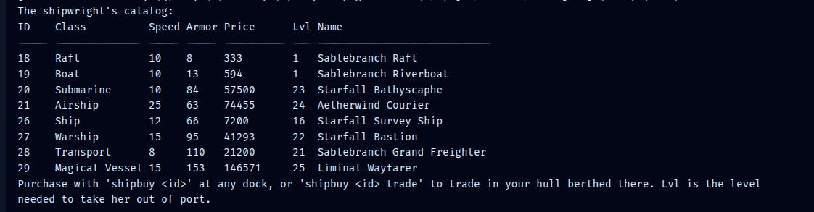

*`shipbrowse`: each design's ID, class, speed, armor, price in gold, and level.*

The catalog on the development world:

| ID | Class | Speed | Armor | Price | Level | Name |
| -: | -- | -: | -: | -: | -: | -- |
| 18 | Raft | 10 | 8 | 333 | 1 | Sablebranch Raft |
| 19 | Boat | 10 | 13 | 594 | 1 | Sablebranch Riverboat |
| 26 | Ship | 12 | 66 | 7,200 | 16 | Starfall Survey Ship |
| 28 | Transport | 8 | 110 | 21,200 | 21 | Sablebranch Grand Freighter |
| 27 | Warship | 15 | 95 | 41,293 | 22 | Starfall Bastion |
| 20 | Submarine | 10 | 84 | 57,500 | 23 | Starfall Bathyscaphe |
| 21 | Airship | 25 | 63 | 74,455 | 24 | Aetherwind Courier |
| 29 | Magical Vessel | 15 | 153 | 146,571 | 25 | Liminal Wayfarer |

The level is what it takes to take her out of port, not to buy her: anyone may own a hull or
ride aboard one. Unless a design sets its own, the levels are 1 for rafts and boats, 16 for
ships, 21 for transports, 22 for warships, 23 for submarines, 24 for airships and 25 for magical
hulls. A captain may hold three hulls (the staff can set the limit from 1 to 10); wrecks and
hulls under summons count.

`help shipbrowse` covers ownership from end to end: browsing, buying, trade-in, christening,
customizing, deeds, permits, crew, summons, hull levels, loss and insurance.

Tips: `nohint` turns off the game's hints, which otherwise interleave with ship output. At night
the wilderness is dark: hold a light (`hold lantern`) to see the dock and the sea map.

## 3. Buying and knowing her

A dock is any room where `shipbuy` works; on the wilderness map it is a `[Sea Port]` room.

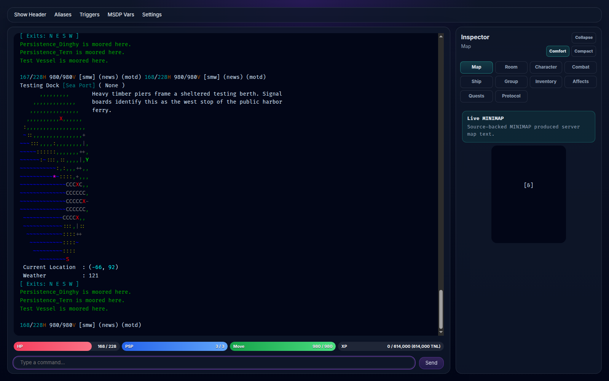

*`look` at the Testing Dock, the harbor's west pier, with hulls moored.*

`shipbuy <id>` pays for a design from the catalog and puts the new hull in the water beside you,
berthed, with her class armament (a ship comes with one Medium Ballista on the bow):

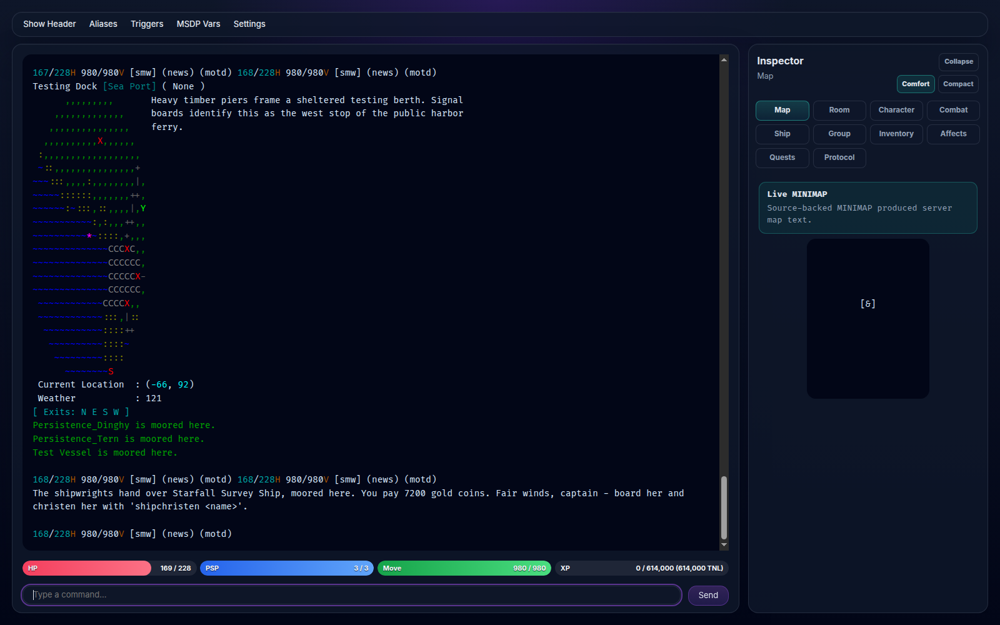

*`shipbuy 26`: "The shipwrights hand over Starfall Survey Ship, moored here. You pay 7200 gold
coins. Fair winds, captain - board her and christen her with 'shipchristen <name>'."*

`board <word>` takes any word of her name (`board survey` before the christening, `board wren`
after). Aboard, give her a name and a look:

```text
shipchristen Sea Wren
shipcustomize paint a deep green hull with a white stripe
shipcustomize figurehead a carved wren with outspread wings
shipcustomize show
```

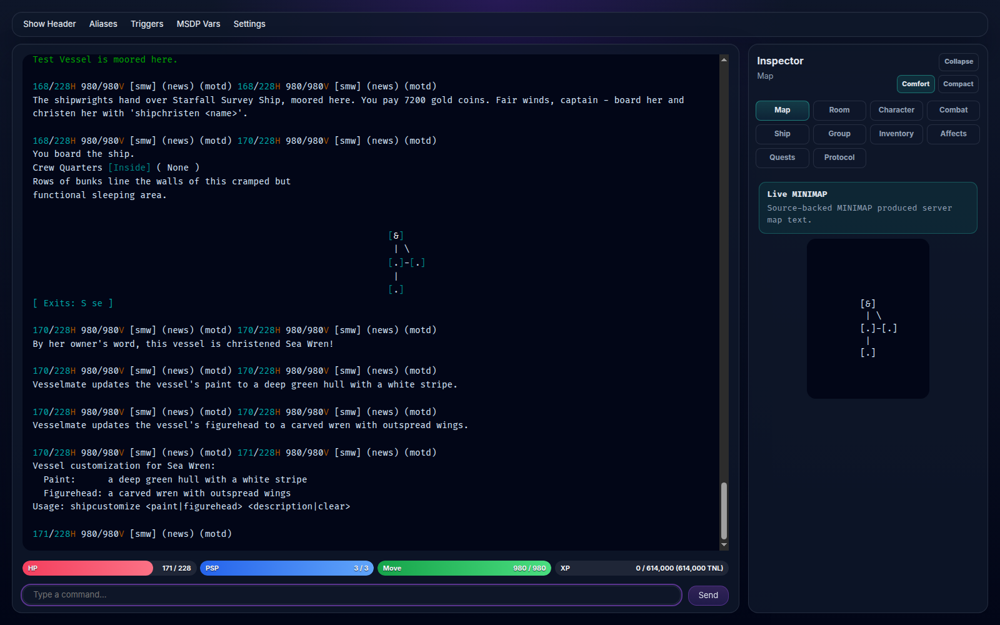

*"By her owner's word, this vessel is christened Sea Wren!" Christening is free while she bears
her design's name; a rename costs a tenth of her value.*

Both commands work only aboard ("You must be aboard your ship to christen her."). From the dock,
`look` shows the result: "Sea Wren is moored here, painted a deep green hull with a white stripe
and bearing a carved wren with outspread wings as a figurehead." The paint text follows
"painted", so a color phrase reads best.

`board` puts you in her entrance room; walk her decks like any rooms, and `ship_rooms` lists
them. A ship always has a bridge, crew quarters (the entrance), a cargo hold and a main deck, and
may have more; larger hulls have more still.

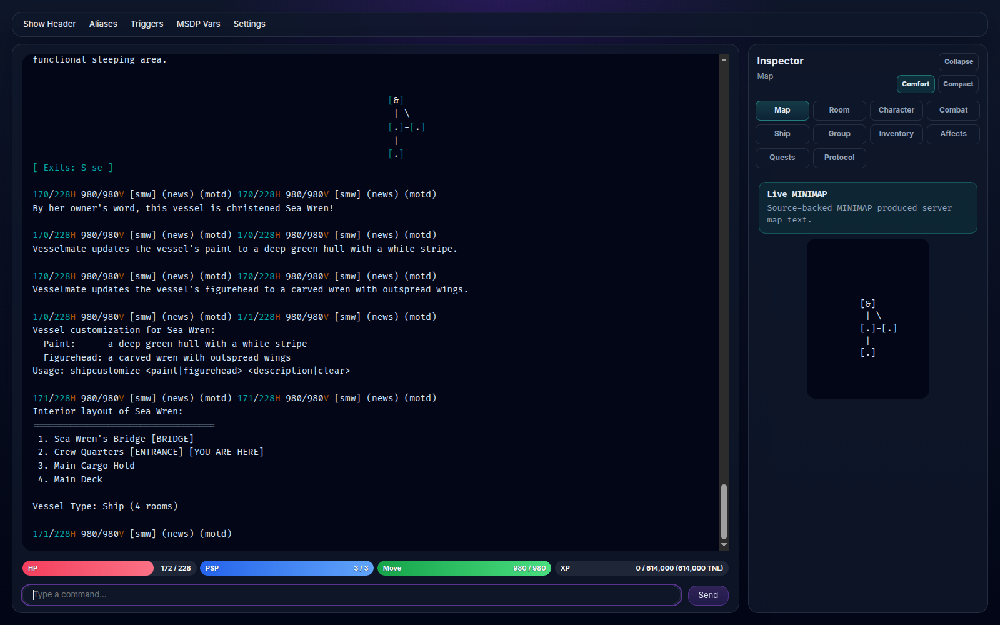

*`ship_rooms` in the crew quarters; the minimap shows the layout.*

The bridge is where she is commanded. `shipstatus` is her whole condition:

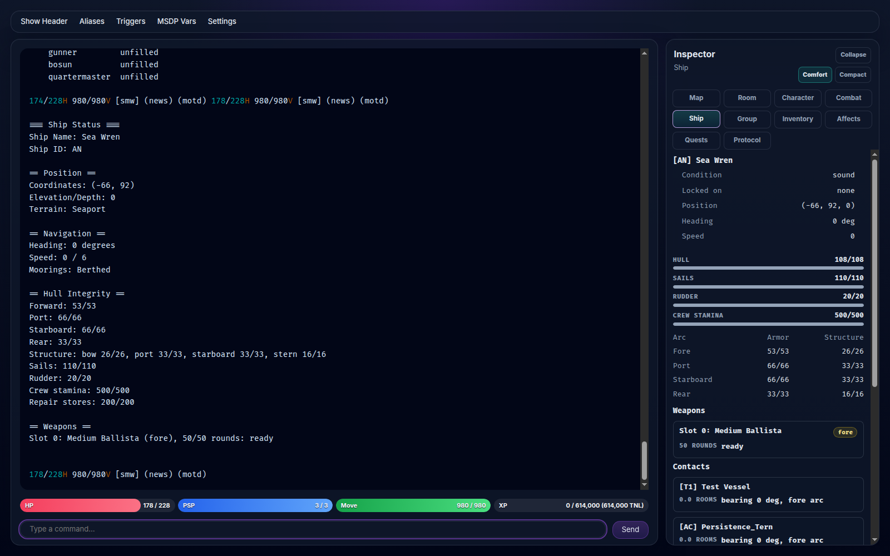

*`shipstatus` on the bridge: position and terrain, heading 0, speed 0 of 6 (a ship makes half
her speed in port), moorings Berthed, armor and structure on each of her four sides, sails 110,
rudder 20, crew stamina 500, repair stores 200, and slot 0, the Medium Ballista on the fore arc
with 50 of 50 rounds. The Ship tab shows her condition live, with the contacts in sight: here the
hulls moored at the dock, at range 0.0.*

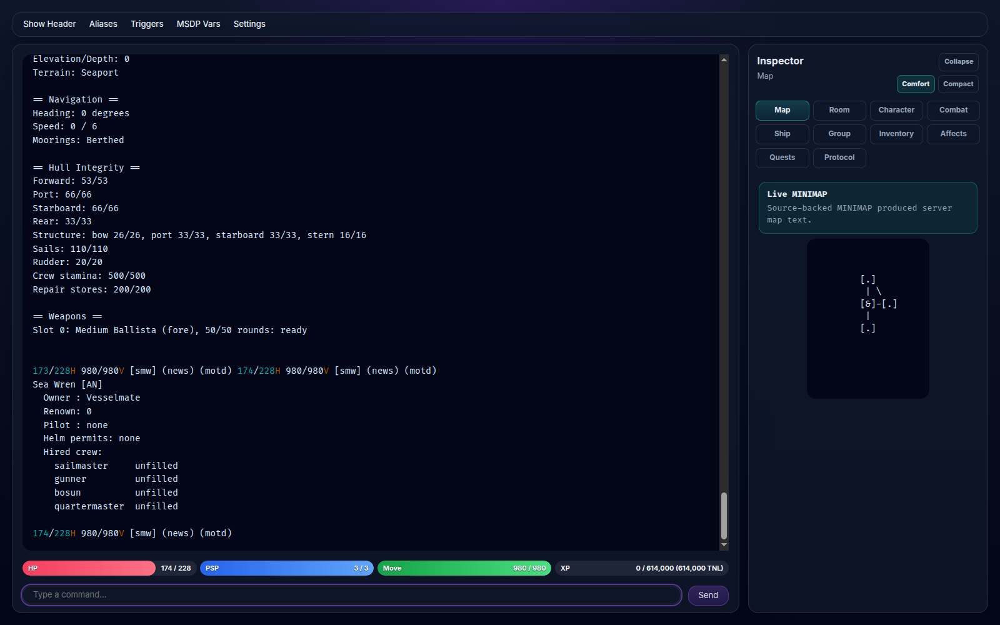

*`shipcrew`: owner, renown 0, no pilot, no helm permits, and the four crew positions unfilled.*

`disembark` from a berthed hull: "You step off the vessel onto the dock."

## 4. Crew, weapons and refits

Hiring needs her in port; fitting weapons and equipment, rearming and refitting need her berthed
and not casting off; dismissing a hand works anywhere aboard.
One help entry covers all of it: `help shiphire` (also found as `help shipweapon`,
`help shipupgrade`, `help ship-crew` and `help ship-refit`).

### Crew

Crew are hired once and draw no wages. `shiphire` with no arguments lists the prices:

| Position | Does | Green | Able (renown) | Veteran (renown) |
| -- | -- | -: | -: | -: |
| sailmaster | speed handling under way | 1,600 | 6,000 (540) | 15,000 (1,350) |
| gunner | gunnery accuracy and reloads | 2,400 | 8,000 (700) | 18,000 (1,640) |
| bosun | repairs | 2,000 | 7,000 (640) | 16,000 (1,480) |
| quartermaster | cargo capacity | 1,200 | 4,500 (540) | 11,000 (1,350) |

An able or veteran hand signs on only with a hull of the renown shown. A new hull has none:

```text
No able sailmaster will sign on with a hull of less than 540 renown, and Sea Wren has 0. Hire a
green hand and let the sea promote them.
```

`shiphire <position> green` signs one on: "You sign on a green sailmaster for 1600 gold." The
hands gain experience at sea and are promoted. `shipdismiss <position>` sends one ashore with no
refund; hiring again costs the full price. Each hand adds to the crew's stamina: 100 for a green
hand, 200 for an able one, 300 for a veteran, on top of 500.

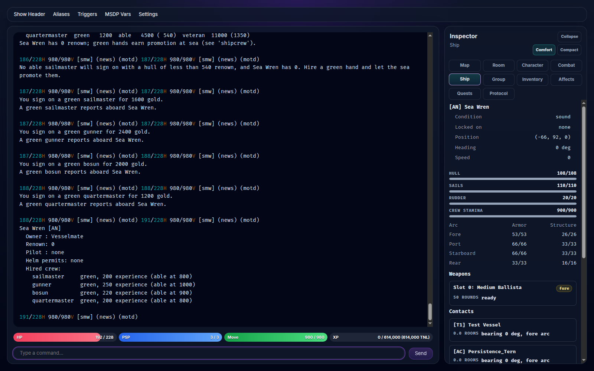

*Four `shiphire <position> green`, then `shipcrew`: each hand's experience and the mark for able
(sailmaster 200 of 800, gunner 250 of 1000, bosun 220 of 900, quartermaster 200 of 800).*

### Weapons

`shipweapon list` shows what her class can mount. On a Ship:

| # | Weapon | Gold | Weight | Rounds | Range | Damage | Reload | Arcs |
| -: | -- | -: | -: | -: | -- | -- | -- | -- |
| 1 | Small Ballista | 100 | 3 | 60 | 0-8 | 2-4 | 17 s | all |
| 2 | Medium Ballista | 200 | 6 | 50 | 0-10 | 4-6 | 17 s | all |
| 3 | Large Ballista | 1,000 | 10 | 30 | 0-12 | 6-9 | 17 s | all |
| 4 | Small Catapult | 1,000 | 10 | 30 | 4-15 | 4 x 2-3 | 17 s | ends |
| 5 | Medium Catapult | 1,600 | 13 | 20 | 5-20 | 5 x 2-4 | 17 s | ends |
| 6 | Large Catapult | 2,400 | 17 | 12 | 6-25 | 6 x 2-5 | 17 s | ends |
| 7 | Heavy Ballista | 2,000 | 15 | 6 | 0-4 | 15-22 | 17 s | beams |
| 8 | Light Beamcannon | 8,000 | 7 | 40 | 0-20 | 16 falling to 4 | 25 s | all; capital, 1,600 renown |
| 9 | Heavy Beamcannon | 10,000 | 9 | 40 | 0-23 | 22 falling to 5 | 25 s | all; capital, 1,800 renown |
| 10 | Mind Blast Cannon | 8,000 | 5 | 50 | 0-20 | stuns the crew | 25 s | all; capital, 1,700 renown |
| 11 | Fragmentation Cannon | 10,000 | 7 | 20 | 0-16 | 5 x 4-6 | 25 s | ends; capital, 1,900 renown |
| 12 | Long Tom Catapult | 10,000 | 9 | 6 | 12-32 | 8 x 3-6 | 25 s | ends; capital, 2,000 renown |

"Ends" are the fore and rear arcs, "beams" port and starboard. A capital weapon needs the renown
shown or a veteran gunner, and a hull carries only one; a Ship cannot mount the Heavy Beamcannon
or the Long Tom. Reloads are the base times: a better gunner shortens them and a tired crew
lengthens them. The list ends with each arc's mounts and weight against its cap (a Ship: fore and
rear one mount and 17 weight each, port and starboard three mounts and 26 each) and her total
fit-out weight. The capital weapons reload in 25 and a half seconds.

```text
shipweapon buy 3 starboard
The shipwrights mount a Large Ballista on the starboard arc of Sea Wren in slot 1 for 1000 gold,
loaded with 30 rounds. She cannot sail for 750 seconds while they work.
```

The shipwrights take 75 seconds for each point of weight, and the work adds up: a second Large
Ballista made it 1,497 seconds, a ram after it 2,072. Plan a refit well before a voyage.
`shipweapon sell <slot>` pays back 90% (10% if the weapon is damaged) but not the work time;
`shipweapon swap <slot> <slot>` exchanges two slots.

`shipequip list` shows equipment: a ram (weight 8; 400 gold on a Ship, 2 a point of hull weight)
and Neutral Colors (free and weightless; see [Trade and freight](#7-trade-and-freight)):
`shipequip buy ram`, `shipequip sell colors`.

`shiprearm all` refills the racks at 2 gold a round, 75 seconds a weapon ("There is nothing to
rearm." when they are full).

### Refits

`shipupgrade` lists four refits, each once per hull and each a fifth of the class price (1,600
gold on a Ship); they add no shipwright time:

| Refit | Effect |
| -- | -- |
| plating | +20% armor on every side |
| rigging | +10% maximum speed |
| hold | +25% cargo capacity |
| reinforcement | +20% structure |

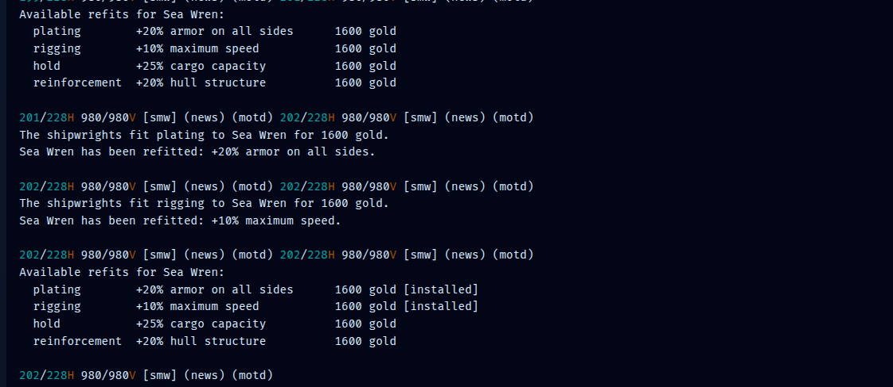

*`shipupgrade`, `shipupgrade plating`, `shipupgrade rigging`, then `shipupgrade` again: two
refits installed.*

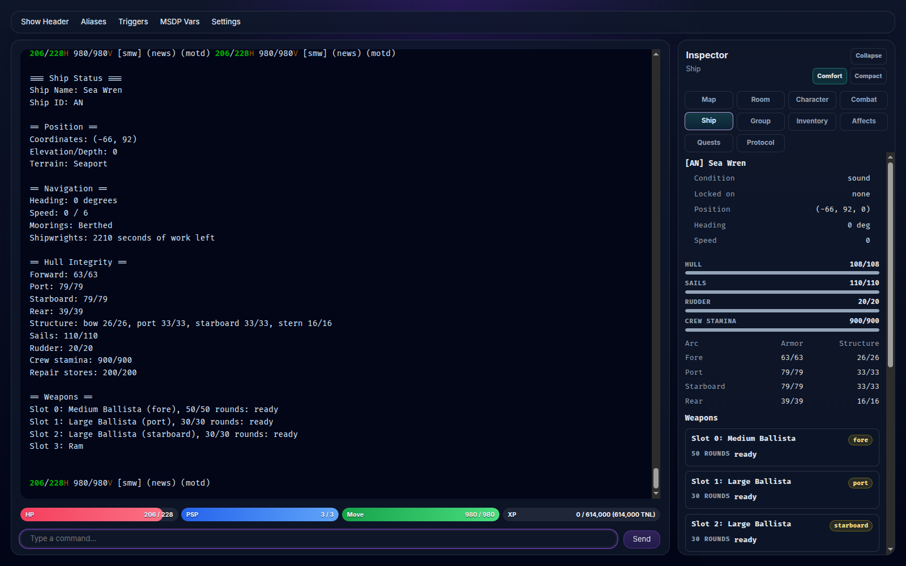

*`shipstatus` after the refit: armor up a fifth (fore 63, port 79, starboard 79, rear 39), crew
stamina 900, "Shipwrights: 2210 seconds of work left", and the weapons: slot 0 Medium Ballista
fore, slots 1 and 2 Large Ballistas port and starboard (after `shipweapon swap 1 2`), slot 3 the
ram.*

## 5. Sailing

Every helm command works only on the bridge, for the owner or a captain the owner has cleared to
take the helm (see [Two captains](#11-two-captains)).

### Leaving port

```text
undock
The crew begins casting off.
The first officer reports Sea Wren ready to get under way.
```

Casting off takes 30 seconds. Meanwhile she takes a heading but no speed or maneuver ("Sea Wren
is still casting off (27 seconds)."). A hull cannot leave a port with dock fees unpaid, and the
captain needs her level to take her out (see [Finding a ship](#2-finding-a-ship)); the level
gate holds departures only.

### Heading and speed

`heading <degrees>` sets her course, 0 north, 90 east: "Heading set to 23 degrees (NE)." She comes
about at her turn rate, which her rudder, speed, sailmaster and crew stamina set; `shipstatus`
shows "Heading: 151 degrees (coming about to 23)" until she is round.

`speed <n>` orders a speed, and she gathers or loses way at her class rate. In port she makes
only part of her speed (half, for a ship: "Under present conditions she can make only 6."); at
sea her top speed comes from her class, her load, her sails, her sailmaster and her rigging, and
shoal water slows her. A ship at speed 6 covers a room in about 7.5 seconds. `speed 0` takes in
sail: "All stop! The crew takes in sail."

A ship sails deep and shoal water and the wider rivers, never the beach, marsh or land. Steered
at the shore she stops short:

```text
Your ship cannot go there! She keeps to the water's surface, clear of beach and land. The crew
brings her up short.
```

Stop, come about, then order speed again. A hull keeps sailing on her last orders, with or without
you: bring her to rest before you leave the bridge.

### Reading the sea

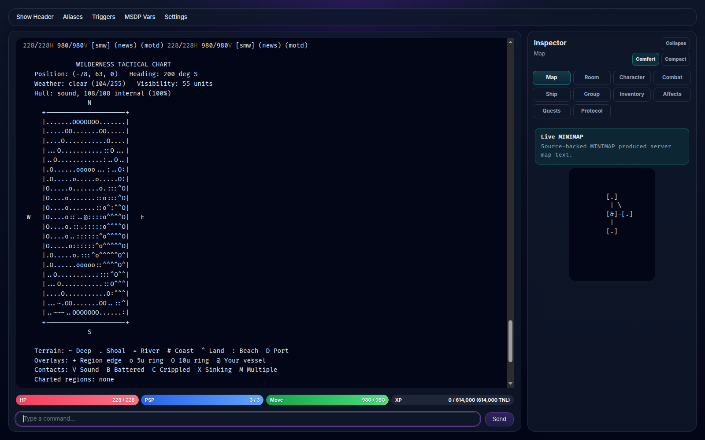

*`tactical`: a 21-by-21 chart around her. `@` is your ship, `~` deep water, `.` shoal, `:`
beach, `^` land, `o` and `O` the 5- and 10-room range rings, `+` region edges; above it her
position, heading, weather, visibility and hull, and below it the legend and the charted regions.
The contact roster follows, scrolled off here.*

`contacts` lists each vessel in sight, nearest first: her two-letter ID, name, range in rooms,
bearing, compass direction, and the arc of your hull she lies off ("AP Corsair Clipper 40.1 u
259 deg W fore"). `seastate` reads the water: its kind, the depth under the keel ("shallow -
watch your draft"), the weather, visibility, her hull, and the waters' law ("Unnamed open waters
(standard maritime law)").

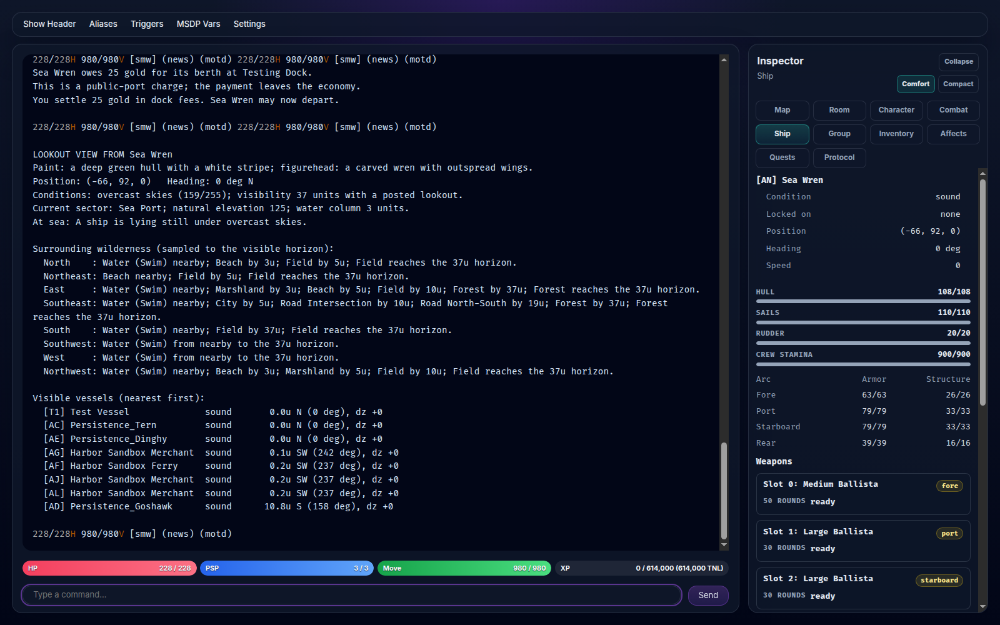

*`lookout` at the Testing Dock gives the same contacts and ranges as a view from the deck.*

The contact ID (AN, AP, T1) is how every command names another vessel: `contacts`, `tactical`,
`lookout`, `shipscan`, `shiplock`, `shipfire`, `dock`, `board_hostile` and the event roster all
use it. A word of her name works too, the nearest such hull first.

At sea you hear the ship and the weather ("The ship's timbers work with the sea. It holds a steady
pace. Clear light runs cleanly to the horizon.") and the waters you enter ("The charts mark our
crossing into Harbor Sandbox Territorial Waters (territorial waters), under Harbor Admiralty
authority."). `shiptalk <message>` speaks to every room aboard: "[Captain's channel - Sea Wren]
Vesselmate: All hands, we sail for the Testing Dock."

### Making port

Sailing into a port room runs up a berthing fee, once a visit, and a hull that comes to rest
there berths:

```text
The harbor master records a 25-gold berthing fee. Use 'dockfees pay' before departure.
Lines go ashore; Sea Wren is made fast at the berth.
```

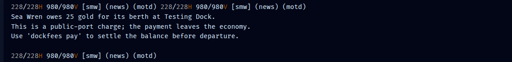

*`dockfees`: "Sea Wren owes 25 gold for its berth at Testing Dock. This is a public-port charge;
the payment leaves the economy. Use 'dockfees pay' to settle the balance before departure."*

`dockfees pay` settles it: "You settle 25 gold in dock fees. Sea Wren may now depart." The fee is
due only before she leaves; trading and freight in port do not wait for it.

### Harbor maneuvers and anchoring

`setsail <direction>` moves her one room, at speed 6 or less, and stops her on the new heading:
"The vessel maneuvers south. Current position: (-66, 91, 0)". The crew needs 5 seconds between
maneuvers. `setsail` into a port berths her. Airships, submarines and magical hulls also
`setsail up` and `setsail down` (see [Other hulls and vehicles](#14-other-hulls-and-vehicles)).

`anchor` holds a stopped hull off a berth: "Sea Wren drops anchor." She takes no speed order or
maneuver until `undock` weighs it ("The crew begins weighing anchor.", 13 seconds).

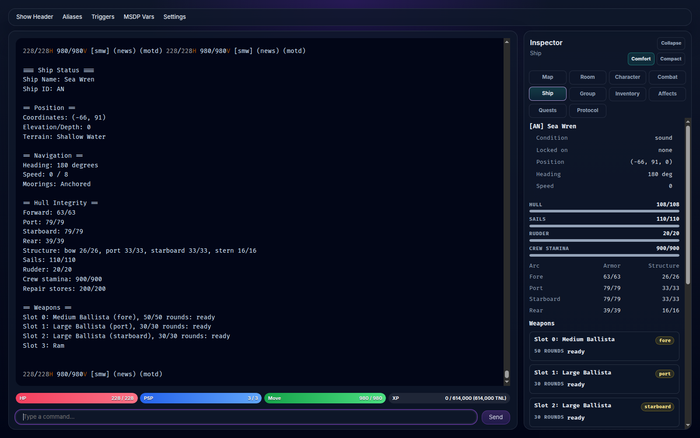

*`shipstatus` at anchor one room off the dock: "Moorings: Anchored".*

`dock <contact>` lays her alongside another hull within two rooms, both at speed 2 or less, and
runs a gangway between them ("Docking complete with Test Vessel."); `undock` takes it in again
("Undocking complete."):

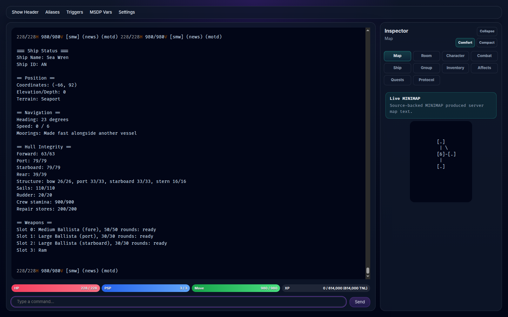

*`shipstatus` after `dock T1`: "Moorings: Made fast alongside another vessel".*

## 6. Routes, autopilot and schedules

The autopilot sails a route of waypoints for you. Route commands work on the bridge.

1. `setwaypoint <name>` marks her present position: "Waypoint 'wren_home' created at position
   (-66.0, 92.0, 0.0)." Names are letters, numbers, `_` and `-`. `listwaypoints` lists every
   waypoint in the world; any captain may use any of them. `delwaypoint <name>` removes one of
   yours.
2. `createroute <name>` starts a route ("Route 'wren_run' created (ID: 6).") and
   `addtoroute <route> <waypoint>` appends a waypoint ("Waypoint 'harbor_channel_turn' added to
   route 'wren_run' at position 1."); up to 20 a route. `listroutes` lists every route with its
   number of waypoints; a route you create sails once through and does not loop.
   `delroute <name>` removes one of yours.
3. `setroute <route>` gives it to the autopilot, and `autopilot on` engages it.

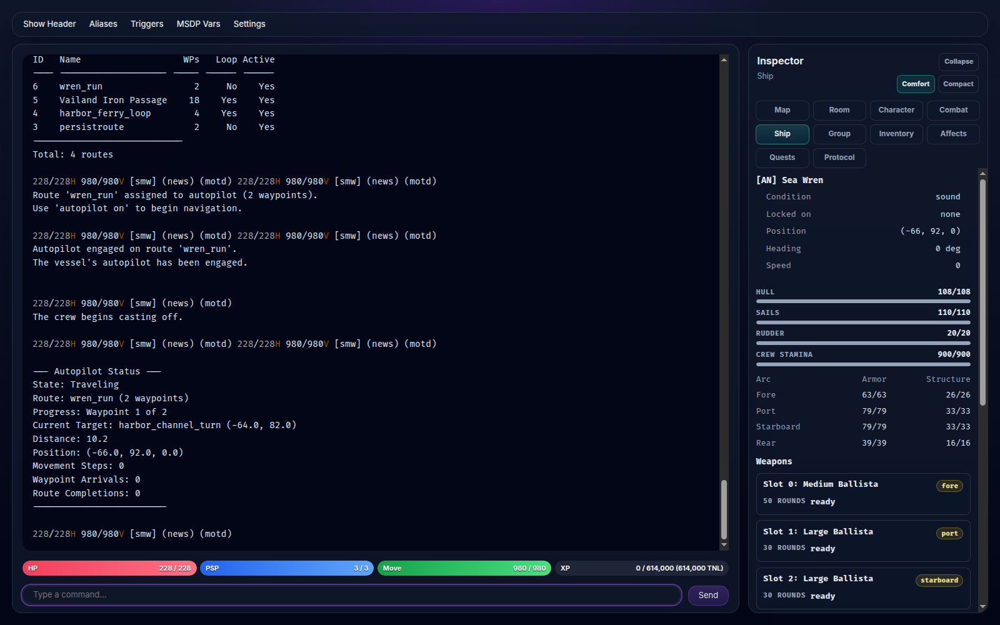

*`listroutes`, `setroute wren_run`, `autopilot on`, `autopilot status`: "Route 'wren_run' assigned
to autopilot (2 waypoints)." "Autopilot engaged on route 'wren_run'." The status card shows her
state, the waypoint she sails for and its distance, and her counts of steps, arrivals and
completed routes.*

The autopilot casts off from a berth (30 seconds) and sails at full speed unless you order a slower
one. More than 45 degrees off her waypoint she slows to steerage way, and more than 90 off she stops
and comes about where she lies. She stops at the last waypoint of a one-way route, berthing if that
is a port. `autopilot pause` holds her and `autopilot on` resumes; after `autopilot off`, or a
finished route, `autopilot on` starts again from the first waypoint. With an NPC pilot assigned,
`off` is refused: pause her, or relieve the pilot. It will not leave a port with dock fees unpaid
("Autopilot pauses: the harbor requires 25 gold in dock fees before departure."): pay, then
`autopilot on`.

`setschedule <route> <hours> [fare]` sails the route every 1 to 24 MUD hours; a fare applies only
to unowned public hulls. `showschedule` shows it, `clearschedule` ends it.

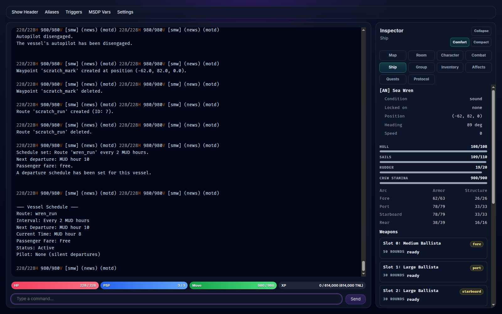

*`setschedule wren_run 2`, `showschedule`: "Schedule set: Route 'wren_run' every 2 MUD hours.
Next departure: MUD hour 10. Passenger fare: free." Without a pilot the departures are silent.*

An NPC on the bridge can be made her pilot with `assignpilot <npc>`; a follower or hireling will
do, if they stay on the bridge. With a route set and the autopilot off, the pilot takes the helm
at once ("The harbor ferrymaster takes the helm and engages autopilot.") and announces each
waypoint. `unassignpilot` relieves them and disengages the autopilot; the route stays set for
`autopilot on`.

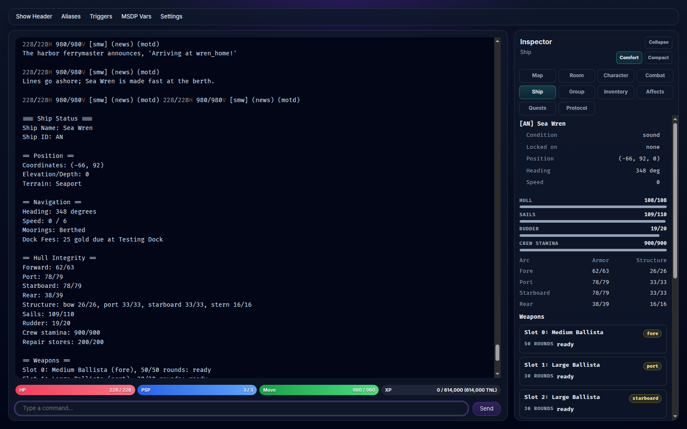

*The ferrymaster brings her home: "The harbor ferrymaster announces, 'Arriving at wren_home!'"
She berths, and `shipstatus` shows the berthing fee due.*

Engaging the autopilot, assigning a pilot and setting a schedule are departures, so they need the
hull's level (16 for a ship). The owner may give these orders anywhere aboard; a captain on a
helm permit gives them on the bridge.

Every captain may use every waypoint and route, but only the captain who made one, or the staff,
may delete it or add to a route; the harbors' own are the staff's. Even their maker cannot delete
a waypoint that a route sails through, nor a route that a ship runs on a schedule or is sailing.
When names repeat, your own waypoint or route of that name is the one meant.

## 7. Trade and freight

Each port has a market and a freight board. Trading is done aboard a hull in a port room;
buying, selling and taking freight need the owner or a captain cleared for her helm. The manifest
and abandoning a contract work anywhere aboard.

### The market

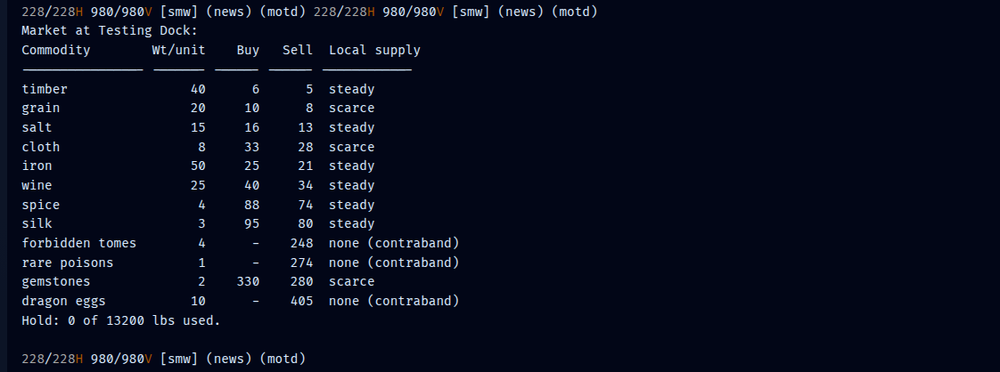

*`market`: each commodity's weight a unit, the price to buy and to sell, and the local supply
(scarce, steady or glutted); contraband is marked. The last line is the hold: "Hold: 0 of 13200
lbs used."*

`cargobuy <goods> <units>` loads goods; a big lot pushes the price as it goes, and the average is
reported. Any word of the goods' name will do. `cargomanifest`, anywhere aboard, lists the hold:

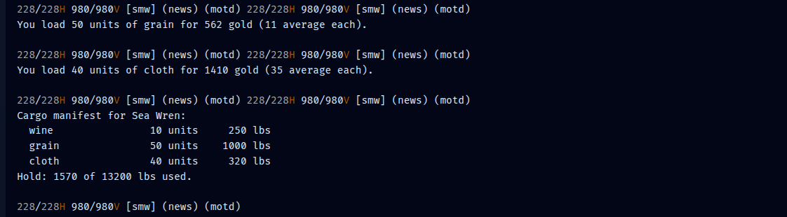

*`cargobuy grain 50` ("You load 50 units of grain for 562 gold (11 average each)."),
`cargobuy cloth 40`, then `cargomanifest`: each lot with its units and weight, and the hold's
use.*

`cargosell <goods> <units|all>` sells. Profit comes from the difference between ports: two
nearby ports with the same supply price alike, so buying in one and selling in the other loses
money. Look for a port where your goods are scarce.

Some things change the price you are paid. Merchants pay a tenth less to a hull under neutral
colors and four tenths less to a warship, and a tenth more to a seller with the Seadog feat.
Neutral colors cannot be taken down (`shipequip sell colors`) while cargo is aboard ("Her neutral
colors stay up while she has cargo aboard.").

### Freight contracts

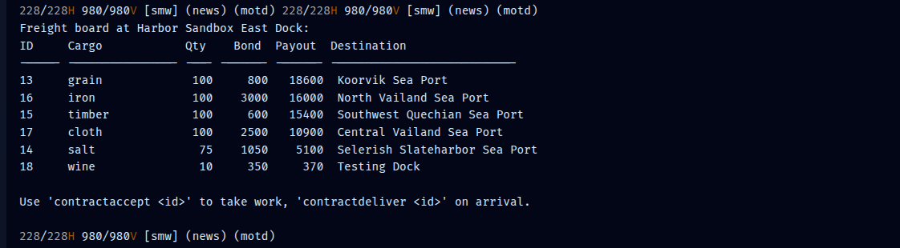

*`contracts` at the east pier: each job's ID, cargo, quantity, the bond the shipper asks, the
payout, and the destination. Your active contracts, if any, are listed below the board.*

`contractaccept <id>` posts the bond and loads the freight:

```text
Contract 24 accepted: you post a 350-gold bond, 10 units are loaded, and 370 gold is paid on
delivery to Harbor Sandbox East Dock.
```

The bond is the goods' worth, and the payout repays it. Without the gold the shipper says so
("The shipper asks a 140-gold bond for that freight; you have 100."). Sail to the destination
and `contractdeliver <id>`:

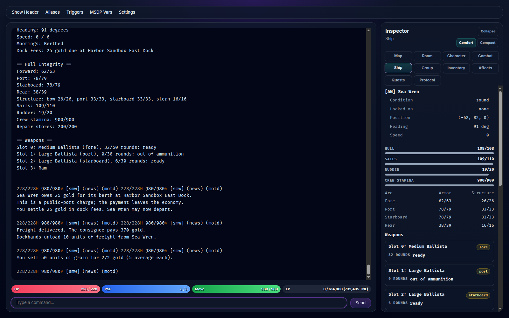

*`contractdeliver 24` and `cargosell grain all` at the east pier: "Freight delivered. The
consignee pays 370 gold." "Dockhands unload 10 units of freight from Sea Wren." "You sell 50
units of grain for 272 gold (5 average each)."*

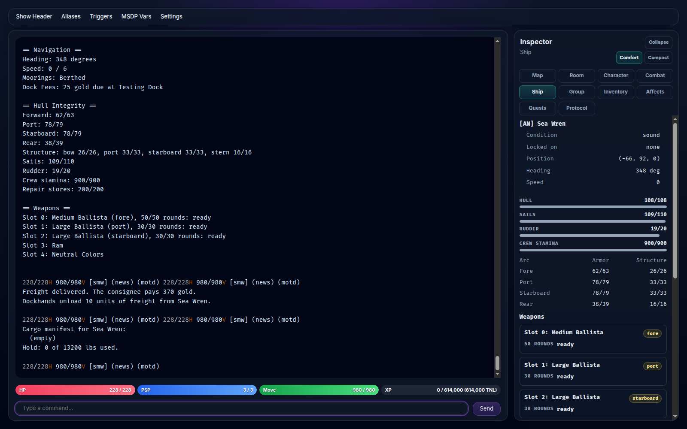

*A delivery at the Testing Dock pays 370 gold and empties the hold; the berthing fee shown is
still owed, due before she leaves.*

`contractabandon <id>`, anywhere, gives a job up: "You abandon contract 14. The freight your bond
paid for remains in your hold." The job goes back on the board until the board next refreshes
(hourly, when it is read). The short hauls between nearby ports pay little over the bond; the
long hauls, 100 units to a distant port for payouts of 10,000 gold and more, are where freight
pays.

## 8. Gunnery

Fight in deep water. At battle stations no harbor admits her, the crew keeps her out of water too
shallow for her draft, and a hull run at the shallows or the shore may go aground (see
[Damage, repair and salvage](#9-damage-repair-and-salvage)). The owner, a captain on a helm permit
and the owner's group may work the guns from anywhere aboard; anyone aboard may read `shipsight`
and `shipscan`.

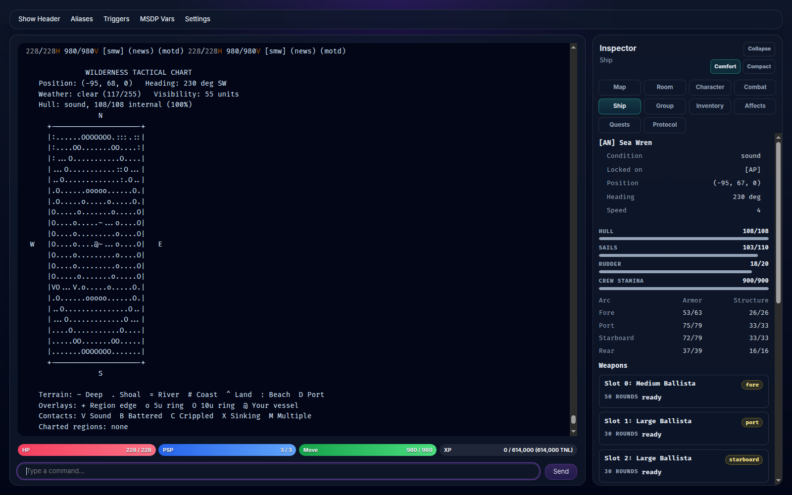

*`tactical` after `shiplock AP`: two corsair raiders (`V`) close in from the west, and the Ship
tab shows the lock on AP.*

1. Find the target in `contacts`: "AP Corsair Clipper 40.1 u 259 deg W fore" is 40.1 rooms off,
   bearing 259, west, off the bow.
2. `shiplock <contact>` locks the guns and calls battle stations: "The guns lock onto [AP]
   Corsair Clipper. The crew scrambles to battle stations!"
3. `shipsight [slot]` gives each weapon's chance to hit (or one weapon's), or why it cannot fire:
   "Corsair Clipper is outside the Medium Ballista's 0-10 room band (20.8)." or "The port Large
   Ballista cannot bear - Corsair Clipper lies off your fore arc."
4. `shipfire <arc|slot> [contact]` fires every weapon on that arc that bears, or the one weapon in
   that slot, at the locked contact (naming a contact locks onto it first):

```text
The guns lock onto [AO] Corsair Ketch.
The port Large Ballista FIRES at Corsair Ketch! Chance to hit: 95%
Direct hit on Corsair Ketch!
You hit [AO] Corsair Ketch for 6 points on the stern!
```

When none can, you are told so: "No weapon on the starboard arc can fire at Corsair Ketch now. See
'shipsight'." Each shot spends a round, and each weapon then reloads ("The port Large Ballista is
reloaded and ready."). Your hull cannot fire in port, at anchor, submerged, while she goes down,
with her crew stunned, or for about 25 seconds after she rams.

Hits land on the side facing the shooter, so keep the target on a beam, where the heaviest
battery is: the Large Ballistas on port and starboard did the work here. A hit through the armor
can damage a weapon mounted on that side ("You damage the rear Small Ballista aboard Corsair
Ketch!").

`shipscan <contact>` reads another hull:

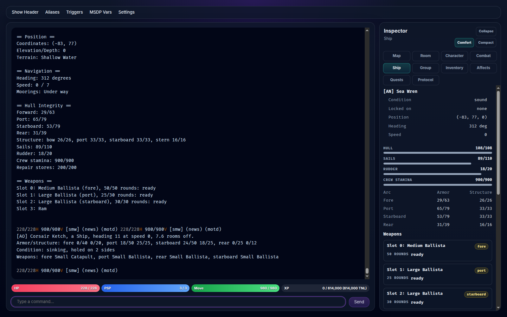

*`shipscan AO`: "[AO] Corsair Ketch, a Ship, heading 11 at speed 0, 7.6 rooms off.
Armor/structure: fore 0/40 0/20, port 18/50 25/25, starboard 24/50 18/25, rear 0/25 0/12.
Condition: sinking, holed on 2 sides." and her weapons by arc.*

### Ramming

Locked on and at speed 6 or more, `shipram` braces the crew to ram: "The crew braces to ram [AO]
Corsair Ketch!" She rams when the target comes within a room, inside a 120-degree cone off her bow
and at her height, while she still makes more than speed 3. Both hulls take crash damage; a ram
(`shipequip buy ram`) strikes first and halves the damage to her own bow. A rammer as heavy as her
target or heavier slews it about and both slow to speed 3; a lighter rammer is ordered to stop.
Every ram knocks people down aboard both hulls unless they make a Reflex save (DC 15), and so does
one hit in nine that gets past the armor; a mind blast fired from inside the middle of its range
knocks the crew down on a failed Will save (DC 15). Stand up (`stand`) before your next order.

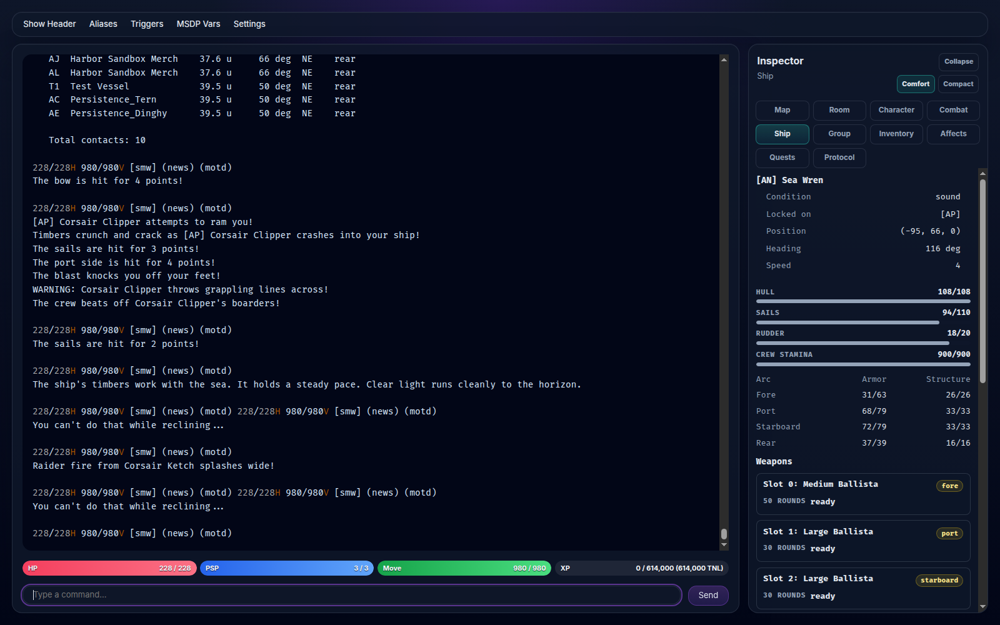

*Rammed by a raider: "[AP] Corsair Clipper attempts to ram you! Timbers crunch and crack as [AP]
Corsair Clipper crashes into your ship! The sails are hit for 3 points! The port side is hit for
4 points! The blast knocks you off your feet!" and, until you stand, "You can't do that while
reclining..."*

### Raiders

Corsair raiders hunt ships at sea, often in pairs. They close fast, ram, throw grappling lines
("WARNING: Corsair Ketch throws grappling lines across!") and try to board, in the same two
contests a player boards by. Beaten off, they withdraw ("The crew beats off Corsair Ketch's
boarders!"); winning, they swarm aboard and carry off cargo. Their fire splashes wide or finds you
("The bow is hit for 4 points!").

`shiplock off` stands the guns down: "The guns come off their target; the crew stands down in 180
seconds."

## 9. Damage, repair and salvage

A hull has armor and, under it, structure on each of four sides (fore, port, starboard, rear),
plus sails and a rudder. Hits land on the side facing the shooter, on the sails, and through the
armor into structure and the weapons mounted there.

- A side with neither armor nor structure left is holed. One holed side leaves her dead in the water
  (a hull aloft keeps half her speed); two set her sinking. `shipscan` and `tactical` show it
  ("Condition: sinking, holed on 2 sides"; `X` on the chart), and any holed hull reads at least
  crippled.
- A stern full of hits fouls her rudder, and she cannot turn.
- A sinking player's hull goes down in 75 to 150 seconds; an unowned hull takes 17 to 25 minutes,
  time enough to board and plunder her. `shipstatus` counts it down ("SINKING: she goes down in
  about 77 seconds.").
- A sunk hull leaves wreckage ("The shattered wreckage of Corsair Ketch floats here."), and half
  of each cargo lot floats free in salvage crates for about half an hour.
- At battle stations, a hull run at the shallows or the shore may go aground. The crew fights to
  keep her off ("The crew fights to keep her off!") and often fails, the more so the faster she
  goes; a stunned crew cannot try. "CRUNCH! Sea Wren runs hard aground!" brings several hits, the
  first on the bow.

### Repairs at sea

At sea the crew mends her on its own from her repair stores (200 on a ship): structure, sails,
rudder and damaged weapons, up to a limit her bosun raises. Without a bosun they mend structure to
a tenth and sails and rudder to two fifths; each tier of bosun adds 15 points to both (a green
bosun: a quarter and 55%), never past 90%. They work far faster at anchor; under way they cannot
patch a holed side or shot-away sails. `shiprepair` at sea is your own patch: one point, on a Craft
(woodworking) check against DC 15, for two combat rounds. Armor is made good only at a shipyard:

```text
Nothing aboard needs a patch the stores can make at sea; armor, and the rest of her, are made
good only at a shipyard.
```

### Repairs at a shipyard

Berthed at a dock, the owner buys the shipwrights' work. `shiprepair` alone gives their quote:

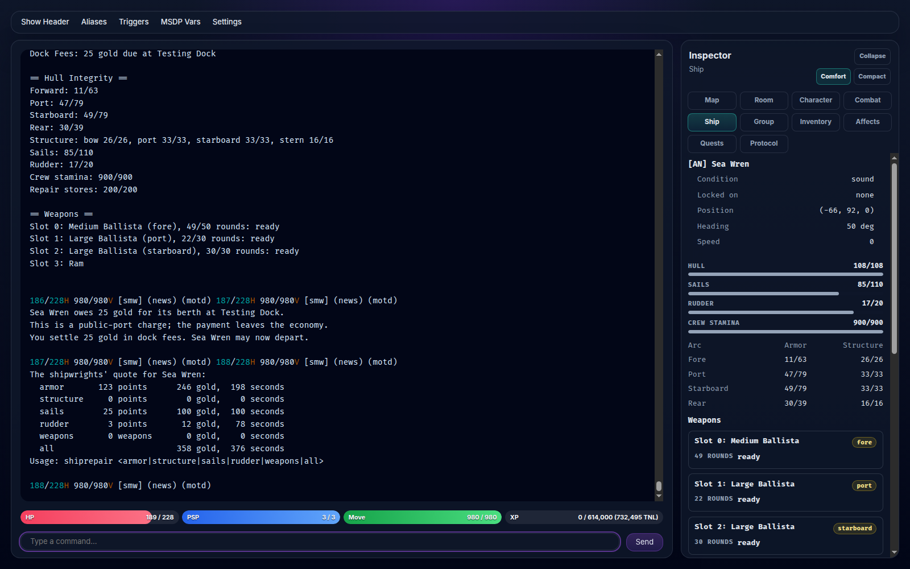

*`shiprepair` berthed at the Testing Dock after a fight: armor 123 points for 246 gold and 198
seconds, sails 25 points for 100 gold, rudder 3 points for 12 gold, all of it 358 gold and 376
seconds.*

Armor and structure cost 2 gold a point, sails and rudder 4; a damaged weapon costs 2 gold a point
of damage and a destroyed one half its price. Each order takes 75 seconds plus a second a point
(a weapon 75 seconds, a destroyed one 150). `shiprepair <armor|structure|sails|rudder|weapons|all>`
pays and the work is done at once ("You pay 358 gold. The shipwrights set to work on ..."); the
time only keeps her at the berth, and `shipstatus` counts it down.

### Salvage

`shipsalvage`, at the helm with your hull stopped on the wreck, hauls the floating crates aboard:
"The crew hauls 50 units of floating salvage into the hold."

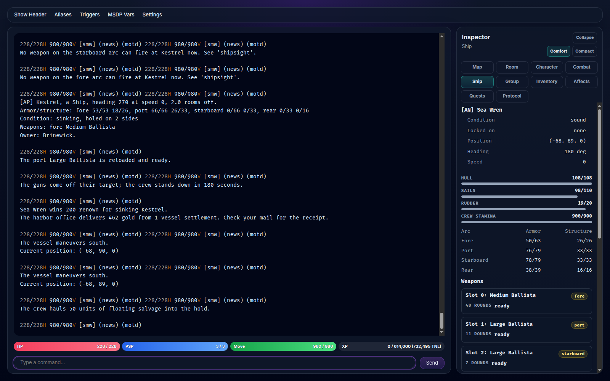

*`setsail` onto the wreck, then `shipsalvage`.*

## 10. Boarding and taking a prize

A hull is a prize when she is holed, cannot move, has struck her colors, or is abandoned at sea
with nobody conscious aboard. A sinking hull cannot be claimed ("Corsair Ketch is going down -
there is nothing left to claim."), and a raider never can be.

### Claiming an abandoned hull

Board her and, on her bridge, `claimship`:

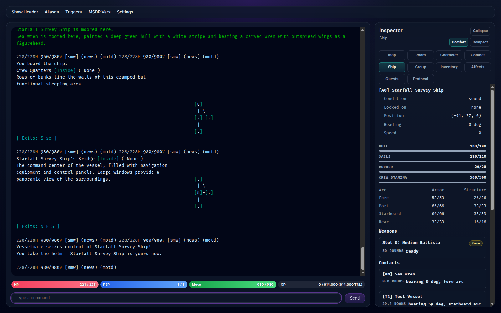

*`claimship` on an abandoned Starfall Survey Ship: "Vesselmate seizes control of Starfall Survey
Ship! You take the helm - Starfall Survey Ship is yours now." She bears her design's name, so
christening her is free.*

### Boarding a defended hull

`board_hostile <vessel>` crosses from a deck to a hull within two rooms, neither of them docked,
moving at speed 3 or less or beaten; name her by contact ID or a word of her name. Two contests
decide it, the grapple and the crossing: each is your Boarding skill plus a d20 against the best
defender's Boarding plus a d20 plus the hull's modifier (her class, her damage, her speed and her
crew), ties to the defender.

```text
Grapple contest: Boarding 4 + d20 19 = 23; the corsair captain Boarding 9 + d20 11 + vessel
modifier (+0) = 20. SUCCESS
Your grappling lines bite home; you commit to the crossing!
```

A failed crossing drives you back ("The defenders drive you back and the grappling lines are
cut!"). On a natural 1, or a loss by 10 or more, the line throws you into the sea, where you must
swim ("Swimming: Athletics Skill (4) + d20 roll (12) = Total (16) vs. DC (15)") and come up
beside your own hull; `board` climbs back aboard. An empty hull still resists with her own
modifier and a d20 ("Your grappling lines fail to take hold.").

Boarding is a class ability you train in the `study` menu (0 Skills, then type `boarding` once
a rank). Once across you fight her crew: a tier-0 Corsair Ketch carries a level-12 captain and
four level-8 deckhands, some of them casters. Wear your armor and bring friends.

With her crew beaten, the raider's captain carries a brass key; the strongbox it opens is lashed
in her hold:

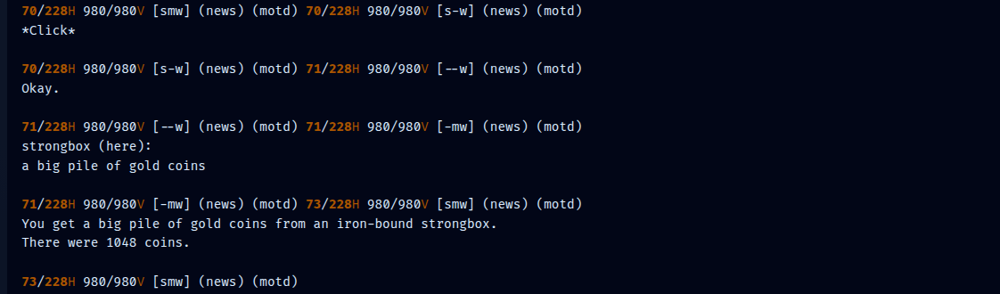

*`unlock chest`, `open chest`, `look in chest`, `get all chest` in the raider's hold: "*Click*"
... "You get a big pile of gold coins from an iron-bound strongbox. There were 1048 coins."*

`plunder` on a beaten prize's bridge, with nobody else awake there and your own hull docked to her
or within two rooms ("You need your own ship alongside to carry off the cargo."), moves her cargo
into your hold. When nothing moves you are told why: her hold is empty ("Corsair Ketch's hold is
empty: there is nothing to take."), or yours has no room. Plunder is piracy (see
[Two captains](#11-two-captains)).

## 11. Two captains

### Permits and deeds

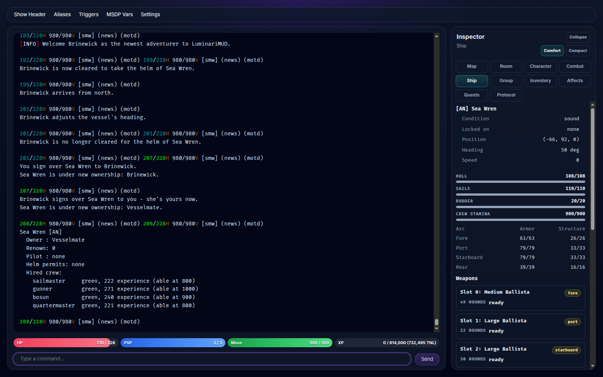

*`shippermit brinewick`, `shiprevoke brinewick`, `shipdeed brinewick`: "Brinewick is now cleared to
take the helm of Sea Wren." "...no longer cleared for the helm of Sea Wren." "You sign over Sea
Wren to Brinewick." Everyone aboard hears "Sea Wren is under new ownership: Brinewick."*

A permit lets another captain take your helm: heading, speed and the rest ("Brinewick adjusts the
vessel's heading."). Revoked, they are told "You must be at an authorized helm to set heading."
`shipdeed <player>` gives her away for good; both captains must stand in the same room aboard her,
and the receiver must be under the ownership cap. An unowned hull with no pilot answers to anyone at
her helm.

### Fighting another captain

Ship-to-ship combat between players needs both to consent: `pvp` turns the flag on ("PvP flag
enabled. You are now eligible for player vs. player combat."), and it cannot be turned off for 15
minutes.

Firing on, boarding or claiming a groupmate's hull costs the aggressor the group, as attacking
them in person does: a shot that clears range, arc and consent leaves the shooter's group
("[Group] Vesselmate has left the group."). A shot that cannot bear records nothing.

A captain who yields strikes her colors with `strikecolors` (the owner or a permit holder, aboard
a stopped hull): "Brinewick strikes Kestrel's colors: she yields. They fly again when she gets
under way or in ten minutes." A hull under struck colors is a prize.

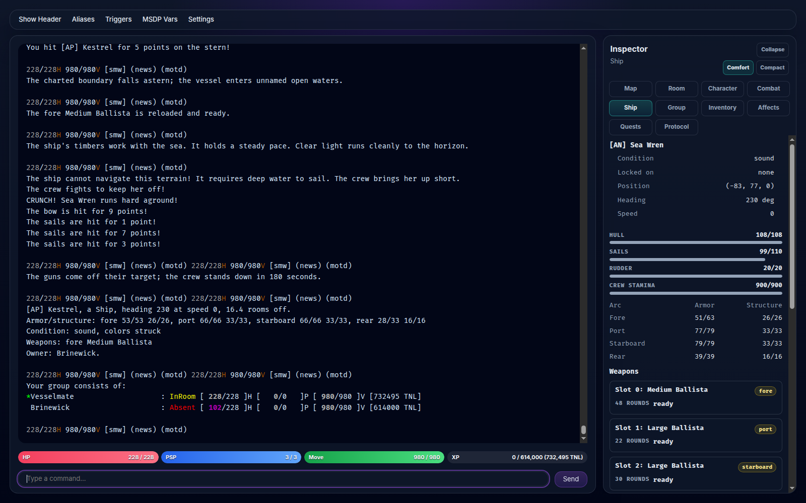

*`shipscan AP` after the Kestrel's captain struck her colors: "Condition: sound, colors struck".
The same screen shows the Sea Wren, at battle stations, running aground in the shallows.*

Fighting tips from the duel:

- One holed side cannot sink her. Maneuver (`setsail`) to bring a second side under your guns.
- Two hulls on the same spot (range 0.0) cannot fire at each other unless a weapon faces north,
  since at range 0 the bearing is taken as north. Keep a room or two apart.

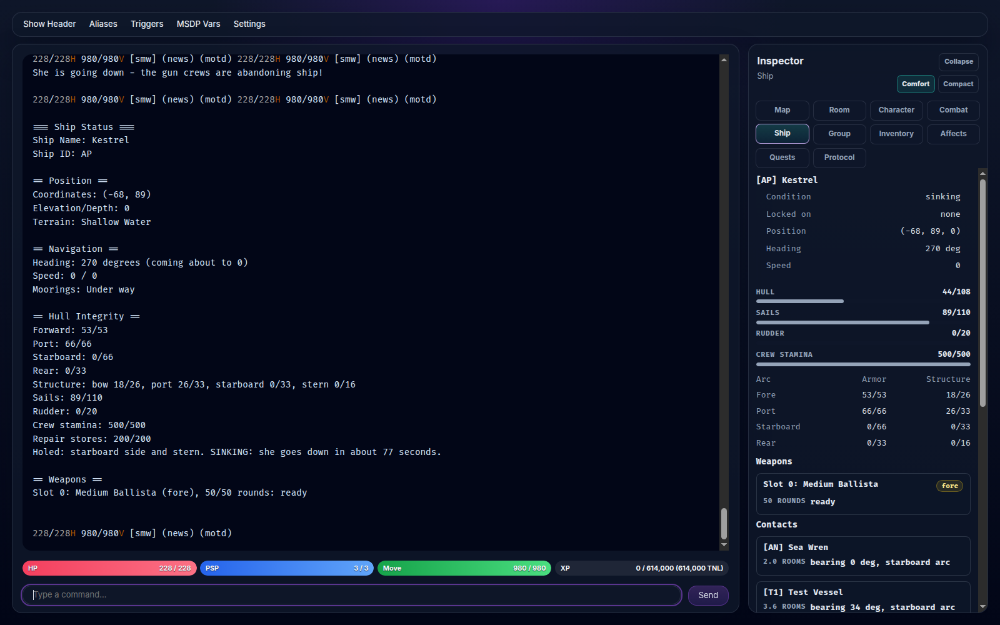

*The Kestrel's captain, `shipstatus`: "Holed: starboard side and stern. SINKING: she goes down in
about 77 seconds."*

### Renown and prize money

When your hull sinks another, the prize court pays: the salvage value of what is left of her, 2.5
gold a point of her renown if she had more than 100, and the bounty on her captain if they were
aboard and wanted. Sinking a player's hull also wins renown: her hull weight (200 for a ship),
which she loses (never below 0).

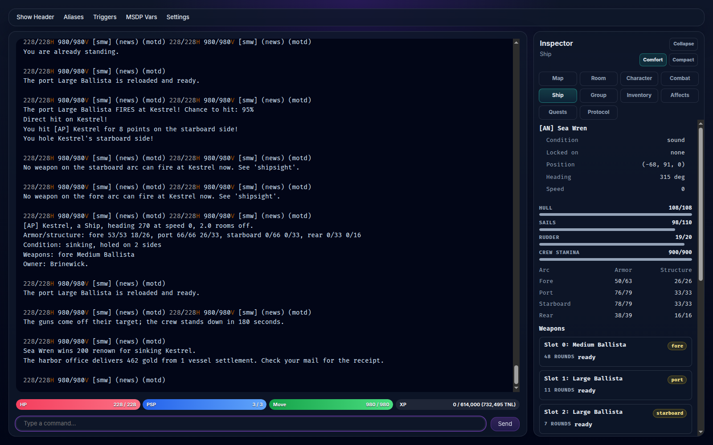

*"Sea Wren wins 200 renown for sinking Kestrel." "The harbor office delivers 462 gold from 1
vessel settlement. Check your mail for the receipt."*

The gold goes into your purse (at your next login if you are away), and a letter brings the receipt.
Allies share the prize and the renown equally: hulls in sight and out of port whose owners are
online and grouped with yours. `shiprenown` is the board of the most renowned hulls ("1. Sea Wren
Ship Vesselmate 200 renown"). Renown opens able and veteran crew, capital weapons and contraband.

### Bounties and letters of marque

Sinking a consenting captain's ship is not piracy. Plunder is: each unit taken adds to your
bounty, 15 gold a unit by ordinary maritime law, more or less where a regional law rules, nothing
in waters that waive it. Sinking or seizing an NPC merchant posts at least 510. At 500 gold you
are WANTED, and lawful ports refuse you all business; at 2,000 you are HUNTED, and
the navy sends warships after you (see [The living world](#15-the-living-world)). A bounty holds
for a day after your last offense, then fades by a twentieth a day.

`bounty` shows yours ("You carry no price."), `bounty <player>` another's. `bounty pay` clears
yours for 125% of it at a lawful port's admiralty office. `marque` buys a letter of marque there,
good for a day: "You pay 2000 gold. The admiralty commissions you as a privateer - prizes taken
now are lawful." Plunder under a letter adds no bounty, but the admiralty does not commission a
captain who is already wanted. Both are done ashore, on a port's dock ("Letters of marque are
issued ashore, at a port's admiralty office.").

## 12. Contraband and customs

Some ports deal in goods the law forbids: forbidden tomes, rare poisons and dragon eggs. `market`
marks them. The port that stocks a good lists it ("forbidden tomes 4 190 161 steady
(contraband)"); every other port reads "- 248 none (contraband)": not for sale there, but it pays
the scarce price.

A smuggling port sells its contraband only to a hull of enough renown (150 for tomes, 200 for
poisons, 250 for dragon eggs in this world) or one with an able sailmaster and quartermaster, and
never to a warship or a buyer of perfect virtue.

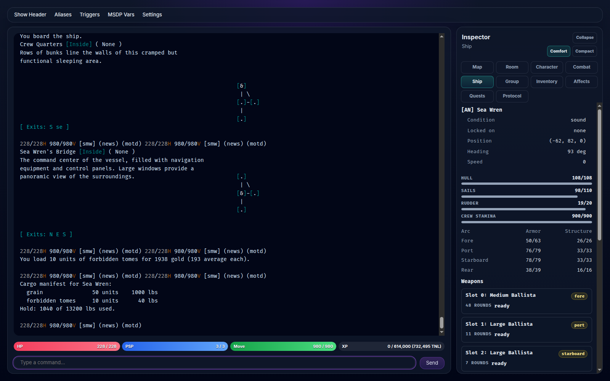

*`cargobuy forbidden 10` (or `cargobuy tomes 10`), `cargomanifest`: "You load 10 units of
forbidden tomes for 1938 gold (193 average each)." beside 50 units of grain.*

Every lawful port searches a player's hull as she comes in. Each unit of contraband the port does
not stock is seized with a chance of 35% plus half a percent a unit, less a fifth of the square
root of her renown, raised the emptier her hold is, and never under 5%:

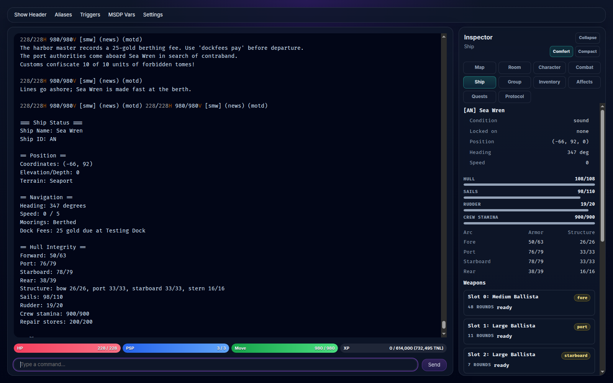

*Making port at the Testing Dock: "The port authorities come aboard Sea Wren in search of
contraband." "Customs confiscate 10 of 10 units of forbidden tomes!"*

Fill the hold with honest cargo first: ten tomes among 50 grain in a 13,200-pound hold were all
taken.

## 13. Loss and recovery

When a player's hull sinks, everyone aboard is thrown into the sea, half of each cargo lot floats
free, and the harbor office pays her insurance:

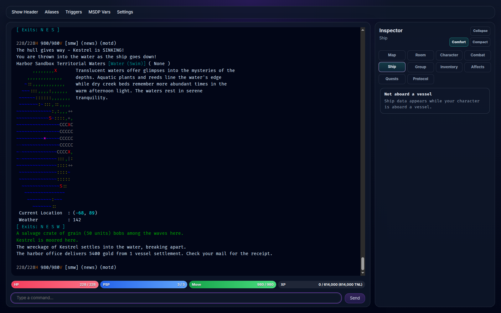

*"The hull gives way - Kestrel is SINKING!" ... "You are thrown into the water as the ship goes
down!" "A salvage crate of grain (50 units) bobs among the waves here." "The wreckage of Kestrel
settles into the water, breaking apart." "The harbor office delivers 5400 gold from 1 vessel
settlement."*

Insurance is automatic: three quarters of her value for a boat, ship or transport, half for a
warship, airship, submarine or magical hull, and nothing for a raft. If an NPC sank her, any
insured hull pays 90%. A hull rebuilt from a wreck is not insured. The gold goes into your purse,
at once or at your next login, with a receipt by mail.

The ship is not gone. She goes into the wreck registry, keeping her name and fleet slot, rebuilt
as the cheapest boat the shipyard sells, stripped. At a dock, `shipsummon` lists your hulls that
can be sent for, and `shipsummon <n>` sends for one:

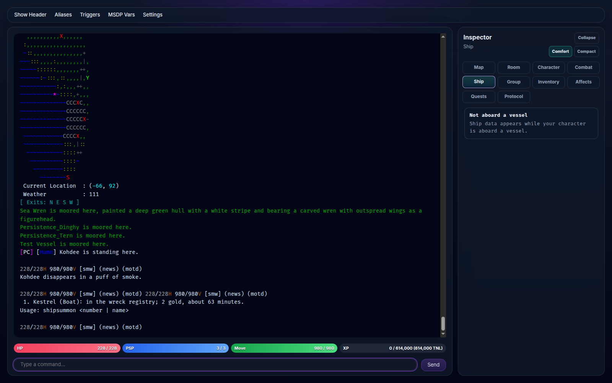

*`shipsummon`: " 1. Kestrel (Boat): in the wreck registry; 2 gold, about 63 minutes."*

`shipsummon 1` pays: "You pay 2 gold. Word goes out to Kestrel; she should make port here in about
63 minutes." A hull summoned from afloat puts everyone aboard over the side and empties her hold
as she goes; none is summoned at battle stations.

When she makes port the harbor sends word to her owner, wherever they are. A rebuilt wreck usually
comes back with no sails, so she cannot sail until a shipyard repairs them; to turn her back into
a real ship, trade her in at a dock: `shipbuy <id> trade`.

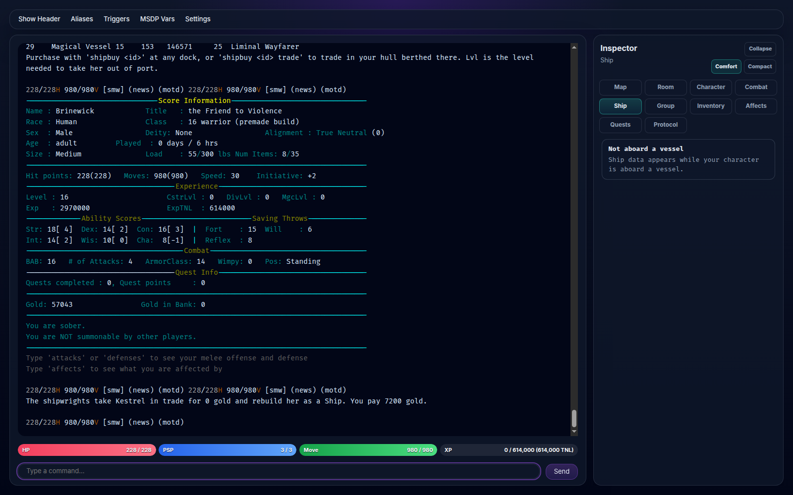

*`shipbuy 26 trade`: "The shipwrights take Kestrel in trade for 0 gold and rebuild her as a Ship.
You pay 7200 gold." She keeps her name, slot, crew and contact ID.*

A wreck is worth nothing in trade; any other hull is credited 90% of her value.

The ownership cap counts every hull you hold:

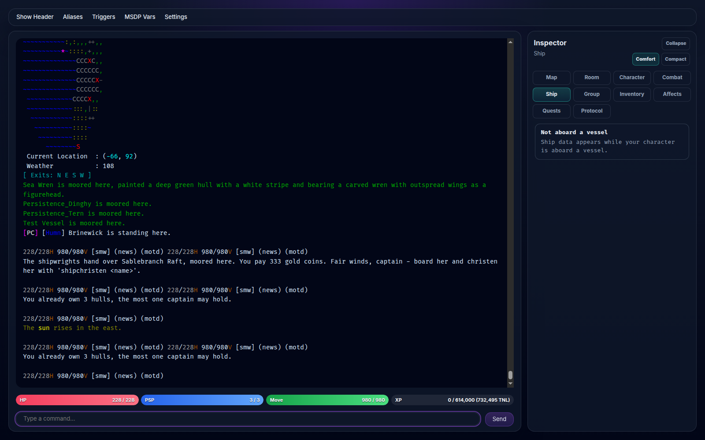

*With the Sea Wren, the Gull Prize and a new raft: "You already own 3 hulls, the most one captain
may hold."*

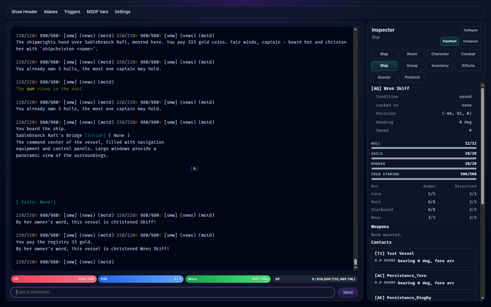

*Christening the new raft is free ("By her owner's word, this vessel is christened Skiff!");
renaming her costs a tenth of her price: "You pay the registry 33 gold." "...christened Wren
Skiff!"*

## 14. Other hulls and vehicles

Each class goes where its hull can. The helm commands are the same; airships, submarines and
magical hulls add `setsail up` and `setsail down`, ten units at a time, five seconds apart.

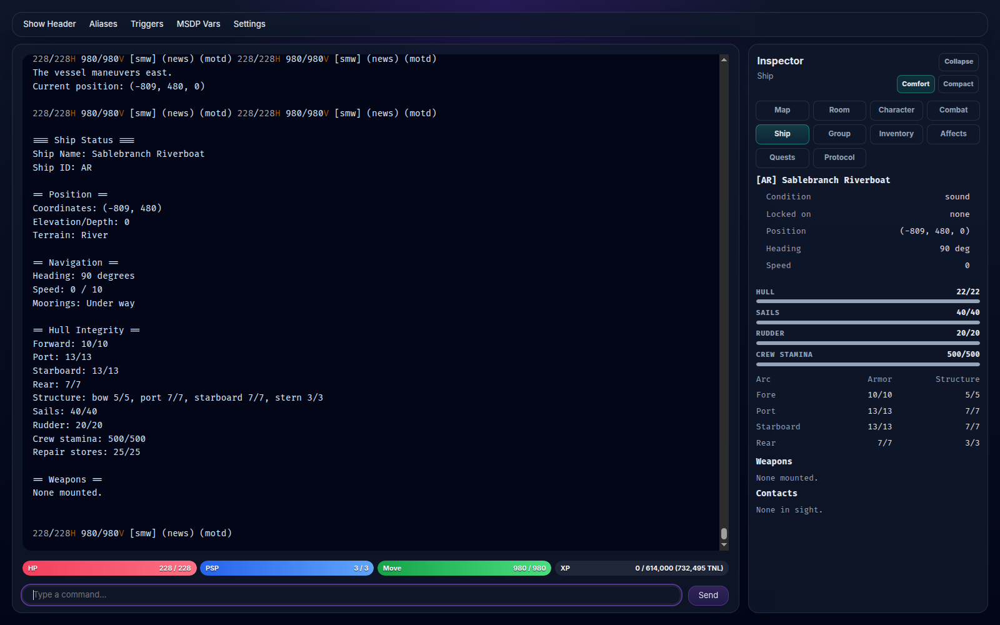

*The Sablebranch Riverboat on a river: `shipstatus` reads "Terrain: River".*

A boat keeps off the open ocean and the land: rivers, shallows, marsh and beach water are hers.
Steered onto the bank: "Your boat cannot go there! She keeps to rivers and shallow coastal
water."

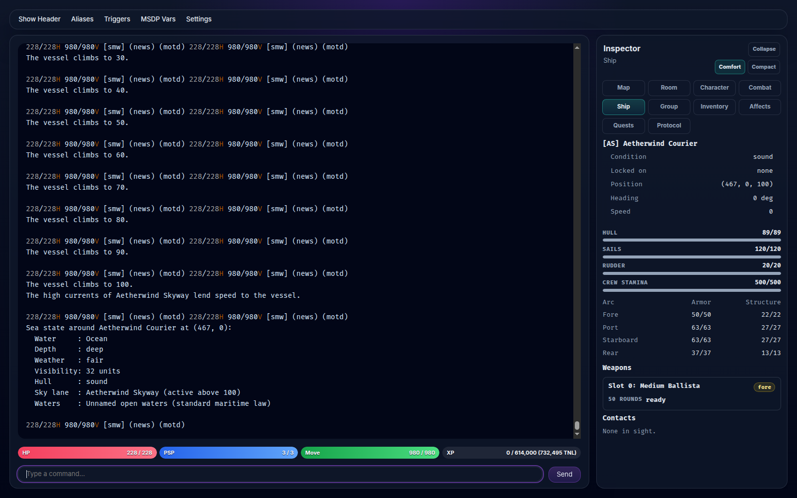

*The Aetherwind Courier after ten `setsail up` to altitude 100: "The vessel climbs to 100." "The
high currents of Aetherwind Skyway lend speed to the vessel." `seastate`: "Sky lane : Aetherwind
Skyway (active above 100)".*

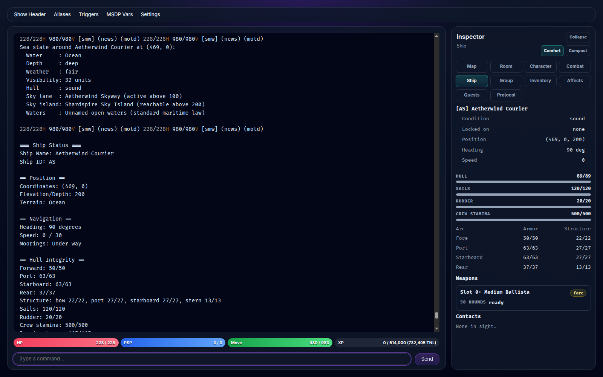

*At 200: `seastate` reads "Sky island: Shardspire Sky Island (reachable above 200)" and
`shipstatus` "Elevation/Depth: 200".*

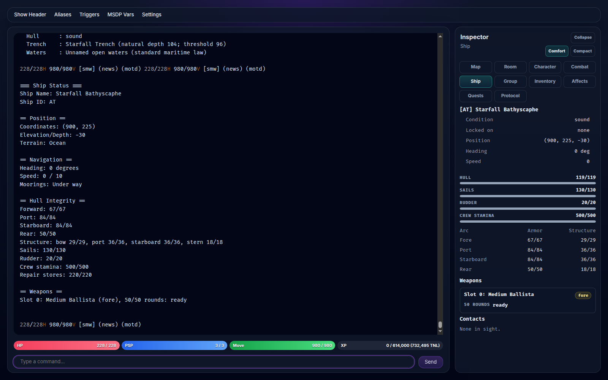

*The Starfall Bathyscaphe after three `setsail down`, each "The vessel descends ...":
`shipstatus` reads "Elevation/Depth: -30", over the Starfall Trench.*

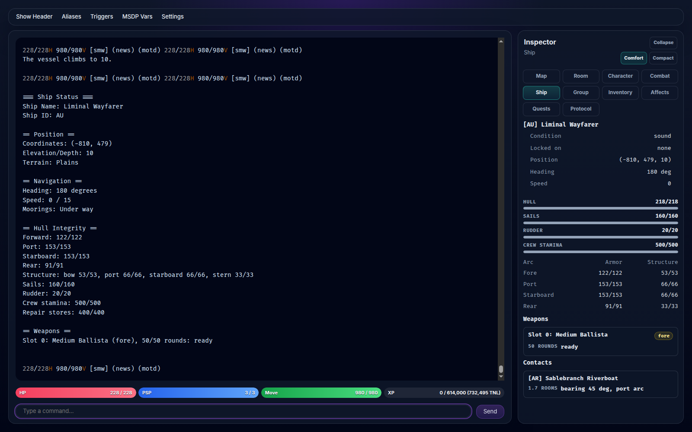

*The Liminal Wayfarer goes over land and water, under rivers and into the air: here she climbs to
10 over the plains ("Terrain: Plains", "Elevation/Depth: 10").*

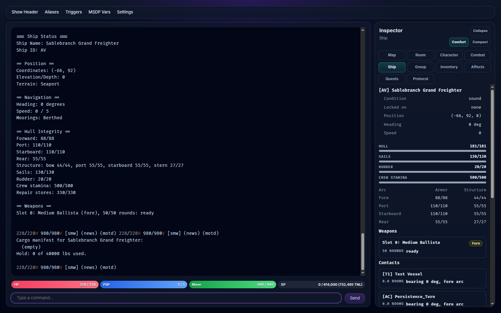

*The Sablebranch Grand Freighter, a transport: slow ("Speed: 0 / 5" in port) with a big hold
("Hold: 0 of 40000 lbs used.").*

### Vehicles

Carts, wagons, carriages and mounts travel the land. `look` lists them in the room:

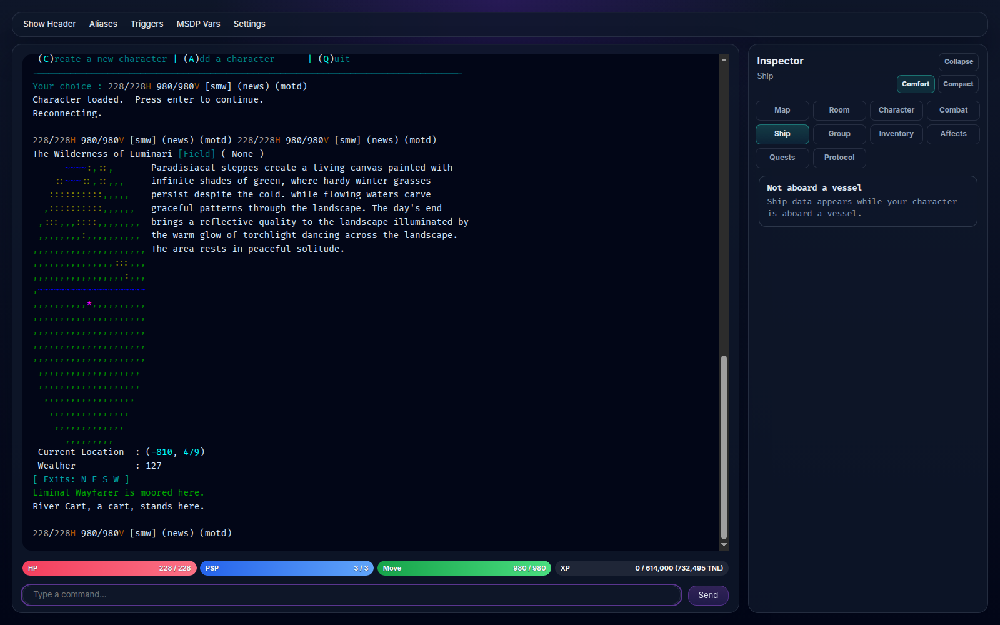

*"River Cart, a cart, stands here."*

- `vstatus` beside one: type, speed, passengers ("0 / 2" for a cart), cargo ("0 / 500 lbs"),
  condition.
- `vmount <vehicle>` climbs aboard ("You climb onto River Cart."), `drive <direction>` drives it
  ("You drive the cart west."), `vdismount` gets off.
- The transport commands: `tstatus` reads any vehicle or vessel; `tenter [vehicle]`,
  `tgo <direction>` (the same as `drive`, carrying the riders) and `texit` are for vehicles, and
  on a vessel point you to `board`, `heading` and `speed`, and `disembark`.

| Vehicle | Passengers | Cargo | Goes on |
| -- | -: | -: | -- |
| cart | 2 | 500 lbs | roads and plains |
| wagon | 6 | 2,000 lbs | roads and plains |
| carriage | 4 | 800 lbs | roads |
| mount | 1 | 200 lbs | roads, plains, forest and hills |

No vehicle crosses water, but a hull can carry one. From aboard a stopped hull at the surface,
`loadvehicle <vehicle>` loads a sound vehicle beside her with nobody riding it, if her vehicle
room (her hold's capacity, less the vehicles already aboard) takes its cargo rating and load (a
raft cannot take a cart; no hull takes more than ten). `unloadvehicle` lists
what she carries, and `unloadvehicle <number>` unloads one where the ground suits it ("The terrain
here is not suitable for River Cart." on a river).

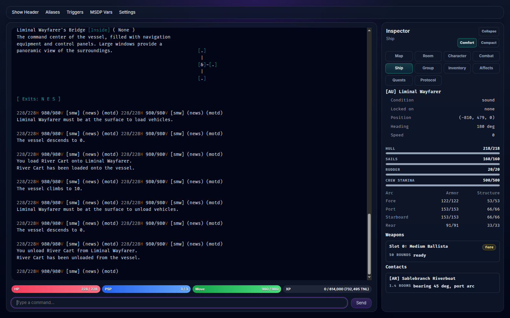

*Aboard the Wayfarer: aloft, "Liminal Wayfarer must be at the surface to unload vehicles."; down
at 0, "You unload River Cart from Liminal Wayfarer."*

## 15. The living world

### Events

Staff run vessel events: regattas, ghost fleets and team skirmishes, one at a time. `vevent status`
shows the event, `vevent join` (`vevent join red` or `blue` in a skirmish, which needs a team)
enters the hull you are at the helm of, and `vevent leaderboard [regatta|skirmish|ghost]` shows the
standings.

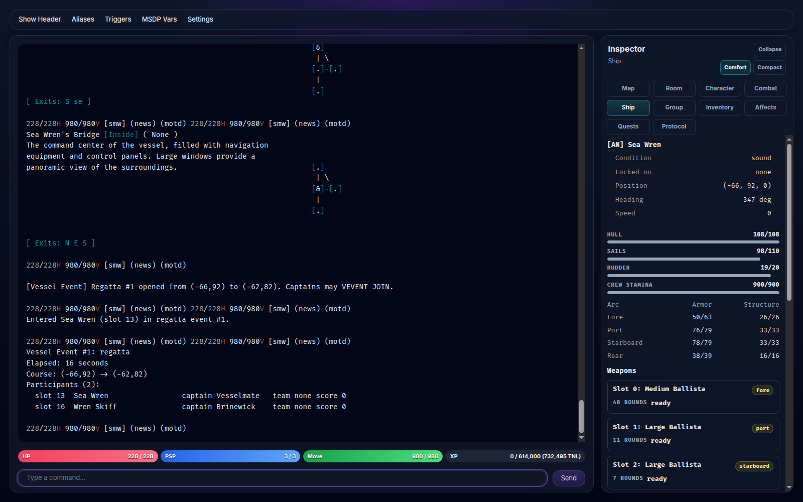

*Two captains entered in a regatta: "Course: (-66,92) -> (-62,82)" and the entrants. Entries begin
at the course's start. (The roster now names each hull by her contact ID, such as [AN], where
this screenshot shows an older fleet-slot number.)*

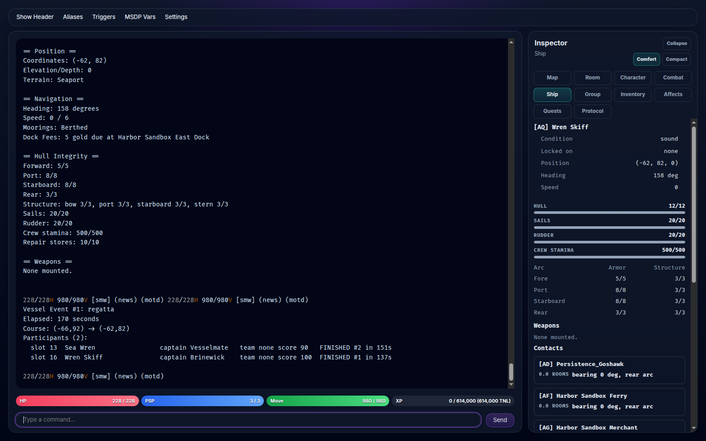

*"FINISHED #1 in 137s" and "FINISHED #2 in 151s". Times run from the moment the regatta opened, and
the finish is the exact coordinate.*

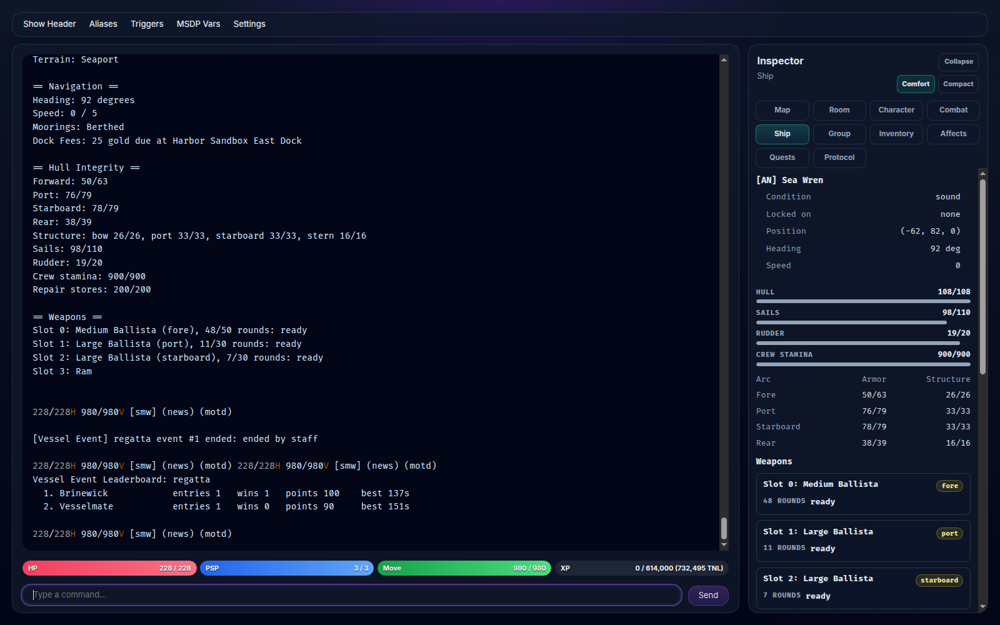

*`vevent leaderboard regatta` after the event ended: "1. Brinewick entries 1 wins 1 points 100
best 137s". Places score 100, 90, 80 and so on, never under 10.*

In a ghost fleet every hit on a ghost scores; in a skirmish every hit on the other team's hulls
does; and in both a sinking adds 100:

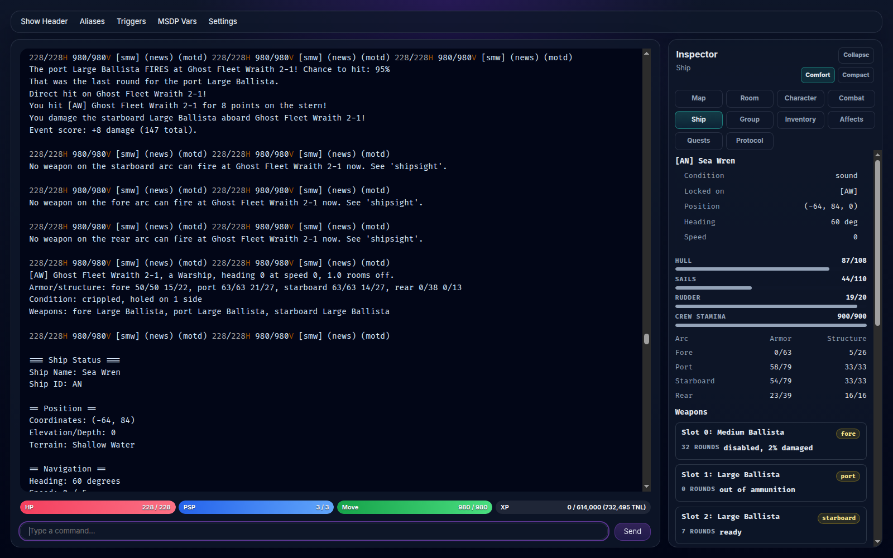

*Against "Ghost Fleet Wraith 2-1": "Event score: +8 damage (147 total)." The wraith fights back
hard.*

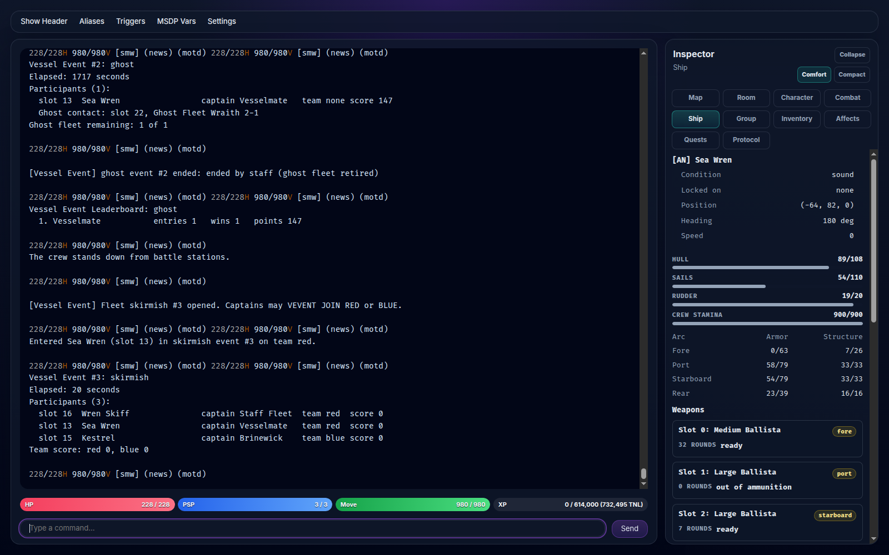

*`vevent status` in a skirmish: three entrants and "Team score: red 0, blue 0". A hull the staff
enlisted shows "Staff Fleet" as her captain.*

### The Blackwake derelict

A derelict lies at anchor in the Vailand waters, and her story is a search through her rooms.

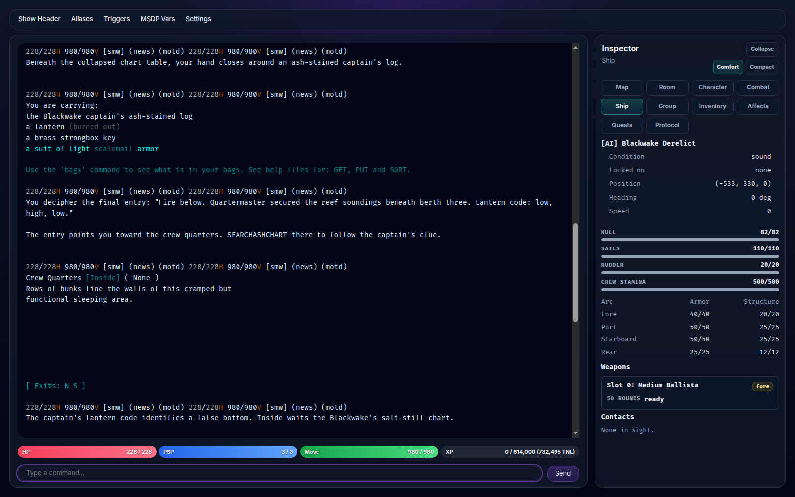

*`search` on her bridge: "Beneath the collapsed chart table, your hand closes around an
ash-stained captain's log." `readashlog` reads it and names the next search: "SEARCHASHCHART there
to follow the captain's clue."*

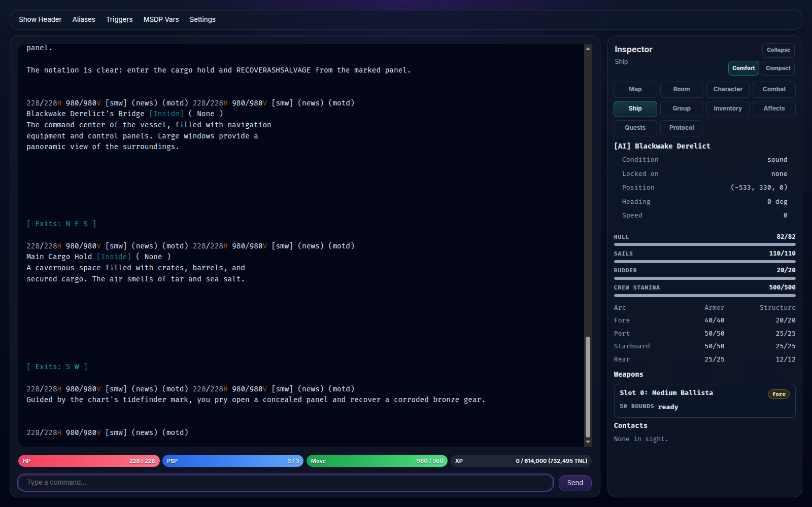

*`studyashchart` names the last step, RECOVERASHSALVAGE in the cargo hold: "you pry open a
concealed panel and recover a corroded bronze gear."*

### Bounties and hunters

A WANTED captain (a bounty of 500 gold or more) is refused all business at lawful ports:

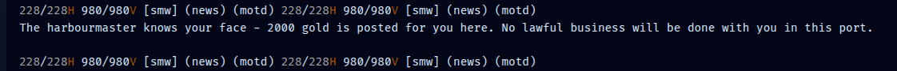

*`shipbuy 18` with a 2,000-gold bounty: "The harbourmaster knows your face - 2000 gold is posted
for you here. No lawful business will be done with you in this port."*

At 2,000 the captain is HUNTED, and in the waters the navy patrols it sends a hunter after their
hull:

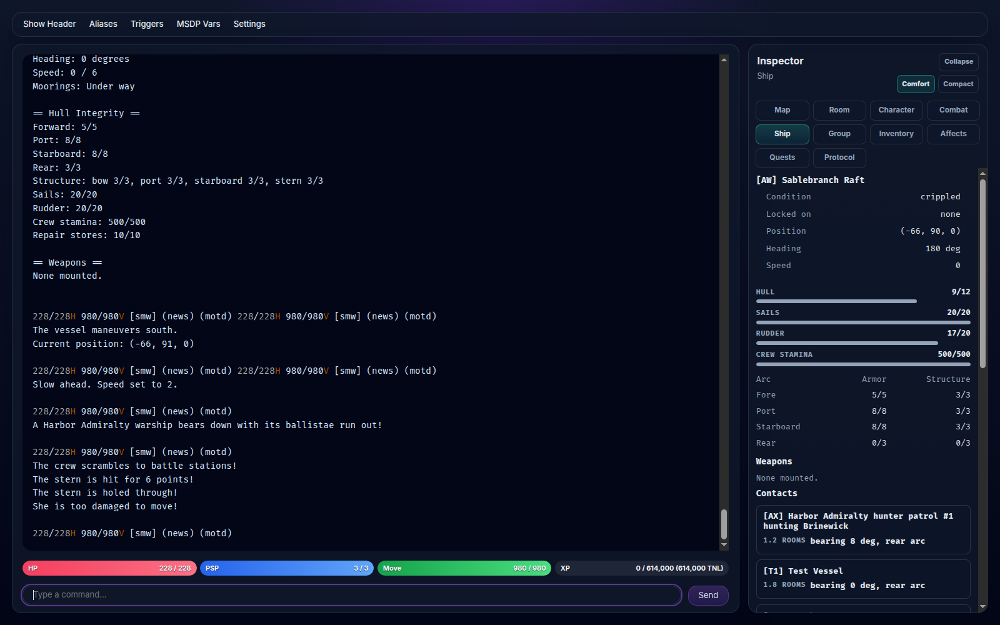

*"A Harbor Admiralty warship bears down with its ballistae run out!" Within a minute the hunter
holed the raft's stern: "She is too damaged to move!"*

`bounty` reads "You: 2000 gold on your head - HUNTED by the navy." and "A lawful port's admiralty
clears it for 2500 gold ('bounty pay')." Paying ends the hunt:

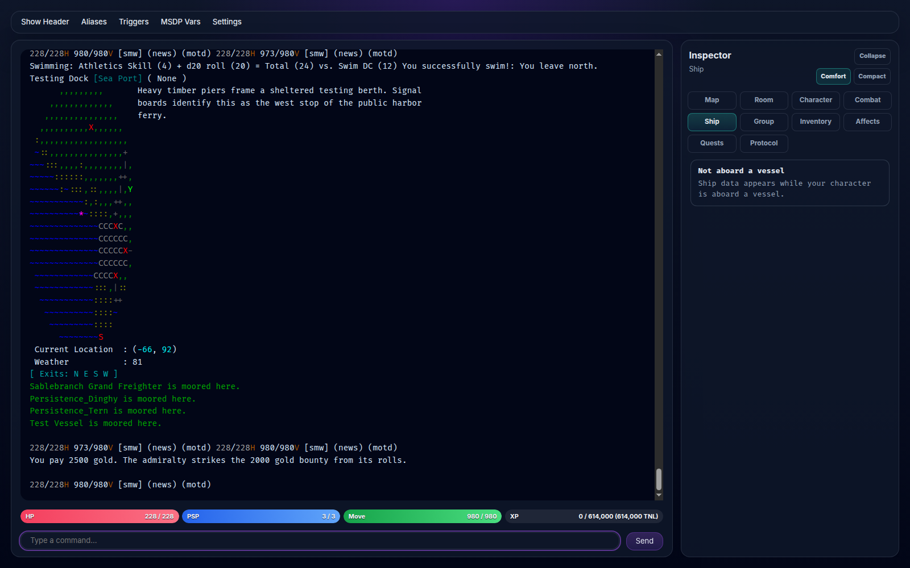

*`bounty pay` ashore on a dock: "You pay 2500 gold. The admiralty strikes the 2000 gold bounty
from its rolls." The hunter is called off within ten seconds.*

Builders also place creature encounters in particular waters, which a moving hull can meet.

## 16. Client data

Luminari Web's inspector has a Ship tab, fed by the server's vessel MSDP data. Most screenshots in
this guide show it beside the terminal.

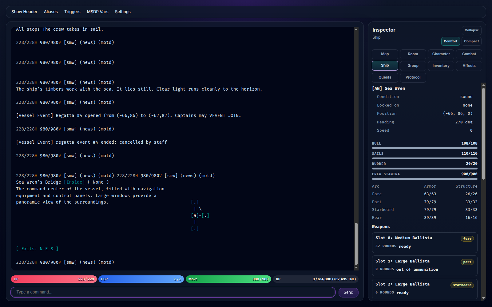

*Aboard the Sea Wren at sea: "[AN] Sea Wren", condition, locked target, position, heading and
speed; bars for hull, sails, rudder and crew stamina; armor and structure by arc; and each weapon
with its slot, arc, rounds and state ("0 ROUNDS out of ammunition" on the emptied port
ballista).*

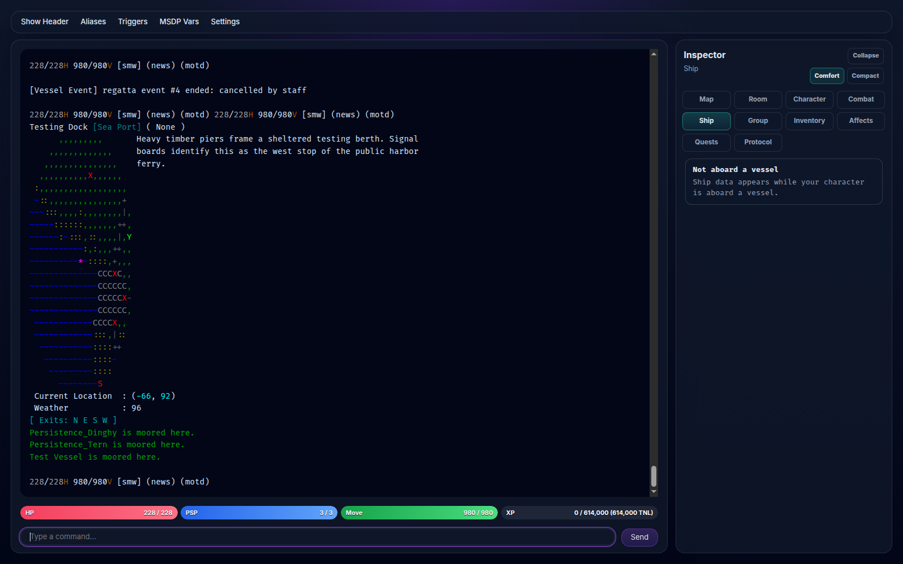

*Ashore: "Not aboard a vessel. Ship data appears while your character is aboard a vessel."*

For players who script their own client, the server sends 21 vessel MSDP variables while you are
aboard and clears them when you leave. A client must ask for them (`REPORT`); a client that
speaks GMCP but not MSDP gets the same values as JSON in the `MSDP` GMCP package.

| Variable | Value |
| -- | -- |
| `SHIP_NAME`, `SHIP_ID` | The hull's name and two-letter contact ID |
| `SHIP_X`, `SHIP_Y`, `SHIP_Z` | Position |
| `SHIP_HEADING`, `SHIP_SPEED` | Heading and speed |
| `SHIP_HULL`, `SHIP_HULL_MAX` | Structure summed over the four arcs |
| `SHIP_STATUS` | sound, battered, crippled or sinking |
| `SHIP_ARMOR`, `SHIP_INTERNAL` | Tables by arc, current and maximum |
| `SHIP_SAIL`, `SHIP_SAIL_MAX` | Sails |
| `SHIP_RUDDER`, `SHIP_RUDDER_MAX` | Rudder |
| `SHIP_STAMINA`, `SHIP_STAMINA_MAX` | Crew stamina |
| `SHIP_TARGET` | The locked contact's ID, or empty |
| `SHIP_WEAPONS` | Slot, name, arc, ammunition, ready, damage |
| `SHIP_CONTACTS` | Up to 20 nearest contacts: ID, name, range, bearing, arc |

The full protocol reference is [MSDP_VARIABLES.md](../systems/MSDP_VARIABLES.md).

## 17. Command summary

| Command | Where | Does |
| -- | -- | -- |
| `board <vessel>`, `disembark` | Beside her / aboard | Go aboard, step off |
| `shipbrowse` | Anywhere | The shipwrights' catalog |
| `shipbuy <id> [trade]` | Dock | Buy a hull, or trade one in |
| `shipchristen <name>`, `shipcustomize` | Aboard | Name her, paint and figurehead |
| `ship_rooms`, `shipstatus`, `shipcrew` | Aboard | Her rooms, condition, crew and permits |
| `shiphire`, `shipdismiss` | Berthed / aboard | Hire and dismiss crew |
| `shipweapon`, `shipequip`, `shiprearm`, `shipupgrade` | Berthed | Weapons, equipment, ammunition, refits |
| `undock`, `heading`, `speed`, `setsail`, `anchor`, `dock` | Bridge | The helm |
| `tactical`, `contacts`, `lookout`, `seastate` | Aboard | The sea around her |
| `shiptalk <message>` | Aboard | Speak to every room aboard |
| `dockfees [pay]` | Aboard | Berthing fees |
| `setwaypoint`, `listwaypoints`, `delwaypoint` | Aboard (owner) / bridge | Waypoints |
| `createroute`, `addtoroute`, `listroutes`, `delroute`, `setroute` | Aboard (owner) / bridge | Routes |
| `autopilot [on\|off\|pause\|status]` | Aboard (owner) / bridge | The autopilot |
| `setschedule`, `showschedule`, `clearschedule` | Aboard (owner) / bridge | Scheduled departures |
| `assignpilot <npc>`, `unassignpilot` | Aboard (owner) / bridge | An NPC pilot |
| `market`, `cargobuy`, `cargosell` | In port | Trade |
| `contracts`, `contractaccept`, `contractdeliver` | In port | Freight |
| `cargomanifest`, `contractabandon` | Aboard | The hold, giving up a job |
| `shiplock`, `shipfire`, `shipram` | Aboard | Gunnery |
| `shipsight`, `shipscan` | Aboard | Reading the guns and the enemy |
| `shiprepair`, `shipsalvage` | At sea or berthed / helm | Repairs and salvage |
| `board_hostile <vessel>`, `claimship`, `plunder` | Deck / prize's bridge | Boarding and prizes |
| `strikecolors` | Aboard, stopped | Yield |
| `shippermit`, `shiprevoke`, `shipdeed` | Aboard | Share or give away the helm |
| `shiprenown`, `bounty`, `marque` | Anywhere / ashore | Renown, bounties, letters of marque |
| `shipsummon [n]` | Dock | Send for a wreck or a distant hull |
| `vmount`, `vstatus` | Beside a vehicle | Mount it, read it |
| `drive`, `vdismount` | Riding it | Drive it, get off |
| `loadvehicle`, `unloadvehicle` | Aboard, stopped | Carry a vehicle |
| `tenter`, `tgo`, `texit`, `tstatus` | Vehicles (`tstatus` any transport) | The unified transport commands |
| `vevent status\|join\|leaderboard` | Anywhere / helm | Vessel events |

## Appendix: Staff tools

These screenshots come from a staff session.

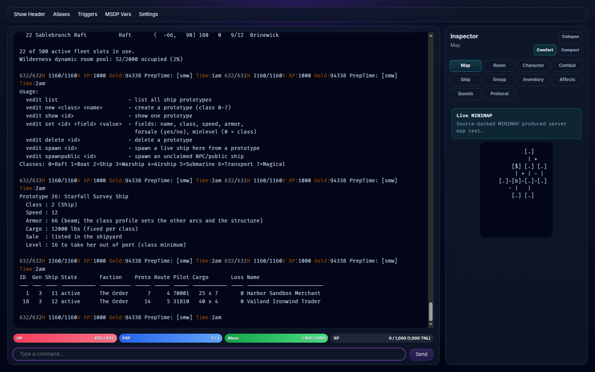

*The end of `shiplist`, then `vedit`, which lists its subcommands (`list`, `new <class> <name>`,
`show <id>`, `set <id> <field> <value>` for name, class, speed, armor, forsale and minlevel,
`delete`, `spawn` for a hull the staff member owns, `spawnpublic` for an unclaimed public hull)
and the class numbers 0-7; `vedit show 26` with its class, speed, armor, cargo, whether the
shipyard lists it, and its level; and `vmerchant`, the NPC merchants with generation, fleet slot,
state, faction, prototype, route, pilot, cargo and losses.*

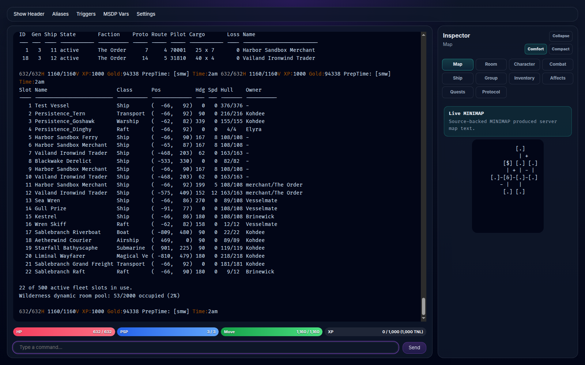

*`shiplist`: every active hull with slot, name, class, position, heading, speed, hull and owner,
then the fleet slots in use and the wilderness room pool. A hull in the wreck registry reads
"wreck registry", and one on her way under a summons "summoned". (The Class and Name columns are
wider now than in this screenshot.)*

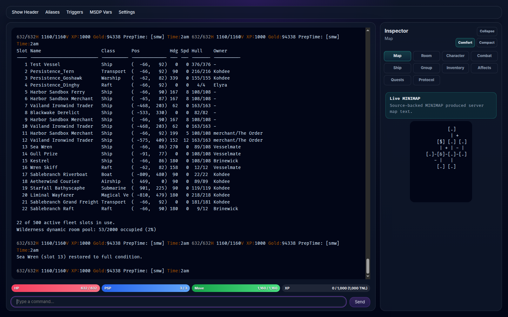

*`shipfix <slot>` restores armor, structure, sails, rudder and weapons, and stops a sinking (not
ammunition): "Sea Wren (slot 13) restored to full condition." Her crew read "A divine hand mends
every timber and line."*

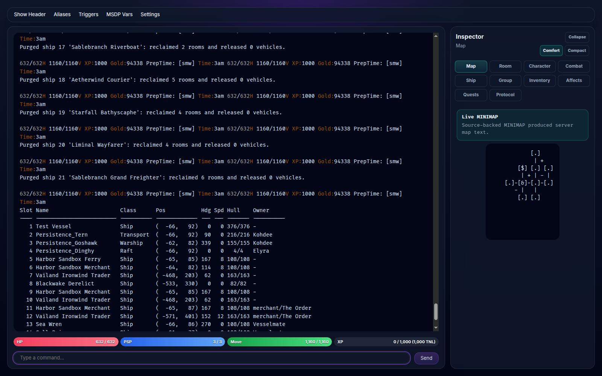

*`shippurge <slot>` removes a hull: "Purged ship 17 'Sablebranch Riverboat': reclaimed 2 rooms and
released 0 vehicles."*

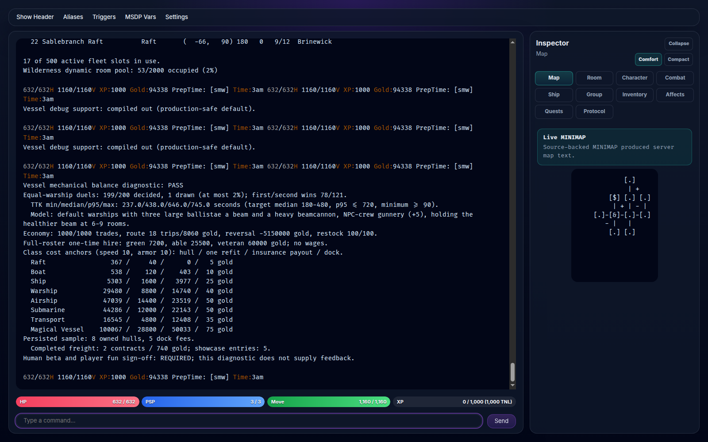

*`vesseldebug balance`: per class, the price of an anchor design (speed 10, armor 10), one refit,
its insurance payout and its dock fee, then the persisted sample (owned hulls, fees, completed
freight, showcase entries) and the sign-off still needed.*

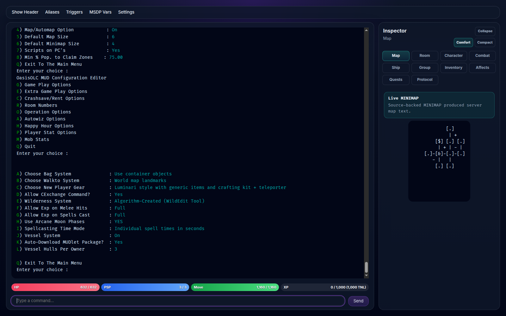

*`cedit`, Extra Game Play Options: "Vessel System : On" (the system's switch) and "Vessel Hulls
Per Owner : 3" (1-10).*

Also: `shipgoto <slot>` puts you on a hull's bridge; `vesseldebug raider <tier>` from aboard a
player's hull sends a raider after her, `vesseldebug ambient` forces an at-sea ambience line and
`vesseldebug encounter` the next encounter check (the other debug categories are a build option);
`vevent start`, `vevent enlist <slot> <team>`, `vevent end` (records the leaderboard),
`vevent cancel` (does not) and `vevent recover`; `vehiclecreate` and `vehiclepurge`. `boardfind`
and `boardcheck` are bulletin-board commands, not vessel ones.
