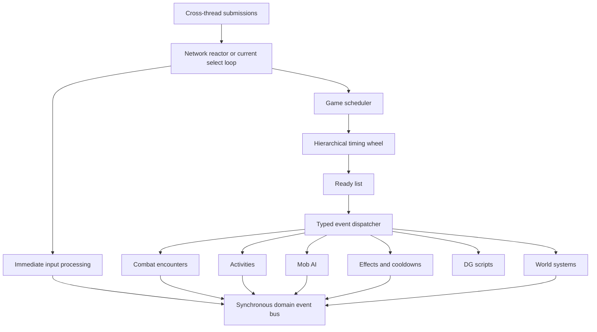
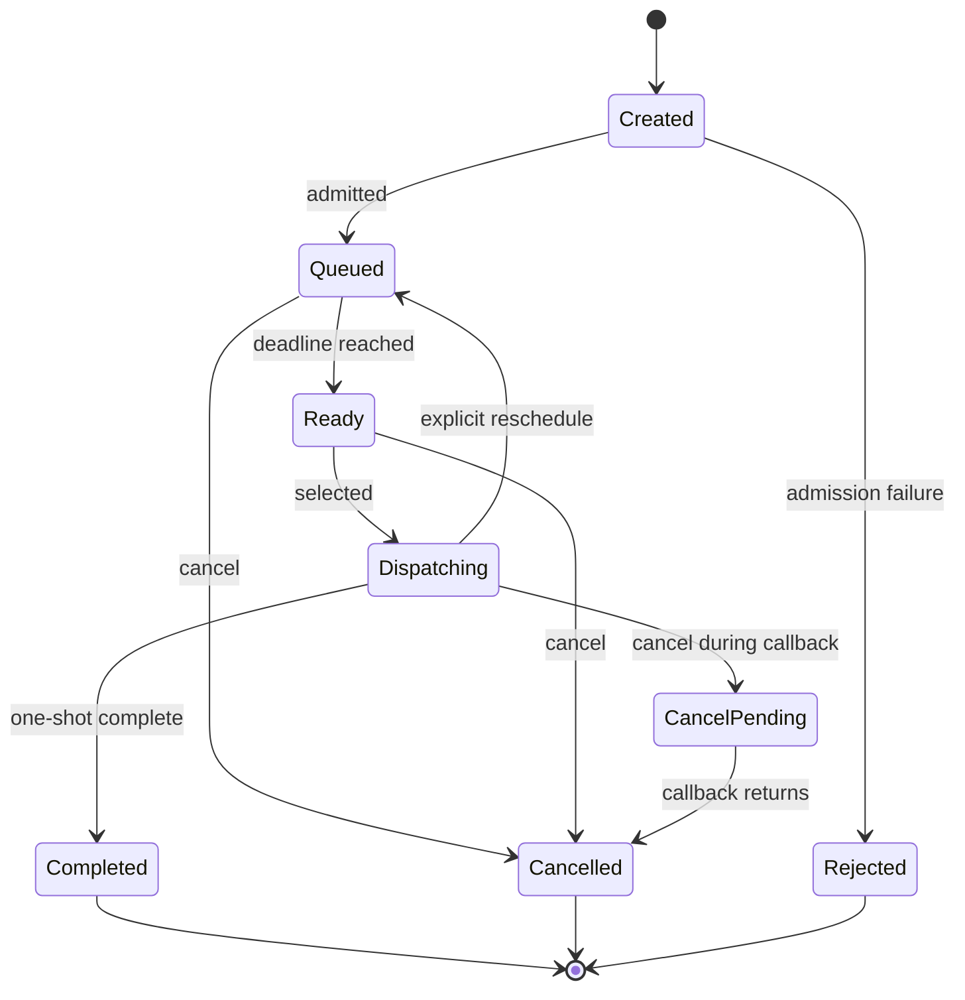

# Event-Driven Core Refactor Specification

**Status:** Draft for architecture review
**Document version:** 0.2
**Started:** 2026-08-29
**Last source review:** 2026-08-29
**Implementation status:** Not started

> This is a planning specification, not a description of current behavior.
> No implementation phase may begin until the applicable design gates in this
> document have been reviewed and accepted.

## 1. Purpose

LuminariMUD currently combines a fixed-rate Diku-style game loop, a bucketed
DG event queue, an entity-scoped MUD event layer, per-character combat events,
action cooldown events, and many subsystem-specific heartbeat checks.

This project will establish one reliable, robust, simple scheduling core for
all delayed and recurring game work. Later phases can use that core to replace
global scans, introduce encounter-level combat scheduling, model interruptible
activities, and eventually modernize network readiness handling without tying
gameplay semantics to a particular I/O library.

The first deliverable is the scheduling backend. Gameplay migration is a
consumer of that backend, not part of its correctness foundation.

## 2. Governing Principles

The following principles are normative for this project:

1. Luminari owns gameplay scheduling semantics. `libevent`, `libev`, or another
   reactor may provide readiness and wakeups, but it must not become the game
   rules engine.
2. The scheduler handles future work. Immediate commands remain immediate, and
   synchronous domain notifications remain separate from timed scheduling.
3. Game action economy is determined by Pathfinder/D20 rules, never by callback
   frequency, client input rate, server load, or wall-clock timing tricks.
4. Scheduled work refers to runtime entities through stable, generation-aware
   handles, not borrowed gameplay pointers.
5. Every payload has one explicit owner and one cleanup path.
6. Cancellation is idempotent and safe in every event lifecycle state.
7. Event ordering is deterministic and testable with a fake clock.
8. A server stall may delay work, but it must not create an unbounded catch-up
   burst.
9. The main game state remains single-threaded unless a later, separately
   reviewed project changes that rule.
10. Migration must be incremental, behavior-preserving, measurable, and
    reversible at each release gate.

The central gameplay invariant is:

> Wall-clock frequency must never determine action economy.

## 3. Scope

### 3.1 In scope

- A unified timed-event scheduler with a hierarchical timing wheel.
- Deterministic event ordering and explicit event lifecycle states.
- Explicit payload cleanup and owner-scoped cancellation.
- Generation-aware runtime entity references.
- Recurrence and lateness policies.
- Dispatch budgets and overload behavior.
- Diagnostics, metrics, inspection, and test hooks.
- Shutdown, reboot, and copyover behavior.
- A compatibility facade for the current DG and MUD event APIs.
- Incremental migration of existing event producers.
- Encounter-level combat scheduling as the first major gameplay consumer.
- A later activity system for interruptible timed character work.
- An eventual reactor integration boundary for network I/O.

### 3.2 Out of scope for the scheduler foundation

- Rewriting all commands as events.
- Making combat continuous real-time or weapon-cooldown based.
- Changing Pathfinder action-economy balance.
- Introducing concurrent mutation of game state.
- Replacing all raw gameplay pointers throughout the entire codebase.
- Selecting or integrating `libevent` or `libev` before the scheduler contract
  is stable.
- Persisting every transient event across a normal reboot.
- Changing player-visible combat behavior during backend parity phases.
- Refactoring unrelated large source files merely because this project touches
  them.

## 4. Current-State Baseline

### 4.1 Main loop and heartbeat

The server runs a `select()`-based main loop and advances at ten pulses per
second. The heartbeat calls `event_process()` every pulse and directly schedules
many other subsystem updates at fixed modulo intervals.

Relevant sources:

- [`src/comm.c`](../../src/comm.c)
- [`src/structs.h`](../../src/structs.h), including `PASSES_PER_SEC`, `RL_SEC`,
  and pulse intervals

### 4.2 DG event queue

The base queue in [`src/dgscript/dg_event.c`](../../src/dgscript/dg_event.c) and
[`src/dgscript/dg_event.h`](../../src/dgscript/dg_event.h):

- Uses ten buckets selected by absolute due pulse modulo ten.
- Maintains sorted linked lists inside the buckets.
- Processes all due events every heartbeat pulse.
- Lets a callback return a positive delay to reschedule itself.
- Uses `q_el == NULL` as an in-dispatch marker.
- Supports an optional cleanup callback, specialized MUD-event cleanup, and a
  global 10,000-event limit.
- Profiles callbacks and records event-processing activity.

This is a useful discrete-event foundation, but it is not a hierarchical timing
wheel. Lifecycle, payload ownership, in-flight cancellation, and MUD-specific
cleanup remain coupled to queue internals.

### 4.3 MUD event layer

[`src/mud_event.c`](../../src/mud_event.c),
[`src/mud_event.h`](../../src/mud_event.h), and
[`src/mud_event_list.c`](../../src/mud_event_list.c) add:

- A table-driven event registry.
- Character, descriptor, object, room, region, and world owner lists.
- Query and owner-specific cancellation helpers.
- Completion and recovery messages.
- Special ownership rules for strings and room/region VNUM copies.

`struct mud_event_data` still stores an untyped `void *pStruct`. Character and
object safety relies heavily on canceling attached events before their owners
are freed.

### 4.4 Current combat scheduling

[`set_fighting()`](../../src/combat/fight.c) creates an `eCOMBAT_ROUND` event for
each fighting character. [`event_combat_round()`](../../src/combat/fight.c)
validates that character and target, executes one queued action, invokes
`perform_violence()`, advances a three-phase counter, and returns a two-second
delay. Three phases collectively represent the nominal six-second combat round.

The global `combat_list` remains initiative-sorted, but scheduling authority is
distributed across character-owned recurring events.

### 4.5 Current action queue and action availability

[`src/actionqueues.c`](../../src/actionqueues.c) stores queued command text and
required-action metadata. Queued actions may be executed from the main command
loop or a combat-round callback. [`src/actions.c`](../../src/actions.c) models
standard, move, and swift availability using separate timed cooldown events.

The existing action queue and action rules must remain usable during early
combat migration, but they do not yet provide one authoritative round budget.

### 4.6 Existing consolidation plan

[`MERGE_MUD_EVENTS.md`](todo-zusuk/MERGE_MUD_EVENTS.md) proposed unifying cleanup
through per-event destructor callbacks. Cleanup callback groundwork now exists
in the base event structure and its tests. This specification absorbs the
remaining goals of that narrower plan and extends them to scheduling,
ownership, dispatch, timing, migration, and gameplay consumers.

### 4.7 Validated local baseline

Phase 0 environment validation was completed on 2026-08-29 against master
commit `8cac912bf11fd1e09a4e6fad4328d31a54d2544d` before this project branch was
created. The validation host was the local WSL2 production copy, explicitly
marked as a development environment. No tracked source or documentation change
was made on master.

The validated baseline is:

- GNU C23 Autotools build completed without compiler warnings.
- The production-linked CuTest suite passed all 914 tests. This local world
  requires `LUMINARI_TEST_SYNTAX_TIMEOUT_SECONDS=180`; its syntax boot takes
  slightly more than the harness's 60-second default.
- The world-tool suite passed 504 tests with 35 expected skips for optional,
  ignored reference corpora that are not installed.
- The focused protocol parser passed all 29 tests.
- Character-rename static and isolated schema tests passed.
- Help-sync passed 36 unit tests, with its eight database tests skipped in the
  default run, and all eight database integration tests passed when explicitly
  enabled.
- MariaDB 10.11.14 accepted all current migrations. The resulting local schema
  had 119 tables, four routines, and eight triggers, and `mariadb-check`
  reported no table errors.
- `make install` installed the tested release and removed the root-level
  `luminari` artifact.
- A bounded `autorun.sh` smoke test reached the game loop, accepted a connection
  on local port 4101, matched the installed binary identity, and shut down
  cleanly with no supervisor, child process, listener, PID file, or kill file
  left behind.

Local baseline reconciliation preserved protected configuration boundaries:

- `src/campaign.h`, `src/mud_options.h`, and `src/vnums.h` were not modified.
- The locally generated Autotools configuration supplies the twelve golem VNUM
  constants already present in `src/vnums.example.h`, because this copy's
  protected `src/vnums.h` predates them.
- The ignored world copy now authors the existing effective special-procedure
  bindings for mobile 1201, object 3118, and room 5905. These declarations make
  the acceptance inventory explicit without changing the callbacks selected by
  the legacy assignment tables.

The baseline also emits pre-existing, nonfatal local content findings. These
include missing DG trigger references in zone 23, invalid zone reset references,
zone 1204 attempting to equip missing object 120602, and mobile 200103 carrying
a SPEC flag without an assigned procedure. Local Ollama and I3 connection
failures are expected by repository policy. These findings are not scheduler
acceptance failures, but they must remain distinguished from regressions in
future boot-log comparisons.

## 5. Terminology

| Term | Meaning |
|------|---------|
| Reactor | Waits for socket readiness, cross-thread wakeups, and the next scheduler deadline. |
| Scheduler | Owns timed-event admission, ordering, cancellation, and dispatch readiness. |
| Timing wheel | Hierarchical collection of time slots used to place scheduled events. |
| Cascade | Movement of events from a coarse wheel level to a finer level as their deadlines approach. |
| Timed event | A request to invoke a registered handler at or after a monotonic deadline. |
| Domain event | A synchronous notification that something already happened; it is not inherently scheduled. |
| Event type | Stable registered identity defining handler, payload, policy, and diagnostics. |
| Event ID | Process-unique opaque identifier for one scheduled event instance. |
| Owner handle | Stable entity kind, runtime ID, and generation tuple. |
| Deadline | Absolute monotonic scheduler tick when an event first becomes eligible. |
| Ready list | Detached list of due events awaiting callback dispatch. |
| Lateness policy | Rule governing what a recurring event does after one or more deadlines were missed. |
| Encounter | Runtime combat session containing participants, hostility, initiative, and one round clock. |
| Activity | Timed, interruptible work occupying some part of a character's attention or action economy. |

## 6. Target Architecture



There is one timed scheduler. Logical event categories do not receive separate
physical timer queues unless profiling later proves that isolation is required.

## 7. Time Model

### 7.1 Runtime clock

- Runtime deadlines MUST use a monotonic clock or a monotonic tick derived from
  it.
- System wall-clock adjustments MUST NOT make an event run early, late, or
  twice.
- The initial scheduler resolution is one existing game pulse: 100 ms.
- Scheduler tick arithmetic MUST use an unsigned width sufficient to avoid
  wraparound during any realistic process lifetime. A 64-bit tick is the
  expected representation.
- Relative delays MUST be converted to absolute deadlines at admission.

### 7.2 Semantic time

Game concepts such as combat rounds, turns, daily uses, effect rounds, and MUD
hours are semantic time. Their owning subsystem decides what elapsed runtime
means. The scheduler only determines when a handler becomes eligible.

The scheduler MUST NOT contain Pathfinder action rules, initiative rules,
weather rules, or resource-regeneration formulas.

### 7.3 Persistent time

Persistent events use a separate serialization policy:

1. Store a durable event-type-specific deadline or remaining duration.
2. On boot or copyover recovery, validate the owner and payload.
3. Convert the durable representation to a new monotonic deadline.
4. Apply that event type's offline-elapsed policy.

The timing wheel itself is never serialized as a data structure.

## 8. Hierarchical Timing Wheel

### 8.1 Proposed geometry

The provisional wheel uses five levels with 64 slots per level and a 100 ms
base tick.

| Level | Slot width | Level horizon | Typical work |
|-------|------------|---------------|--------------|
| L0 | 1 tick / 100 ms | 64 ticks / 6.4 seconds | Combat, short actions, immediate delays |
| L1 | 64 ticks / 6.4 seconds | 4,096 ticks / 6.8 minutes | Cooldowns, AI, short activities |
| L2 | 4,096 ticks / 6.8 minutes | 262,144 ticks / 7.3 hours | Long effects, saves, world work |
| L3 | 262,144 ticks / 7.3 hours | 16,777,216 ticks / 19.4 days | Long recovery and maintenance |
| L4 | 16,777,216 ticks / 19.4 days | 1,073,741,824 ticks / 3.4 years | Exceptional long-duration work |

A sparse overflow structure, provisionally a min-heap, handles deadlines beyond
the L4 horizon. It is expected to remain nearly empty.

The exact geometry remains a review decision until Phase 1 benchmarks confirm
memory use, cascade cost, and the distribution of real Luminari event delays.

### 8.2 Placement

Placement is based on `deadline - current_tick`:

- Less than 2^6 ticks: L0.
- Less than 2^12 ticks: L1.
- Less than 2^18 ticks: L2.
- Less than 2^24 ticks: L3.
- Less than 2^30 ticks: L4.
- Otherwise: overflow structure.

The target slot is selected from the deadline bits for that level. The event
retains its exact deadline even while stored in a coarse slot.

### 8.3 Advance and cascade

For each elapsed scheduler tick:

1. Advance the current tick.
2. If L0 wrapped, detach the current L1 slot and reinsert its events according
   to their remaining time.
3. If L1 also wrapped, cascade from L2 before cascading L1.
4. Repeat for higher levels as required.
5. Detach the current L0 slot into the ready list.
6. Dispatch ready events within the current processing budget.

Callbacks are never invoked while a wheel slot is being traversed.

### 8.4 Large clock advances

Copyover recovery, debugger pauses, host suspension, and severe stalls may
advance time by many ticks. The implementation MUST define an efficient bounded
advance path and MUST NOT blindly execute one full callback pass per missed
tick.

The wheel may advance structural cursors and cascade affected slots, but handler
execution remains governed by per-type lateness policy and the dispatch budget.

## 9. Event Model

### 9.1 Conceptual event record

The following names are illustrative and not yet a frozen C API:

```text
game_event
    event_id
    event_type
    state
    deadline_tick
    insertion_sequence
    owner_handle (optional)
    payload
    wheel linkage
    owner-index linkage
    registry linkage
    cancellation flag
```

An event ID is opaque to callers. The scheduler registry maps it to the current
event instance, permitting O(1)-expected lookup and cancellation without
exposing a node pointer.

### 9.2 Event type registry

Every new-style event type MUST be registered with:

- Stable symbolic identity and diagnostic name.
- Handler.
- Payload schema or payload kind.
- Cleanup function where needed.
- Owner requirements.
- Recurrence and lateness policy.
- Persistence classification.
- Admission limits.
- Logging and profiling classification.

Registration MUST be validated at boot. An invalid or duplicate registration
is a boot error in development/test and must never silently replace a handler.

### 9.3 Payload policy

- The event type defines the payload representation.
- Payload ownership transfers to the scheduler only after successful admission.
- Failed admission leaves ownership with the caller unless the final API
  explicitly returns another documented result.
- Cleanup runs exactly once after completion, cancellation, invalid-owner
  discard, shutdown, or failed reschedule.
- New-style payloads MUST NOT use free-form strings as their primary schema.
- Small fixed payloads should be stored by value where practical.
- Variable payloads require an explicit clone/cleanup contract.

## 10. Public Scheduling Contract

The final names remain open, but the public concepts are:

```text
schedule_at(type, owner, deadline, payload) -> event_id or error
schedule_after(type, owner, delay, payload) -> event_id or error
cancel(event_id) -> cancellation result
cancel_owner(owner) -> count
remaining(event_id) -> duration or not-found
reschedule_at(event_id, deadline) -> result
advance(now, budget) -> dispatch report
next_deadline() -> optional deadline
inspect(filter) -> diagnostic snapshot
```

API rules:

- A zero or past relative deadline is normalized according to admission policy;
  it must not recurse into the current callback.
- Scheduling during dispatch is allowed.
- Canceling an unknown or already terminal event is a safe no-op with a
  distinguishable result.
- Rescheduling preserves event identity only if the event is not terminal.
- Callers cannot mutate scheduler-owned payloads or linkage.
- The API returns structured errors for invalid type, invalid owner, capacity,
  invalid deadline, and shutdown state.

## 11. Lifecycle and Cancellation

### 11.1 States



### 11.2 Cancellation guarantees

- Cancellation is idempotent.
- Cancellation detaches a queued event in O(1) expected time.
- Canceling a ready event prevents its callback if dispatch has not begun.
- Canceling an executing event marks it cancel-pending; cleanup occurs after the
  handler returns.
- Owner-wide cancellation is safe during dispatch.
- Cleanup runs once and only once.
- A canceled recurring event cannot be revived by a stale callback return.

### 11.3 Handler rules

Handlers MUST:

- Execute on the main game thread.
- Treat owner lookup failure as a normal stale-event outcome.
- Avoid blocking I/O.
- Avoid unbounded loops.
- Return or set an explicit completion/reschedule result.
- Not directly free or relink their own scheduler event.
- Not assume they will execute exactly at the requested deadline.

Slow handlers are subsystem defects, not a reason to run game state concurrently.

## 12. Entity Ownership and Runtime Handles

### 12.1 Owner handle

The provisional owner handle is:

```text
owner_kind
runtime_id
generation
```

The pair `(runtime_id, generation)` identifies one live incarnation. Reusing a
player's persistent ID after logout or reload must not make an old transient
event attach to the new `char_data` instance.

### 12.2 Entity registry requirements

The entity registry MUST:

- Resolve an owner handle to a live typed entity.
- Reject kind mismatches.
- Increment or replace generation on lifecycle reuse.
- Remove visibility before entity memory is released.
- Support owner-wide event cancellation without a world scan.
- Permit diagnostics without exposing mutable pointers to the scheduler.

The existing DG UID table is relevant groundwork, but it does not by itself
define all generation and typed-resolution guarantees required here.

### 12.3 Non-entity owners

World, zone, room, region, descriptor, combat encounter, vessel, and other
owners may use the same owner-handle shape if they have a lifecycle registry.
Static database identifiers and runtime generations remain distinct concepts.

## 13. Dispatch Semantics

### 13.1 Deterministic ordering

Ready events sort by:

1. Exact deadline.
2. Insertion sequence.

Event type, owner, wheel level, and hash position MUST NOT affect observable
ordering for equal deadlines.

### 13.2 Reentrancy boundary

An event scheduled during a callback for `now` becomes eligible no earlier than
the next scheduler dispatch cycle. Immediate causal reactions use direct calls
or the synchronous domain-event bus instead.

This prevents accidental infinite same-tick scheduling and makes callback
graphs understandable.

### 13.3 Dispatch budget

Each main-loop iteration has both:

- A maximum callback count.
- A monotonic wall-time budget.

When either is reached, remaining ready events stay ordered for the next loop.
They are not dropped or moved back through the wheel.

Budgets must be configurable or derived from measured server timing. Phase 0
records the current event callback distribution and network-loop latency before
numeric acceptance thresholds are frozen.

## 14. Recurrence and Lateness

### 14.1 Recurrence

New-style recurring work uses an explicit result rather than an overloaded
integer callback return. The result distinguishes:

- Complete.
- Reschedule at an absolute deadline.
- Reschedule after a relative delay.
- Cancelled while dispatching.
- Failed with a diagnostic classification.

Periodic events normally derive their next deadline from the previous deadline,
not callback completion time, to avoid drift.

### 14.2 Lateness policies

Each recurring type selects one policy:

| Policy | Behavior |
|--------|----------|
| Run once late | Execute one occurrence, then continue according to type policy. |
| Coalesce | Execute once with elapsed/missed count information. |
| Skip missed | Advance to the first future deadline without executing missed occurrences. |
| Catch up bounded | Execute no more than a configured number, then coalesce or skip. |

Unbounded catch-up is prohibited.

### 14.3 Provisional subsystem policy

- Combat rounds: run at most once after a stall; never burst missed attacks.
- Character action recovery: restore state once; never grant stacked actions.
- Resource regeneration: coalesce elapsed time using subsystem rules.
- Autosave: run once late, then resume cadence.
- Mob think: skip or coalesce missed thoughts; never burst a backlog of AI turns.
- DG waits: resume once when eligible.

These are provisional requirements for later consumer specifications.

## 15. Capacity and Failure Behavior

### 15.1 Admission controls

The scheduler enforces:

- Global live-event capacity.
- Optional per-event-type capacity.
- Optional per-owner and owner/type capacity.
- Payload-size or allocation failure reporting.
- Shutdown-state rejection.

The existing global limit of 10,000 is a baseline to measure, not an assumed
final value.

### 15.2 Failure policy

- Invalid event type: reject and log a `SYSERR` with caller context.
- Invalid required owner: reject before admission.
- Owner disappears after admission: discard normally and count as stale.
- Capacity exhausted: return an error; critical callers decide whether boot or
  gameplay must fail.
- Payload cleanup failure: log a `SYSERR`; never run cleanup twice.
- Handler over budget: log/profile and defer remaining events.
- Internal wheel invariant violation: fail loudly in tests; production behavior
  must prefer controlled shutdown over silent corruption.

## 16. Thread Model

- The scheduler wheel, registry, ready list, and callbacks are main-thread only.
- Worker threads cannot call scheduling internals directly.
- Cross-thread producers write immutable submission records to a bounded,
  thread-safe ingress queue and wake the reactor.
- The main thread validates and admits those records.
- Cancellation from a worker is also a request processed on the main thread.
- No worker may retain a mutable game entity pointer.

This boundary applies to I3, Discord, AI services, database workers, and future
external integrations.

## 17. Persistence, Copyover, and Shutdown

Every event type is classified as one of:

- Transient: canceled on shutdown and recreated only by live state.
- Reconstructable: not serialized; rebuilt by subsystem boot logic.
- Copyover-preserved: serialized for copyover and restored with owner validation.
- Persisted: durable across full reboot with an explicit offline-elapsed policy.

Requirements:

- The scheduler can stop admitting new work during shutdown.
- Shutdown cleanup drains no gameplay callbacks unless explicitly requested.
- Every remaining payload is cleaned exactly once.
- Copyover serialization records typed events, not wheel slots or node pointers.
- Restored events receive new process-local event IDs.
- Invalid restored owners or payload versions are rejected safely and reported.
- Event schema versioning belongs to the event type.

## 18. Observability and Operations

The scheduler must expose at least:

- Current and high-water live event counts.
- Counts by event type and owner kind.
- Counts by wheel level and overflow storage.
- Ready backlog and oldest overdue age.
- Scheduled, completed, canceled, stale-owner, rejected, skipped, and coalesced
  totals.
- Cascade count and largest cascade.
- Callback count, total time, maximum time, and slow-handler samples by type.
- Admission failures by reason.
- Cross-thread ingress depth and drops/rejections.

Diagnostics must support safe read-only filtering by event ID, event type,
owner, deadline range, and lifecycle state. Player-sensitive payloads must not be
dumped into logs or staff output by default.

Existing PERFMON event metrics should be preserved and extended rather than
replaced with an unrelated telemetry path.

## 19. Legacy Compatibility Architecture

There will be one physical scheduler during migration.

```text
legacy event_create/EVENTFUNC facade --+
                                       +--> timing-wheel scheduler
legacy MUD event facade ---------------+
new typed scheduling API --------------+
```

The legacy facade preserves:

- Minimum one-pulse delay behavior.
- Positive callback return as a relative reschedule request.
- Existing event names and PERFMON attribution.
- Existing owner-list query helpers.
- Existing specialized cleanup until each owner type migrates.

The facade must not preserve unsafe behavior merely for compatibility. Where a
behavioral correction is required, it receives a dedicated migration phase,
test, release note, and rollback decision.

## 20. Combat Encounter Consumer Specification

Encounter scheduling is not part of scheduler Phase 1, but it is the first major
consumer and constrains the scheduler owner model.

### 20.1 Naming

The repository's current `encounter_data` describes generated wilderness
encounter content. A runtime fight session must use an unambiguous name such as
`combat_encounter_data`; it must not overload the existing structure.

### 20.2 Encounter authority

One live combat encounter owns:

- Encounter ID and generation.
- One scheduled round/phase event.
- Current semantic round and phase.
- Next deadline.
- Participant records using owner handles.
- Initiative values and deterministic tie-break data.
- Eligibility/not-before state.
- Hostility relationships or sides.
- Pending additions and removals.
- Resolution state and dirty flags.

`FIGHTING(ch)` may remain a selected target during migration, but it must not be
the encounter lifetime authority.

### 20.3 Joining

A character does not join merely by entering the room. Joining occurs when a
hostile relationship is established or an assist action connects the character
to the fight.

- Neither party has an encounter: create one and add both.
- One party has an encounter: add the other party.
- Both have the same encounter: update hostility/targeting only.
- Parties have different encounters: merge the encounters.

A participant added while a round is resolving is placed on a pending-add list.
The provisional fair-play rule is that a new participant first becomes eligible
on the next encounter round. Immediate reactions remain possible only through
the normal reaction budget.

### 20.4 Leaving

Departure sequence:

1. Validate the attempted movement or departure.
2. Resolve synchronous reactions such as attacks of opportunity.
3. If departure succeeds, mark the participant inactive immediately.
4. Complete movement/extraction/death handling.
5. Compact encounter membership after the current dispatch.

A participant marked inactive is skipped even if present in the current round's
snapshot. The shared encounter event is not canceled because one participant
leaves.

Departure reasons include movement, flee, teleport, death, extraction,
disconnect policy, combat-ending effects, and administrative movement.

### 20.5 Merge and split

Connecting two encounters requires a merge so one fight is never governed by
two clocks. The surviving encounter adopts all participants. Absorbed
participants retain a temporary not-before deadline so the merge cannot grant
an early second turn.

Splitting a disconnected hostility graph is an optimization, not an initial
correctness requirement. A temporarily over-inclusive encounter remains valid
as long as participant and hostility checks are correct.

### 20.6 Ending

After every membership change and round resolution, the encounter evaluates
whether two hostile sides remain. If not, it cancels its one scheduled event,
clears encounter-scoped state, detaches participants, and releases its registry
entry.

### 20.7 Combat migration modes

The first encounter implementation may preserve current visible cadence by
running one encounter-owned event every two seconds and invoking the existing
three-phase behavior for eligible members. Only after parity is proven should a
separate gameplay phase consider resolving one initiative-ordered encounter
round every six seconds with explicit action budgets.

Backend migration and combat-rules redesign must not be combined in one release.

## 21. Activity Consumer Requirements

The future activity system will use the same scheduler but own its gameplay
state separately. Activities cover lockpicking, trap searching, camp building,
crafting, harvesting, treating wounds, ritual casting, and similar work.

An activity will need:

- Character owner handle and target handle.
- Activity type and explicit lifecycle state.
- Occupied action/attention resources.
- Progress model: atomic, progressive, or continuous.
- Interruption policy by movement, damage, attack, room change, target loss,
  and combat state.
- Temporary conditions and vulnerability modifiers.
- One completion/progress event, not repeated world scans.

Activity policy remains outside the scheduler. The scheduler only invokes the
activity handler at its next deadline.

## 22. Migration Plan

Each phase requires an independently reviewable change set. No phase may bundle
unrelated gameplay redesign.

### Phase 0: Specification and baseline

Deliverables:

- Review and accept scheduler invariants.
- Inventory all base-event and MUD-event call sites.
- Classify current events by owner, recurrence, persistence, and cleanup.
- Record queue depth, delay distribution, callback rate, slow handlers, and
  heartbeat/network latency under representative load.
- Freeze the deterministic ordering and stall behavior expected from legacy
  compatibility mode.
- Resolve open decisions required for Phase 1.

Gate:

- Approved specification and reproducible baseline report.

Rollback:

- Documentation only; no runtime effect.

### Phase 1: Standalone scheduler core

Deliverables:

- Hierarchical timing wheel behind a private API.
- Fake monotonic clock.
- Opaque IDs, lifecycle state, explicit payload cleanup, and deterministic
  ready ordering.
- Cancellation, rescheduling, recurrence, lateness, and dispatch budgets.
- Unit tests independent of game entities and MariaDB.

Gate:

- Complete deterministic test matrix, sanitizer pass, and benchmark against
  the Phase 0 delay distribution.

Rollback:

- New core is unused and can be removed without affecting the live queue.

### Phase 2: Legacy compatibility adapter

Deliverables:

- Route legacy base-event creation through the new scheduler facade.
- Preserve callback-return recurrence and cleanup behavior.
- Preserve diagnostics and event names.
- Add trace-comparison tests using identical fake-clock scenarios against the
  old and new queue implementations.

Gate:

- Equivalent callback order, timing eligibility, recurrence, cancellation, and
  cleanup for the documented compatibility contract.

Rollback:

- Boot-time backend selection returns to the old queue. Backend selection must
  occur only with an empty scheduler; live switching is prohibited.

### Phase 3: MUD event ownership adapter

Deliverables:

- Route MUD event attachment through the same scheduler.
- Preserve character/object/room/region/world query behavior.
- Replace cleanup branching with one explicit cleanup contract.
- Introduce generation-aware owner resolution where lifecycle support exists.
- Retain compatibility shims for unmigrated owner types.

Gate:

- Owner extraction, room/region removal, in-flight cancellation, shutdown, and
  bulk-clear tests pass under sanitizers and Valgrind.

Rollback:

- Return MUD facade to the legacy backend without changing gameplay callers.

### Phase 4: Production parity and hardening

Deliverables:

- Run the complete production-linked test suite and protocol harness.
- Add event churn, capacity, cascade, stall, copyover, and long-soak tests.
- Exercise representative world, spell, cooldown, DG wait, AI, and resource
  events.
- Compare PERFMON behavior to Phase 0.
- Remove any temporary dual-backend diagnostic code that can execute callbacks
  twice.

Gate:

- No known correctness regression, leak, use-after-free, ordering mismatch, or
  unbounded latency regression.

Rollback:

- Retain the old backend for one release boundary if maintenance cost remains
  acceptable; otherwise rollback by revision rather than live conversion.

### Phase 5: Encounter-level combat compatibility

Deliverables:

- Runtime combat encounter registry and lifecycle.
- One event per encounter.
- Join, leave, merge, end, death, extraction, movement, and disconnect handling.
- Compatibility execution of existing combat phases and action queue.
- Diagnostic comparison between character-event and encounter-event outcomes.

Gate:

- Current player-visible cadence and mechanics remain equivalent within the
  explicitly documented compatibility boundary.

Rollback:

- Restore per-character `eCOMBAT_ROUND` scheduling behind a boot-time feature
  selection. Do not convert an active encounter between models.

### Phase 6: Semantic combat rounds

Deliverables:

- Explicit encounter round and initiative processing.
- Explicit per-round action and reaction budgets.
- Defined intent buffering and queue semantics.
- Six-second D20 round behavior.
- Migration of once-per-round cooldown-event flags to encounter/participant
  state where appropriate.

Gate:

- Separate gameplay design approval, balance review, help updates, and expanded
  combat regression suite.

Rollback:

- Return to encounter-owned compatibility phases without reverting the event
  backend.

### Phase 7: Activities and scan reduction

Deliverables:

- Activity manager and first migrated timed commands.
- Measured conversion of selected heartbeat/global scans to scheduled owners.
- Admission and cancellation limits for high-cardinality AI/world events.

Gate:

- Each converted subsystem demonstrates parity, bounded event counts, lifecycle
  cleanup, and measurable or architectural benefit.

Rollback:

- Per-subsystem feature gate returns that consumer to its former update path.

### Phase 8: Reactor modernization

Deliverables:

- Decide `libevent`, `libev`, or retained native polling based on measured
  requirements.
- Integrate socket readiness, scheduler deadline wakeups, signals, and
  cross-thread notifications.
- Preserve descriptor, copyover, protocol, health endpoint, and operational
  behavior.

Gate:

- Independent network/reactor specification and full connection, protocol,
  copyover, load, and rollback validation.

Rollback:

- Restore the existing `select()` reactor while retaining the scheduler.

### Phase 9: Legacy removal

Deliverables:

- Remove old queue implementation and temporary backend selection.
- Remove raw event-pointer APIs and obsolete cleanup branches.
- Remove migrated heartbeat scans.
- Publish permanent system, testing, operational, and developer documentation.

Gate:

- At least one stable release period on the new backend, no rollback dependency,
  and explicit maintainer approval.

## 23. Verification Strategy

### 23.1 Deterministic unit tests

The scheduler test harness must use a fake clock and cover:

- Deadlines at 0, 1, 63, 64, 65, 4,095, 4,096, 4,097, and every higher-level
  cascade boundary.
- Equal-deadline FIFO ordering.
- Admission during callbacks.
- Cancellation while queued, ready, and dispatching.
- Repeated cancellation.
- Self-cancellation and cancellation of another ready event.
- Rescheduling earlier and later.
- Owner destruction before readiness and during another callback.
- Cleanup exactly once for every terminal route.
- Event ID and insertion-sequence wrap defenses.
- Large clock jumps.
- Every lateness policy.
- Dispatch count and time-budget exhaustion.
- Capacity and per-owner admission limits.
- Overflow-heap entry and return to the wheel.
- Shutdown with queued, ready, and dispatching events.

### 23.2 Compatibility tests

- Legacy positive return reschedules at the expected pulse.
- Legacy zero return completes and cleans up.
- MUD event registry identity and messages remain intact.
- Character, object, room, region, descriptor, and world list queries remain
  valid during their compatibility phases.
- DG wait and AI direct-event callers retain behavior.
- Event cleanup tests in `test_syntax_check_boot.c` continue to pass.

### 23.3 Integration tests

- Character extraction with multiple queued events.
- Object extraction and room/region lifecycle changes.
- Copyover with mixed transient and preserved event types.
- Server stall without combat, AI, or cooldown bursts.
- Sustained event creation/cancellation churn.
- Event-capacity exhaustion without memory corruption.
- Main-loop input/output responsiveness under a due-event storm.

### 23.4 Encounter tests

- Two characters start and end a fight.
- A third character joins before, during, and after round dispatch.
- A participant leaves through movement, flee, teleport, death, extraction, and
  disconnect policy.
- Two encounters merge without any participant receiving an extra turn.
- A bridge participant leaves a merged encounter.
- Joining and leaving from callbacks do not invalidate iteration.
- All participants disappear before the scheduled event fires.
- Encounter ID is destroyed and reused with a new generation.
- Reactions occur before successful departure.
- No hostile sides remain and the one shared event is canceled exactly once.

### 23.5 Tooling and release validation

- `make test`
- `make install` after the root production-linked suite
- Protocol parser harness and fuzz target
- AddressSanitizer and UndefinedBehaviorSanitizer
- Valgrind event churn and shutdown scenarios
- Static analysis and CodeQL
- Local server startup, copyover, shutdown, and soak testing

No test phase may leave a root-level `luminari` artifact.

## 24. Performance Requirements

Numeric thresholds will be frozen after Phase 0 measurement. The architectural
requirements are:

- Normal wheel insertion and queued cancellation are O(1) expected time.
- The scheduler does not scan all live events every tick.
- Empty world size does not determine scheduled-work CPU cost.
- Ready dispatch cost is proportional to due work, bounded by the dispatch
  budget.
- Cascade cost is observable and bounded by events actually present in the
  cascading slot.
- Owner destruction does not scan the global event population.
- Encounter scheduling uses one recurring event per active encounter, not per
  character or attack.
- Network input/output continues to receive service during an event storm.

## 25. Security and Robustness Requirements

- Event admission limits must prevent command, script, or external-input event
  amplification from exhausting memory.
- Payload parsers validate size and type before admission.
- Diagnostic output redacts or omits sensitive payload data.
- Cross-thread ingress is bounded.
- Integer deadline arithmetic is overflow-checked.
- Event type registration cannot be altered by player data.
- Script-created recurrence is bounded and attributable to its script owner.
- Owner resolution validates both type and generation before casting.
- No scheduler callback performs blocking network or database work.
- Cancel, shutdown, and failed admission paths are sanitizer-clean.

## 26. Documentation Requirements

During implementation:

- This document records accepted architectural decisions and phase status.
- [`docs/systems/MUD_EVENTS.md`](../systems/MUD_EVENTS.md) continues to describe
  current production behavior until the new backend becomes authoritative.
- An ADR records the final scheduler and reactor decisions.
- Testing documentation records fake-clock, churn, soak, and failure tests.
- Operator documentation covers diagnostics, overload, copyover, and rollback.
- Combat and command/help documentation changes only when player-visible
  behavior changes.

On completion, durable material moves to the formal documentation tree and this
working document is retired according to the ongoing-project policy.

## 27. Open Decisions

| ID | Decision | Provisional recommendation | Required by |
|----|----------|----------------------------|-------------|
| D1 | Wheel geometry | Five levels, 64 slots, 100 ms base tick | Phase 1 |
| D2 | Beyond-wheel storage | Sparse min-heap | Phase 1 |
| D3 | Event ID representation | Monotonic unsigned 64-bit opaque ID | Phase 1 |
| D4 | Ready ordering container | Deadline/sequence ordered detached list or small heap | Phase 1 |
| D5 | Event allocation | Ordinary allocation first; add slab only if measured | Phase 1 |
| D6 | Handler result API | Explicit tagged result, legacy return adapter | Phase 1 |
| D7 | Same-tick scheduling | Eligible next dispatch cycle, never recursive | Phase 1 |
| D8 | Owner registry | Typed runtime ID plus generation | Phase 3 |
| D9 | Persistent event store | Per-type serialization and rehydration | Phase 3 |
| D10 | Old/new backend selection | Boot-time only with empty scheduler | Phase 2 |
| D11 | Combat join eligibility | Next encounter round | Phase 5 |
| D12 | Encounter merge clock | Preserve survivor clock plus participant not-before guards | Phase 5 |
| D13 | Encounter splitting | Defer unless correctness or profiling requires it | Phase 5 |
| D14 | Linkdead combat policy | Preserve current behavior until separately reviewed | Phase 5 |
| D15 | Reactor library | Decide only after scheduler stabilization | Phase 8 |

## 28. Risks and Mitigations

| Risk | Mitigation |
|------|------------|
| Timing behavior changes invisibly | Fake-clock trace comparison and compatibility phases |
| Double-free or use-after-free | Explicit lifecycle, generation-aware owners, cleanup-once tests |
| Event storm starves networking | Count/time dispatch budgets and ready backlog metrics |
| Stall causes combat burst | Per-type lateness policy; combat never catches up unbounded |
| Two event systems remain indefinitely | One physical scheduler and dated legacy-removal gate |
| Gameplay redesign obscures backend bugs | Backend parity before encounter and semantic combat changes |
| Encounter joins grant extra actions | Next-round eligibility and not-before guards during merge |
| Movement invalidates round iteration | Immediate inactive marker plus deferred compaction |
| Copyover restores stale owners | Typed generation validation and new process-local event IDs |
| Timing wheel is optimized prematurely | Provisional geometry, measurements, and private backend API |
| Reactor rewrite expands blast radius | Reactor is the final independent phase |

## 29. Project Acceptance Criteria

The complete refactor is accepted only when:

- One physical timed scheduler serves all migrated event producers.
- The timing wheel and overflow path pass deterministic boundary tests.
- Event cancellation and cleanup are safe and exactly-once in every state.
- Runtime owners are resolved through typed generation-aware handles.
- Dispatch budgets preserve network responsiveness under load.
- Recurrence and lateness policies prevent unbounded catch-up.
- Copyover, shutdown, and persistence classifications are explicit and tested.
- Legacy event behavior remains compatible until each consumer receives its own
  approved migration.
- Combat uses one recurring scheduled event per live encounter.
- Joining, leaving, merging, death, movement, and extraction are deterministic
  and cannot grant extra actions.
- Player-visible semantic combat changes have separate design and balance
  approval.
- Existing production-linked, protocol, sanitizer, static, and operational test
  gates pass.
- Permanent developer, system, testing, and operations documentation is current.
- The legacy queue, raw event-pointer public API, and obsolete heartbeat scans
  have approved removal evidence.

## 30. Review Checklist

Before accepting version 1.0 of this specification, reviewers should confirm:

- [ ] Scope and non-goals are correct.
- [ ] Current-state description matches the source.
- [ ] Time and lateness semantics are unambiguous.
- [ ] Wheel geometry and overflow behavior are accepted.
- [ ] Payload ownership and failed-admission behavior are explicit.
- [ ] Cancellation during dispatch cannot double-clean or revive an event.
- [ ] Owner generation semantics cover PCs, NPCs, objects, rooms, and runtime
      subsystem owners.
- [ ] Dispatch budgets and event-storm behavior are operationally acceptable.
- [ ] Copyover and reboot classifications are sufficient.
- [ ] Legacy compatibility and rollback do not permit double callback execution.
- [ ] Encounter join, leave, merge, and termination rules are fair and complete.
- [ ] Migration phases are independently testable and reversible.
- [ ] Documentation and help obligations are assigned to the correct phases.

## 31. Revision Log

| Version | Date | Summary |
|---------|------|---------|
| 0.1 | 2026-08-29 | Initial source-grounded specification covering the scheduler foundation, timing wheel, ownership, lifecycle, migration, encounter consumer, testing, and open decisions. |
| 0.2 | 2026-08-29 | Recorded the clean local build, database, test, install, and runtime baseline plus known nonfatal content findings before implementation. |
