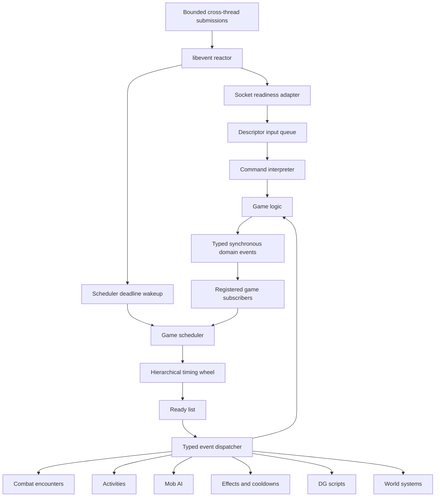
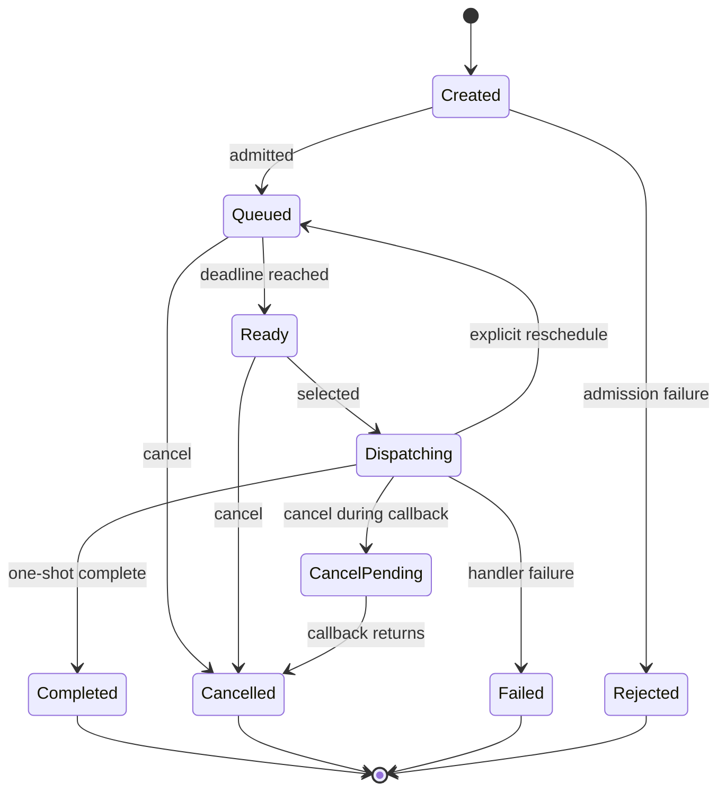

# Event-Driven Core Refactor Specification

**Status:** In progress - Phases 1 through 10 accepted; Phase 11 reversible implementation and final source audit are complete; irreversible removal gate pending
**Document version:** 1.34
**Started:** 2026-08-29
**Last source review:** 2026-09-01
**Implementation status:** Phases 1 through 10 and observability complete; Phase 11 owner handles, named runtime services, elapsed offline cooldown recovery, raw-event zero-caller enforcement, demand-driven autonomous agendas including exact NPC resource recovery, active DG/trail registries, constant-time domain owner resolution, gameplay intent naming, the final adversarial source audit, the executable demand-driven architecture lock, and the operator release-gate handoff are implemented; only the externally gated physical rollback removal remains

> This remains the controlling planning specification. The Phase 1 scheduler
> now stores legacy timed events through the Phase 2 compatibility facade. The
> scheduler deadlines now drive bounded reactor dispatch. Named service events
> own the remaining cadence work by default; the compatibility heartbeat remains
> only for explicit runtime-service or timed-backend rollback. Generation-aware MUD-event
> ownership and lifecycle cancellation form the accepted scheduler foundation.
> A private `libevent` compatibility reactor now owns production readiness and
> signals, with boot-time `select()` rollback. Gameplay timing ownership is
> migrating, and encounter-owned six-second semantic combat is now accepted.
> Versioned player-event records now validate stable ownership, apply elapsed
> wall time to durable cooldowns, and rebuild fresh process-local timers, while
> transient and boot-reconstructed work has an explicit policy.
> Encounter rounds, primary activities, autonomous mobiles, affected owners,
> character periodic work, object automatic procedures, and DG random triggers
> now store generation-safe opaque event handles instead of public
> compatibility-record pointers. Their timing, recurrence, teardown,
> diagnostics, and rollback behavior are unchanged.
> Vessel owners, the vessel/point-update singleton services, DG waits, and MUD
> events and one-shot AI jobs also use opaque handles. The compatibility
> record, pointer API, and rollback queue declarations are private to the
> facade and its low-level parity tests; gameplay has zero raw callers.
> Mud-hour DG time triggers now dispatch from lifecycle-maintained owner
> registries, and trail expiry visits only locations with live trail data. DG
> rooms and ordinary trails use stable room vnums; wilderness trails use zone
> vnum plus coordinates so reusable dynamic room slots cannot move evidence.
> Both expose compact registry health in `eventdebug`.
> Production-world validation rejected the former full-population recurring
> owner design. About 61,000 loaded NPCs produced about 20 million callbacks in
> eleven minutes and consumed about 97% of one CPU core. Replacing a list walk
> with one unconditional recurring event per entity is distributed polling,
> not the event-driven gameplay architecture required here. Version 1.29 makes
> explicit pending work, rather than entity existence, the admission contract.
> Version 1.30 records the corrected implementation and copied-world evidence:
> about 39,000 concrete autonomous agendas, zero ready or overdue scheduler
> work, and 2.6% settled CPU. Boot placement is now an explicit non-gameplay
> lifecycle phase. Character and object handles resolve through
> generation-keyed lifecycle registries rather than global population scans,
> and NPC movement no longer fans arrival reactions out to unrelated NPCs.
> Gameplay callbacks now describe their domain responsibility rather than the
> heartbeat cadence that historically invoked them. Whole-population entry
> points are explicitly named as legacy rollback, and a source contract rejects
> new gameplay `pulse_*` or `*_pulse` function definitions while retaining the
> small exact set of physical timing and performance pulse APIs.
> The final source audit closed the remaining autonomous-resource gap: spending
> an NPC class spell slot or known-spell use now admits one exact owner-local
> recovery deadline, combat or incapacitation postpones only that owner, and a
> full resource pool retires the agenda. It also classified all 14 default
> runtime services as bounded connected-owner, fixed/indexed global, or
> singleton work; broad character/object/mobile scans are rollback-only.
> A production-linked population test now fixes that distinction in executable
> form: 512 loaded dormant NPCs add no queue entries or callbacks while one
> off-screen wanderer owns exactly one agenda. A source-policy gate rejects
> global-list traversal, whole-mobile dispatch, or reason-blind execution from
> the normal mobile agenda callback. The whole-mobile cycle remains reachable
> only through the explicit rollback selectors.
> The current removal inventory proves raw event records are private, records
> the remaining opaque-adapter burn-down surface, and links an operator runbook
> for tagged deployment, fallback-use observation, PubSub inventory, protected
> backup, restore rehearsal, and explicit sign-off. No release evidence or
> production approval is inferred from development acceptance.
> Runtime ticks now derive from monotonic elapsed time independently of a pulse
> callback. The reactor sleeps to the nearest I/O, scheduler, or queued
> `WAIT_STATE` deadline, and deferred extraction has an explicit safe point.
> The process now owns a boot-sealed typed domain-event registry with bounded
> synchronous dispatch, generation-aware resolution, and diagnostics. Nine
> fact contracts exist. `WorldPhenomenon` is the first production-published
> fact and routes wilderness-distance or room-graph sights and sounds without a
> polling scan. The old database-backed pub/sub runtime, queue, and commands are
> retired; its tables remain untouched as deprecated archival data.

## 1. Purpose

LuminariMUD currently combines a fixed-rate Diku-style game loop, a bucketed
DG event queue, an entity-scoped MUD event layer, per-character combat events,
action cooldown events, and many subsystem-specific heartbeat checks.

This project will replace the fixed-cadence Diku orchestration model with a
deadline-driven, `libevent`-backed reactor, one reliable scheduling core for
delayed and recurring work, and a separate typed domain-event core for
synchronous gameplay notifications. The command interpreter remains the entry
point for player commands; event-driven does not mean scheduling every command.

The principal scalability objective is to make processing cost follow active
world work rather than total world size. Migrated mobs, rooms, objects, effects,
encounters, and activities wake because work is due or a relevant domain event
occurred. Dormant entities are not repeatedly scanned merely to discover that
they have nothing to do.

The first deliverable is the scheduling backend. Gameplay migration is a
consumer of that backend, not part of its correctness foundation.

## 2. Governing Principles

The following principles are normative for this project:

1. `libevent` is the selected reactor for readiness, timers, signals, and
   cross-thread wakeups. Luminari owns gameplay scheduling semantics, and
   `libevent` types or callbacks must not become the game rules API.
2. The scheduler handles future work. Immediate commands remain immediate, and
   synchronous domain notifications remain separate from timed scheduling.
3. Game action economy is determined by Pathfinder/D20 rules, never by callback
   frequency, client input rate, server load, or wall-clock timing tricks.
4. Scheduled work refers to runtime entities through stable, generation-aware
   handles, not borrowed gameplay pointers.
5. Every payload has one explicit owner and one cleanup path.
6. Cancellation is idempotent and safe in every event lifecycle state.
7. Event ordering is deterministic and testable with a fake clock.
8. A server stall may delay work, but it must not create an unbounded catch-up
   burst.
9. The main game state remains single-threaded unless a later, separately
   reviewed project changes that rule.
10. Migration must be incremental, behavior-preserving, measurable, and
    reversible at each release gate.
11. Domain events report state changes that have occurred. They do not replace
    scheduled work, player commands, explicit rule checks, or cancellable
    decision APIs.
12. Processing cost for migrated systems is proportional to active or due work,
    not to the total number of dormant world entities.

The central gameplay invariant is:

> Wall-clock frequency must never determine action economy.

### 2.1 Adversarial review disposition

The adversarial review of v0.4 is retained in
[`EVENT_DRIVEN_CORE_REFACTOR_SPEC_REVIEW.md`](EVENT_DRIVEN_CORE_REFACTOR_SPEC_REVIEW.md).
Version 0.8 resolves or assigns every finding rather than treating the review as
a one-time checklist.

| Findings | v0.8 disposition |
|----------|------------------|
| F1, F6, F10, F11, F15, F16, F22 | Phase 2.5 now owns the owner record, index, cancellation, capacity, lifecycle matrix, diagnostics, and MUD-event adaptation before reactor work. The public contract is explicitly phased and its error set is complete. |
| F2, F8, F13, F14, F21 | Corrected the cascade rule, diagram identity, next-tick vocabulary, failed lifecycle, and shutdown callback policy. |
| F3, F4, F9, F19, F20 | Phase 3 now owns monotonic pacing, the complete descriptor/fd inventory, copyover and signal lifecycle, a concrete libevent dependency contract, and the dual-driver/backend CI matrix. |
| F5 | Phase 6 is split into reversible introduction and irreversible retirement subphases. |
| F7, F17, F18 | The baseline records the intentionally deferred representative workload, existing missed-pulse behavior, and combat string-payload hazard. |
| F12 | Large-advance implementation cost and the Phase 4 measurement gate are explicit. |
| F23-F25 | Checklist status, verified wheel geometry, and accepted test evidence are retained and updated. |
| F26, F27 | Activity capability claims require a separately accepted policy matrix; encounter joining now covers resolving encounters explicitly. |
| F28 | The ongoing-project index is updated with this revision and review status. |

## 3. Scope

### 3.1 In scope

- A unified timed-event scheduler with a hierarchical timing wheel.
- Deterministic event ordering and explicit event lifecycle states.
- Explicit payload cleanup and owner-scoped cancellation.
- Generation-aware runtime entity references.
- Recurrence and lateness policies.
- Dispatch budgets and overload behavior.
- Diagnostics, metrics, inspection, and test hooks.
- Shutdown, reboot, and copyover behavior.
- A compatibility facade for the current DG and MUD event APIs.
- Incremental migration of existing event producers.
- A `libevent` reactor hidden behind a Luminari-owned integration boundary.
- One reactor timer armed from the game scheduler's nearest deadline.
- A typed, synchronous, in-process domain-event core.
- Replacement and retirement of the current database-backed pub/sub subsystem.
- Explicit active, cooling-down, and dormant world lifecycle policies.
- Encounter-level combat scheduling as a separately gated major consumer.
- A first-class activity system for interruptible timed character work.
- Gradual decomposition of obsolete heartbeat scans and `WAIT_STATE` uses.

### 3.2 Out of scope for the scheduler foundation

- Rewriting all commands as events.
- Calling `libevent` directly from gameplay subsystems.
- Making combat continuous real-time or weapon-cooldown based.
- Changing Pathfinder action-economy balance.
- Introducing concurrent mutation of game state.
- Replacing all raw gameplay pointers throughout the entire codebase.
- Replacing the command interpreter, aliases, nanny states, or descriptor input
  queues with scheduled callbacks.
- Preserving the existing pub/sub implementation merely because it uses event
  terminology.
- Persisting every transient event across a normal reboot.
- Changing player-visible combat behavior during backend parity phases.
- Refactoring unrelated large source files merely because this project touches
  them.

## 4. Current-State Baseline

### 4.1 Main loop and heartbeat

The server runs a `select()`-based main loop and advances at ten pulses per
second. The heartbeat calls `event_process()` every pulse and directly schedules
many other subsystem updates at fixed modulo intervals.

The loop currently computes elapsed time with `gettimeofday()`. When more than
one pulse elapsed it records missed-pulse telemetry and resynchronizes, but it
does not replay every missed heartbeat callback. The compatibility reactor must
preserve that no-burst behavior while replacing runtime pacing with a monotonic
source.

Relevant sources:

- [`src/comm.c`](../../src/comm.c)
- [`src/structs.h`](../../src/structs.h), including `PASSES_PER_SEC`, `RL_SEC`,
  and pulse intervals

### 4.2 Timed-event compatibility facade

The public facade in [`src/dgscript/dg_event.c`](../../src/dgscript/dg_event.c)
and [`src/dgscript/dg_event.h`](../../src/dgscript/dg_event.h) preserves the
current `event_create*`, `EVENTFUNC`, cancellation, query, and callback-return
contract. It now defaults to the Phase 1 timing-wheel scheduler and retains the
old ten-bucket queue as a boot-time rollback backend.

The scheduler adapter stores an opaque scheduler ID, explicit dispatch and
cancel-pending state, callback identity, and the existing payload ownership
metadata in each compatibility record. One internal scheduler event type serves
all compatibility callbacks; PERFMON continues to attribute work to the
individual callback or MUD-event name. Both backends enforce the existing
10,000-event ceiling and one-pulse minimum delay.

The legacy queue remains private fallback storage. Its equal-deadline insertion
was corrected to FIFO so both selectable backends obey the accepted deterministic
ordering contract.

### 4.3 MUD event layer

[`src/mud_event.c`](../../src/mud_event.c),
[`src/mud_event.h`](../../src/mud_event.h), and
[`src/mud_event_list.c`](../../src/mud_event_list.c) add:

- A table-driven event registry.
- Character, descriptor, object, room, region, and world owner lists.
- Query and owner-specific cancellation helpers.
- Completion and recovery messages.
- Special ownership rules for strings and room/region VNUM copies.

`struct mud_event_data` retains `void *pStruct` for callback compatibility, but
each admitted event now also carries a typed, generation-aware owner handle.
Bulk owner teardown invalidates the generation, detaches the compatibility
list, and cancels queued or dispatching work before owner memory is released.

### 4.4 Current combat scheduling

[`set_fighting()`](../../src/combat/fight.c) creates an `eCOMBAT_ROUND` event for
each fighting character. [`event_combat_round()`](../../src/combat/fight.c)
validates that character and target, executes one queued action, invokes
`perform_violence()`, advances a three-phase counter, and returns a two-second
delay. Three phases collectively represent the nominal six-second combat round.

The global `combat_list` remains initiative-sorted, but scheduling authority is
distributed across character-owned recurring events.

Several combat events still carry free-form string payloads through the MUD
event compatibility layer. Phase 2.5 must classify and preserve their cleanup
behavior; typed conversion removes the string schema in the owning consumer
phase rather than changing combat behavior during reactor work.

### 4.5 Current action queue and action availability

[`src/actionqueues.c`](../../src/actionqueues.c) stores queued command text and
required-action metadata. Queued actions may be executed from the main command
loop or a combat-round callback. [`src/actions.c`](../../src/actions.c) models
standard, move, and swift availability using separate timed cooldown events.

The existing action queue and action rules must remain usable during early
combat migration, but they do not yet provide one authoritative round budget.

### 4.6 Retired pub/sub subsystem

The subsystem formerly in `src/pubsub/` was a
database-backed player/topic messaging system rather than the typed synchronous
domain-event core required by this project. It includes string topics, player
subscriptions, persistent messages and metadata, priority queues, periodic
heartbeat processing, staff/player commands, and character-name database
dependencies.

Its external integration is comparatively narrow: boot initialization,
once-per-second queue processing, interpreter commands, player-rename schema
handling, database administration, and limited wilderness spatial metadata.
Gameplay systems do not broadly publish typed state changes through it.

Phase 6b replaced that subsystem rather than using it as the gameplay domain
bus. Its runtime, queue, commands, rename hooks, and wilderness adapter are
gone. The native `WorldPhenomenon` fact preserves and generalizes the intended
gameplay capability for distant sights and sounds, including weather, flying
creatures and vessels, epic spells, terrain events, nearby combat, and
explosions. Existing pub/sub database tables remain deprecated archival data;
no production data is dropped automatically or without a separately reviewed
migration.

### 4.7 Existing consolidation plan

[`MERGE_MUD_EVENTS.md`](todo-zusuk/MERGE_MUD_EVENTS.md) proposed unifying cleanup
through per-event destructor callbacks. Cleanup callback groundwork now exists
in the base event structure and its tests. This specification absorbs the
remaining goals of that narrower plan and extends them to scheduling,
ownership, dispatch, timing, migration, and gameplay consumers.

### 4.8 Validated local baseline

Phase 0 environment validation was completed on 2026-08-29 against master
commit `8cac912bf11fd1e09a4e6fad4328d31a54d2544d` before this project branch was
created. The validation host was the local WSL2 production copy, explicitly
marked as a development environment. No tracked source or documentation change
was made on master.

The validated baseline is:

- GNU C23 Autotools build completed without compiler warnings.
- The production-linked CuTest suite passed all 914 tests. This local world
  requires `LUMINARI_TEST_SYNTAX_TIMEOUT_SECONDS=180`; its syntax boot takes
  slightly more than the harness's 60-second default.
- The world-tool suite passed 504 tests with 35 expected skips for optional,
  ignored reference corpora that are not installed.
- The focused protocol parser passed all 29 tests.
- Character-rename static and isolated schema tests passed.
- Help-sync passed 36 unit tests, with its eight database tests skipped in the
  default run, and all eight database integration tests passed when explicitly
  enabled.
- MariaDB 10.11.14 accepted all current migrations. The resulting local schema
  had 119 tables, four routines, and eight triggers, and `mariadb-check`
  reported no table errors.
- `make install` installed the tested release and removed the root-level
  `luminari` artifact.
- A bounded `autorun.sh` smoke test reached the game loop, accepted a connection
  on local port 4101, matched the installed binary identity, and shut down
  cleanly with no supervisor, child process, listener, PID file, or kill file
  left behind.

Local baseline reconciliation preserved protected configuration boundaries:

- `src/campaign.h`, `src/mud_options.h`, and `src/vnums.h` were not modified.
- The locally generated Autotools configuration supplies the twelve golem VNUM
  constants already present in `src/vnums.example.h`, because this copy's
  protected `src/vnums.h` predates them.
- The ignored world copy now authors the existing effective special-procedure
  bindings for mobile 1201, object 3118, and room 5905. These declarations make
  the acceptance inventory explicit without changing the callbacks selected by
  the legacy assignment tables.

The baseline also emits pre-existing, nonfatal local content findings. These
include missing DG trigger references in zone 23, invalid zone reset references,
zone 1204 attempting to equip missing object 120602, and mobile 200103 carrying
a SPEC flag without an assigned procedure. Local Ollama and I3 connection
failures are expected by repository policy. These findings are not scheduler
acceptance failures, but they must remain distinguished from regressions in
future boot-log comparisons.

## 5. Terminology

| Term | Meaning |
|------|---------|
| Reactor | `libevent` integration that waits for socket readiness, signals, cross-thread wakeups, and the next scheduler deadline. |
| Scheduler | Owns timed-event admission, ordering, cancellation, and dispatch readiness. |
| Timing wheel | Hierarchical collection of time slots used to place scheduled events. |
| Cascade | Movement of events from a coarse wheel level to a finer level as their deadlines approach. |
| Timed event | A request to invoke a registered handler at or after a monotonic deadline. |
| Domain event | A typed synchronous notification that something already happened; it is not scheduled and cannot silently veto the completed operation. |
| Decision hook | Explicit synchronous rule query used before a cancellable operation; separate from domain-event notification. |
| Command | Parsed player intent entering through the existing interpreter. |
| Action | Rule-governed operation that may consume standard, move, swift, immediate, or other game resources. |
| Event type | Stable registered identity defining handler, payload, policy, and diagnostics. |
| Event ID | Process-unique opaque identifier for one scheduled event instance. |
| Owner handle | Stable entity kind, runtime ID, and generation tuple. |
| Deadline | Absolute monotonic scheduler tick when an event first becomes eligible. |
| Ready list | Detached list of due events awaiting callback dispatch. |
| Lateness policy | Rule governing what a recurring event does after one or more deadlines were missed. |
| Encounter | Runtime combat session containing participants, hostility, initiative, and one round clock. |
| Activity | Timed, interruptible work occupying some part of a character's attention or action economy. |
| Active set | Entities or subsystem instances currently capable of producing work; dormant entities are excluded. |

## 6. Target Architecture



There is one timed scheduler. Logical event categories do not receive separate
physical timer queues unless profiling later proves that isolation is required.

### 6.1 Reactor boundary

After the compatibility gate, one `event_base` becomes the authoritative
blocking wait mechanism. It owns:

- Listener and descriptor read/write readiness registration.
- A scheduler wakeup timer armed for the nearest scheduler deadline.
- Signal integration needed for clean shutdown and operational behavior.
- Readiness for ordinary main-thread sockets, including listener, player
  descriptors, I3, Discord, and operational endpoints discovered by the Phase
  3 fd inventory.
- Bounded cross-thread wakeups for AI, database, or future worker submissions.

Initially, a 100 ms compatibility timer may invoke the existing pulse and
heartbeat path unchanged. This permits reactor parity to be validated without
simultaneously changing gameplay cadence. As heartbeat consumers migrate, the
compatibility timer loses responsibilities and is ultimately removed or
retained only as an explicitly justified low-frequency global clock.

The scheduler does not allocate one `libevent` timer per game event. It stores
game events in the timing wheel and exposes the nearest deadline. The reactor
bridge maintains at most one scheduler wakeup timer and rearms it whenever the
earliest deadline changes or dispatch leaves more ready work.

No `libevent` type may appear in combat, movement, magic, quest, activity,
entity, or world-system APIs. A boot-time compatibility selector may choose the
old `select()` driver or the `libevent` driver while migration is incomplete;
live switching is prohibited.

Workers never call into `event_base` directly. They enqueue immutable bounded
submission records and signal a reactor-owned pipe or platform event fd. The
main thread drains and admits those records, so the core libevent component is
sufficient and no libevent threading API is part of the game-state contract.

### 6.2 Command, action, activity, and notification boundaries

Socket readiness does not execute game commands directly. Existing descriptor
input processing continues to parse complete lines into the input queue, and
the existing command interpreter remains responsible for aliases, nanny states,
and command dispatch.

Commands select one of three execution models:

1. Immediate interaction, such as `look`, `score`, inventory, or speech, runs
   synchronously when dequeued.
2. Rule-governed actions, especially in combat, enter the existing action and
   intent machinery and execute only when the rules grant the required budget.
3. Timed and interruptible work enters the activity manager, which uses the
   scheduler for future progress or completion.

After game logic commits a state change, it may publish a typed domain event.
Notifications are not scheduler entries and do not acquire wall-clock delay.
Operations that can be vetoed or modified before commitment use a separately
typed decision hook with an explicit aggregation rule; ordinary domain-event
handlers cannot retroactively cancel completed state.

### 6.3 Active world and residual heartbeat

The active world is demand-driven. A loaded entity is not automatically active
and entity existence MUST NOT be an event-admission predicate. Each scheduled
owner MUST identify at least one explicit pending gameplay responsibility. When
the final responsibility is completed, cancelled, or becomes ineligible, the
owner deadline MUST be cancelled without waiting for a discovery scan.

World entities use an explicit lifecycle:

- Active: owns concrete scheduled work or is a participant in reactive work.
  Relevance is subsystem-defined and is never synonymous with player
  proximity. Off-screen wandering, patrols, scripts, hunts, and NPC-versus-NPC
  conflicts remain active gameplay.
- Cooling down: owns a bounded final deadline or pending condition that may
  reactivate concrete work. Cooling down is not permission for a generic poll.
- Dormant: owns no scheduled work and contributes no periodic callback cost.
  A dormant NPC may still be loaded and visible; a domain or lifecycle event
  wakes it when concrete work appears.

Entry, hostility, script activation, resource expenditure, effect application,
explicit world changes, and relevant domain events add or update typed work.
Completion, extraction, state loss, and resource recovery remove it. A local
reaction may inspect the affected room or bounded adjacent-room graph; it MUST
NOT traverse `character_list`, `object_list`, or the world to rediscover work.

There is one global timing wheel, not one scheduler per gameplay class. Typed
records in that wheel describe concrete intent. An owner may retain one
earliest-deadline handle backed by an explicit agenda, or multiple typed handles
when that is simpler, but a callback MUST dispatch registered due work rather
than test every possible responsibility. Empty agenda means no event.

For NPC gameplay the required ownership is:

| Responsibility | Admission | Retirement |
|---|---|---|
| Wander decision | AI-enabled, mobile, standing NPC with no controlling master | Sentinel/disabled state, position or control change, extraction |
| Patrol step | Non-empty configured path and eligible movement state | Path completion/removal, combat suspension, extraction |
| Hunt step | Valid generation-aware hunt target | Target loss, combat admission, hunt cancellation, extraction |
| Mobile special activity | Bound procedure explicitly supporting mobile activity | Binding/flag removal, disabled owner, extraction |
| Mobile echo | Non-empty echo definition | Definition removal or extraction |
| Scavenge attempt | Scavenger and eligible room object work | No eligible room objects, flag removal, extraction; object mutation wakes it |
| Resource recovery | A consumed recoverable resource with a future deadline | Resource full, owner invalid, extraction |
| Encounter turn | Membership in a live encounter | Encounter departure/end; encounter owns the clock |
| Room reaction | Character/object entry or combat-state fact affecting that room | One-shot completion or invalidated fact |
| Timed expiry/effect | Concrete effect, cooldown, hazard, or expiry deadline | Expiry, removal, recovery, extraction |

Aggression, memory recognition, guarding, assistance, nearby-combat listening,
and adjacent archery are reactions to movement or combat facts, not permanent
six-second events. Position restoration is scheduled only while position
differs. Gated-creature expiry uses its actual deadline. Cooldowns use absolute
deadlines; missing vitals schedule regeneration only until full.

Some behavior is inherently periodic. A wander-capable NPC may therefore own a
recurring decision event even without players nearby. That cost is tied to an
explicit configured behavior, not to all instantiated NPCs. Naturally shared
work such as weather or a mud-hour trigger boundary may use one service event
over an indexed subscriber set; the subscriber set, never the world population,
defines its bound.

Legitimate global work remains possible for metrics, watchdogs, the world
clock, weather coordination, persistence, maintenance, and diagnostics. Each
such task must be an explicit scheduled owner that publishes state changes; it
must not become a disguised scan of every room, mobile, object, or character.

## 7. Time Model

### 7.1 Runtime clock

- Runtime deadlines MUST use a monotonic clock or a monotonic tick derived from
  it.
- System wall-clock adjustments MUST NOT make an event run early, late, or
  twice.
- The initial scheduler resolution is one existing game pulse: 100 ms.
- Scheduler tick arithmetic MUST use an unsigned width sufficient to avoid
  wraparound during any realistic process lifetime. A 64-bit tick is the
  expected representation.
- Relative delays MUST be converted to absolute deadlines at admission.
- Phase 3 MUST replace production pulse pacing with a monotonic source such as
  `clock_gettime(CLOCK_MONOTONIC)` on supported Unix platforms. Wall time remains
  available only for calendar, logging, and explicitly durable-time semantics.
- A platform without an accepted monotonic source fails configuration for the
  libevent driver; it must not silently fall back to wall-clock pacing.

### 7.2 Semantic time

Game concepts such as combat rounds, turns, daily uses, effect rounds, and MUD
hours are semantic time. Their owning subsystem decides what elapsed runtime
means. The scheduler only determines when a handler becomes eligible.

The scheduler MUST NOT contain Pathfinder action rules, initiative rules,
weather rules, or resource-regeneration formulas.

### 7.3 Persistent time

Persistent events use a separate serialization policy:

1. Store a durable event-type-specific deadline or remaining duration.
2. On boot or copyover recovery, validate the owner and payload.
3. Convert the durable representation to a new monotonic deadline.
4. Apply that event type's offline-elapsed policy. Player ability cooldowns and
   charge recovery continue against wall time while the player is logged out;
   elapsed single-use records expire, and multi-use records catch up only the
   bounded arithmetic number of recovered uses without replaying callbacks.

The timing wheel itself is never serialized as a data structure.

## 8. Hierarchical Timing Wheel

### 8.1 Accepted Phase 1 geometry

The accepted Phase 1 wheel uses five levels with 64 slots per level and a
100 ms base tick.

| Level | Slot width | Level horizon | Typical work |
|-------|------------|---------------|--------------|
| L0 | 1 tick / 100 ms | 64 ticks / 6.4 seconds | Combat, short actions, immediate delays |
| L1 | 64 ticks / 6.4 seconds | 4,096 ticks / 6.8 minutes | Cooldowns, AI, short activities |
| L2 | 4,096 ticks / 6.8 minutes | 262,144 ticks / 7.3 hours | Long effects, saves, world work |
| L3 | 262,144 ticks / 7.3 hours | 16,777,216 ticks / 19.4 days | Long recovery and maintenance |
| L4 | 16,777,216 ticks / 19.4 days | 1,073,741,824 ticks / 3.4 years | Exceptional long-duration work |

A sparse overflow structure, provisionally a min-heap, handles deadlines beyond
the L4 horizon. It is expected to remain nearly empty.

Future geometry changes require Phase 4 observed-workload benchmarks
demonstrating memory, cascade, or delay-distribution benefit and must preserve
the private API contract.

### 8.2 Placement

Placement is based on `deadline - current_tick`:

- Less than 2^6 ticks: L0.
- Less than 2^12 ticks: L1.
- Less than 2^18 ticks: L2.
- Less than 2^24 ticks: L3.
- Less than 2^30 ticks: L4.
- Otherwise: overflow structure.

The target slot is selected from the deadline bits for that level. The event
retains its exact deadline even while stored in a coarse slot.

### 8.3 Advance and cascade

For each elapsed scheduler tick:

1. Advance the current tick.
2. Determine the highest wheel level whose boundary wrapped on that tick.
3. Cascade affected slots from that coarsest level down toward L1, reinserting
   each detached event from its exact deadline.
4. Detach the current L0 slot into the ready list.
5. Dispatch ready events within the current processing budget.

After cascading, no event whose remaining time is below a level's slot width
may remain stored at that level. This coarse-to-fine rule is the behavior of
the accepted Phase 1 implementation.

Callbacks are never invoked while a wheel slot is being traversed.

### 8.4 Large clock advances

Copyover recovery, debugger pauses, host suspension, and severe stalls may
advance time by many ticks. The implementation MUST define an efficient bounded
advance path and MUST NOT blindly execute one full callback pass per missed
tick.

The wheel may advance structural cursors and cascade affected slots, but handler
execution remains governed by per-type lateness policy and the dispatch budget.

The accepted implementation switches to its bounded structural advance path
when the elapsed delta exceeds 4,096 ticks. Its cost is proportional to the
wheel levels and inspected slots plus live events that require reclassification,
not to one callback pass per missed tick. This threshold is implementation
policy rather than a frozen performance budget; Phase 4 must measure long
stalls, largest cascades, and reactor latency before accepting or changing it.

## 9. Event Model

### 9.1 Conceptual event record

The following names describe the implemented record after Phase 2.5:

```text
game_event
    event_id
    event_type
    state
    deadline_tick
    insertion_sequence
    owner_handle (optional)
    payload
    wheel linkage
    owner-index linkage
    registry linkage
    cancellation flag
```

An event ID is opaque to callers. The scheduler registry maps it to the current
event instance, permitting O(1)-expected lookup and cancellation without
exposing a node pointer.

### 9.2 Event type registry

Every new-style event type MUST be registered with:

- Stable symbolic identity and diagnostic name.
- Handler.
- Payload schema or payload kind.
- Cleanup function where needed.
- Owner requirements.
- Recurrence and lateness policy.
- Persistence classification.
- Admission limits.
- Logging and profiling classification.

Registration MUST be validated at boot. An invalid or duplicate registration
is a boot error in development/test and must never silently replace a handler.

### 9.3 Payload policy

- The event type defines the payload representation.
- Payload ownership transfers to the scheduler only after successful admission.
- Failed admission leaves ownership with the caller unless the final API
  explicitly returns another documented result.
- Cleanup runs exactly once after completion, cancellation, invalid-owner
  discard, shutdown, or failed reschedule.
- New-style payloads MUST NOT use free-form strings as their primary schema.
- Small fixed payloads should be stored by value where practical.
- Variable payloads require an explicit clone/cleanup contract.

## 10. Public Scheduling Contract

The final names remain open. The Phase 1/2 core implements event admission,
ID cancellation, remaining time, rescheduling, advancement, and nearest
deadline. Phase 2.5 adds owner admission, `cancel_owner()`, owner capacity, and
owner-filtered inspection. Phase 4 completes operational filtering and reactor
metrics. The target public concepts are:

```text
schedule_at(type, owner, deadline, payload) -> event_id or error
schedule_after(type, owner, delay, payload) -> event_id or error
cancel(event_id) -> cancellation result
cancel_owner(owner) -> count
remaining(event_id) -> duration or not-found
reschedule_at(event_id, deadline) -> result
advance(now, budget) -> dispatch report
next_deadline() -> optional deadline
inspect(filter) -> diagnostic snapshot
```

API rules:

- A zero or past deadline is normalized to `current_tick + 1`; it must not
  recurse into the current callback.
- Scheduling during dispatch is allowed.
- Canceling an unknown or already terminal event is a safe no-op with a
  distinguishable result.
- Rescheduling preserves event identity only if the event is not terminal.
- Callers cannot mutate scheduler-owned payloads or linkage.
- The API returns structured errors and never collapses admission failures into
  one generic result.

The accepted Phase 1/2 status set is:

| Status | Meaning |
|--------|---------|
| `OK` | Operation completed. |
| `INVALID_ARGUMENT` | Required pointer or argument combination is invalid. |
| `INVALID_TYPE` | Event type is absent or not registered. |
| `INVALID_PAYLOAD` | Payload violates the event type contract. |
| `INVALID_DEADLINE` | Deadline arithmetic or representation is invalid. |
| `CLOCK_REVERSED` | Injected scheduler time moved backward. |
| `CAPACITY_REACHED` | Global event capacity is exhausted. |
| `TYPE_CAPACITY_REACHED` | Event-type capacity is exhausted. |
| `ALLOCATION_FAILED` | Required allocation failed. |
| `SHUTTING_DOWN` | Scheduler is no longer admitting work. |
| `NOT_FOUND` | Event ID does not identify a live event. |
| `BUSY` | Requested transition conflicts with current dispatch state. |
| `ID_EXHAUSTED` | No safe event ID or insertion sequence remains. |

Phase 2.5 adds distinguishable invalid-owner, owner-capacity, and owner/type
capacity results and tests each failed-admission ownership path.

Caller obligations are also explicit: invalid arguments, types, payloads, and
deadlines are programmer/configuration defects; capacity results require the
producer's documented degrade-or-fail policy; allocation failure leaves payload
ownership with the caller; clock reversal performs no advancement; shutdown and
busy results defer or reject by lifecycle policy; not-found is safe for
idempotent cancellation; ID exhaustion requires controlled shutdown rather than
identity reuse.

## 11. Lifecycle and Cancellation

### 11.1 States



### 11.2 Cancellation guarantees

- Cancellation is idempotent.
- Cancellation detaches a queued event in O(1) expected time.
- Canceling a ready event prevents its callback if dispatch has not begun.
- Canceling an executing event marks it cancel-pending; cleanup occurs after the
  handler returns.
- Owner-wide cancellation is safe during dispatch.
- Cleanup runs once and only once.
- A canceled recurring event cannot be revived by a stale callback return.

### 11.3 Handler rules

Handlers MUST:

- Execute on the main game thread.
- Treat owner lookup failure as a normal stale-event outcome.
- Avoid blocking I/O.
- Avoid unbounded loops.
- Return or set an explicit completion/reschedule result.
- Not directly free or relink their own scheduler event.
- Not assume they will execute exactly at the requested deadline.

Slow handlers are subsystem defects, not a reason to run game state concurrently.

## 12. Entity Ownership and Runtime Handles

### 12.1 Owner handle

The provisional owner handle is:

```text
owner_kind
runtime_id
generation
```

The pair `(runtime_id, generation)` identifies one live incarnation. Reusing a
player's persistent ID after logout or reload must not make an old transient
event attach to the new `char_data` instance.

### 12.2 Entity registry requirements

The entity registry MUST:

- Resolve an owner handle to a live typed entity.
- Reject kind mismatches.
- Increment or replace generation on lifecycle reuse.
- Remove visibility before entity memory is released.
- Support owner-wide event cancellation without a world scan.
- Permit diagnostics without exposing mutable pointers to the scheduler.

The existing DG UID table is relevant groundwork, but it does not by itself
define all generation and typed-resolution guarantees required here.

### 12.3 Non-entity owners

World, zone, room, region, descriptor, combat encounter, vessel, and other
owners may use the same owner-handle shape if they have a lifecycle registry.
Static database identifiers and runtime generations remain distinct concepts.

### 12.4 Owner lifecycle matrix

Phase 2.5 must accept and test this minimum matrix before Phase 3 begins:

| Owner kind | Runtime identity and generation boundary | Terminal behavior |
|------------|------------------------------------------|-------------------|
| PC, NPC, object | Live instance registry entry; extraction or replacement advances the generation | Remove registry visibility, cancel owned events, then release memory. |
| Room | Runtime room instance, distinct from persistent VNUM | Cancel on unload/replacement; a reloaded room receives a new generation. |
| Descriptor | Connection instance, never account or character identity | Cancel on close; copyover-preserved descriptors are rebound to new process-local handles after validation. |
| Region, vessel | Runtime subsystem instance, not only static database identity | Cancel on destruction/reload and advance generation on recreation. |
| Combat encounter | Registry ID plus generation | Cancel its one event before releasing participant and registry state. |
| Zone, world service | Named runtime singleton or instance with explicit boot generation | Reconstruct declared work at boot; never treat a stale process generation as live. |

Descriptor ownership is intentionally connection-scoped. A character event
does not become descriptor-owned merely because the player is online, and a
descriptor event does not survive reconnect unless its event type explicitly
serializes and rebinds it during copyover.

## 13. Dispatch Semantics

### 13.1 Deterministic ordering

Ready events sort by:

1. Exact deadline.
2. Insertion sequence.

Event type, owner, wheel level, and hash position MUST NOT affect observable
ordering for equal deadlines.

### 13.2 Reentrancy boundary

An event scheduled during a callback at or before `current_tick` is normalized
to `current_tick + 1`. Immediate causal reactions use direct calls or the
synchronous domain-event bus instead.

This prevents accidental infinite same-tick scheduling and makes callback
graphs understandable.

### 13.3 Dispatch budget

Each main-loop iteration has both:

- A maximum callback count.
- A monotonic wall-time budget.

When either is reached, remaining ready events stay ordered for the next loop.
They are not dropped or moved back through the wheel.

Budgets must be configurable or derived from measured server timing. Phase 2
adds aggregate telemetry, and Phase 4 records representative callback and
reactor latency before numeric acceptance thresholds are frozen.

## 14. Recurrence and Lateness

### 14.1 Recurrence

New-style recurring work uses an explicit result rather than an overloaded
integer callback return. The result distinguishes:

- Complete.
- Reschedule at an absolute deadline.
- Reschedule after a relative delay.
- Cancelled while dispatching.
- Failed with a diagnostic classification.

Periodic events normally derive their next deadline from the previous deadline,
not callback completion time, to avoid drift.

### 14.2 Lateness policies

Each recurring type selects one policy:

| Policy | Behavior |
|--------|----------|
| Run once late | Execute one occurrence, then continue according to type policy. |
| Coalesce | Execute once with elapsed/missed count information. |
| Skip missed | Advance to the first future deadline without executing missed occurrences. |
| Catch up bounded | Execute no more than a configured number, then coalesce or skip. |

Unbounded catch-up is prohibited.

### 14.3 Provisional subsystem policy

- Combat rounds: run at most once after a stall; never burst missed attacks.
- Character action recovery: restore state once; never grant stacked actions.
- Resource regeneration: coalesce elapsed time using subsystem rules.
- Autosave: run once late, then resume cadence.
- Mob think: skip or coalesce missed thoughts; never burst a backlog of AI turns.
- DG waits: resume once when eligible.

These are provisional requirements for later consumer specifications.

## 15. Capacity and Failure Behavior

### 15.1 Admission controls

The scheduler enforces:

- Global live-event capacity.
- Optional per-event-type capacity.
- Optional per-owner and owner/type capacity.
- Payload-size or allocation failure reporting.
- Shutdown-state rejection.

The existing global limit of 10,000 is a baseline to measure, not an assumed
final value.

### 15.2 Failure policy

- Invalid event type: reject and log a `SYSERR` with caller context.
- Invalid required owner: reject before admission.
- Owner disappears after admission: discard normally and count as stale.
- Capacity exhausted: return an error; critical callers decide whether boot or
  gameplay must fail.
- Payload cleanup failure: log a `SYSERR`; never run cleanup twice.
- Handler over budget: log/profile and defer remaining events.
- Internal wheel invariant violation: fail loudly in tests; production behavior
  must prefer controlled shutdown over silent corruption.

## 16. Thread Model

- The scheduler wheel, registry, ready list, and callbacks are main-thread only.
- Worker threads cannot call scheduling internals directly.
- Cross-thread producers write immutable submission records to a bounded,
  thread-safe ingress queue and wake the reactor.
- The main thread validates and admits those records.
- Cancellation from a worker is also a request processed on the main thread.
- No worker may retain a mutable game entity pointer.

This boundary applies to I3, Discord, AI services, database workers, and future
external integrations.

## 17. Persistence, Copyover, and Shutdown

Every event type is classified as one of:

- Transient: canceled on shutdown and recreated only by live state.
- Reconstructable: not serialized; rebuilt by subsystem boot logic.
- Copyover-preserved: serialized for copyover and restored with owner validation.
- Persisted: durable across full reboot with an explicit offline-elapsed policy.

Requirements:

- The scheduler can stop admitting new work during shutdown.
- Shutdown cleanup invokes no gameplay callbacks unless an event type has an
  explicit, separately tested shutdown-dispatch policy. The default is cleanup
  without dispatch.
- Every remaining payload is cleaned exactly once.
- Copyover serialization records typed events, not wheel slots or node pointers.
- Restored events receive new process-local event IDs.
- Invalid restored owners or payload versions are rejected safely and reported.
- Event schema versioning belongs to the event type.

## 18. Observability and Operations

The scheduler must expose at least:

- Current and high-water live event counts.
- Counts by event type and owner kind.
- Counts by wheel level and overflow storage.
- Ready backlog and oldest overdue age.
- Scheduled, completed, canceled, stale-owner, rejected, skipped, and coalesced
  totals.
- Cascade count and largest cascade.
- Callback count, total time, maximum time, and slow-handler samples by type.
- Admission failures by reason.
- Cross-thread ingress depth and drops/rejections.

Diagnostics must support safe read-only filtering by event ID, event type,
owner, deadline range, and lifecycle state. Player-sensitive payloads must not be
dumped into logs or staff output by default.

Existing PERFMON event metrics should be preserved and extended rather than
replaced with an unrelated telemetry path.

Phase 2.5 owns owner-kind counts, owner-filtered inspection, and per-owner
admission metrics. Phase 4 owns wheel/cascade, ready-backlog, reactor-latency,
cross-thread-ingress, and production workload reporting. A requirement in this
section is not considered implemented merely because the final API names it.

## 19. Legacy Compatibility Architecture

There will be one physical scheduler during migration.

```text
legacy event_create/EVENTFUNC facade --+
                                       +--> timing-wheel scheduler
legacy MUD event facade ---------------+
new typed scheduling API --------------+
```

The Phase 2 base-event facade preserves:

- Minimum one-pulse delay behavior.
- Positive callback return as a relative reschedule request.
- Existing event names and PERFMON attribution.
- Existing MUD owner-list query helpers indirectly through the unchanged MUD
  layer above it.
- Existing specialized cleanup until Phase 2.5 adapts each owner type.

The Phase 2 compatibility contract additionally fixes these details:

- Events with the same exact deadline run in FIFO admission order. The legacy
  queue previously inserted equal keys in LIFO order; its fallback comparator
  now matches the accepted scheduler contract.
- Self-cancellation always wins over a positive callback return, so a stale
  recurrence result cannot revive a cancelled event.
- A positive legacy callback return is relative to the pulse at which that
  callback actually ran, matching the existing event API rather than the new
  scheduler's previous-deadline recurrence option.
- Work scheduled from a callback has a minimum one-pulse delay and cannot run
  recursively in the same dispatch.

These are compatibility-foundation correctness rules, not player-visible game
balance changes. The Phase 2 parity suite applies them to both selectable
backends, so rollback does not restore the unsafe or nondeterministic variant.

The facade must not preserve unsafe behavior merely for compatibility. Where a
behavioral correction is required, it receives a dedicated migration phase,
test, release note, and rollback decision.

## 20. Domain Event Core and Pub/Sub Retirement

### 20.1 Purpose and separation

The domain-event core reports typed gameplay facts synchronously after state is
committed. Examples include character movement, damage, death, extraction,
combat-state changes, object movement, door-state changes, and activity
transitions. Subscribers may update derived state, notify scripts or quests, or
schedule future work.

The domain core is not:

- A timer queue or delayed-work facility.
- A player-configurable topic system.
- A durable message broker or message-history store.
- A replacement for the command interpreter or action queue.
- A generic veto mechanism for operations that already completed.

The existing database-backed subsystem in `src/pubsub/` is not reused as this
core. Its strings, database records, player subscriptions, delivery priorities,
and periodic queue are incompatible with typed in-process game notification.

### 20.2 Type and dispatch contract

Each domain-event type is registered at boot with a stable symbolic identity,
diagnostic name, payload type/size contract, and a fixed handler list. Runtime
player data cannot create event types or install handlers.

Publication rules are:

- Publication and handlers execute synchronously on the main game thread.
- The payload is immutable and borrowed only for the duration of publication;
  handlers cannot retain it.
- Entity references use typed generation-aware handles. A handler resolves and
  revalidates a handle before mutation.
- Handler order is deterministic by explicit priority and registration
  sequence. Hash or link order is never observable behavior.
- A handler may publish another domain event or schedule future work, subject
  to bounded nested depth and a bounded causal-chain event count.
- Nested publication is depth-first and completes before the nested publish
  call returns. Exceeding either bound stops the causal chain with diagnostics
  rather than recursing without limit.
- Registration is immutable after boot. Dispatch therefore never traverses a
  handler list being modified by another handler.
- Handlers perform no blocking database, network, or external-service work.

The bus records publication and handler counts, maximum depth, rejected causal
chains, total and maximum handler time, and slow-handler samples by event type
and handler identity.

### 20.3 Decision hooks

Some operations need synchronous preconditions, replacement values, or vetoes.
Those use a distinct typed decision API whose caller defines how multiple
answers combine. Examples include movement permission, activity interruption,
or damage modification.

Notifications such as `CharacterEnteredRoom` or `CharacterDamaged` are
published only after the corresponding state transition. A notification
handler cannot report a failure that silently rolls the completed operation
back. This separation keeps causal order and rollback behavior explicit.

### 20.4 Retirement contract

Replacing the existing pub/sub subsystem includes:

- Removing its heartbeat queue processing and boot initialization.
- Removing player/staff topic, subscription, publish, and queue commands unless
  a separately specified user-facing messaging feature retains them.
- Removing obsolete wilderness pub/sub metadata and test-only integration.
- Removing character-rename cache hooks and schema requirements after the
  associated feature is retired.
- Updating build manifests, help content, database setup, system documentation,
  and administrative diagnostics.

Database tables are first marked deprecated and ignored by runtime code. Their
eventual removal requires an explicit schema migration, backup/rollback plan,
and production review; this refactor never drops them opportunistically.

## 21. Combat Encounter Consumer Specification

Encounter scheduling is not part of scheduler Phase 1. It is a major gameplay
consumer and constrains the scheduler owner model.

### 21.1 Naming

The repository's current `encounter_data` describes generated wilderness
encounter content. A runtime fight session must use an unambiguous name such as
`combat_encounter_data`; it must not overload the existing structure.

### 21.2 Encounter authority

One live combat encounter owns:

- Encounter ID and generation.
- One scheduled round/phase event.
- Current semantic round and phase.
- Next deadline.
- Participant records using owner handles.
- Initiative values and deterministic tie-break data.
- Eligibility/not-before state.
- Hostility relationships or sides.
- Pending additions and removals.
- Resolution state and dirty flags.

`FIGHTING(ch)` may remain a selected target during migration, but it must not be
the encounter lifetime authority.

### 21.3 Joining

A character does not join merely by entering the room. Joining occurs when a
hostile relationship is established or an assist action connects the character
to the fight.

- Neither party has an encounter: create one and add both.
- One party has an encounter: add the other party.
- Both have the same encounter: update hostility/targeting only.
- Parties have different encounters: merge the encounters.
- Either encounter is currently resolving: queue additions and any merge on
  the affected encounter pending-mutation lists; do not mutate the participant
  snapshot being dispatched or grant eligibility in the current round.
- An encounter already marked terminal with no hostile sides cannot be revived.
  Complete its teardown and generation invalidation, then apply the ordinary
  no-encounter or one-active-encounter rule to the new hostility.

A participant added while a round is resolving is placed on a pending-add list.
The provisional fair-play rule is that a new participant first becomes eligible
on the next encounter round. Immediate reactions remain possible only through
the normal reaction budget.

### 21.4 Leaving

Departure sequence:

1. Validate the attempted movement or departure.
2. Resolve synchronous reactions such as attacks of opportunity.
3. If departure succeeds, mark the participant inactive immediately.
4. Complete movement/extraction/death handling.
5. Compact encounter membership after the current dispatch.

A participant marked inactive is skipped even if present in the current round's
snapshot. The shared encounter event is not canceled because one participant
leaves.

Departure reasons include movement, flee, teleport, death, extraction,
disconnect policy, combat-ending effects, and administrative movement.

### 21.5 Merge and split

Connecting two encounters requires a merge so one fight is never governed by
two clocks. The surviving encounter adopts all participants. Absorbed
participants retain a temporary not-before deadline so the merge cannot grant
an early second turn.

Splitting a disconnected hostility graph is an optimization, not an initial
correctness requirement. A temporarily over-inclusive encounter remains valid
as long as participant and hostility checks are correct.

### 21.6 Ending

After every membership change and round resolution, the encounter evaluates
whether two hostile sides remain. If not, it cancels its one scheduled event,
clears encounter-scoped state, detaches participants, and releases its registry
entry.

### 21.7 Combat migration modes

The first encounter implementation may preserve current visible cadence by
running one encounter-owned event every two seconds and invoking the existing
three-phase behavior for eligible members. Only after parity is proven should a
separate gameplay phase consider resolving one initiative-ordered encounter
round every six seconds with explicit action budgets.

Backend migration and combat-rules redesign must not be combined in one release.

## 22. Activity Consumer Requirements

The future activity system will use the same scheduler but own its gameplay
state separately. Activities cover lockpicking, trap searching, camp building,
crafting, harvesting, treating wounds, ritual casting, and similar work.

One character initially owns at most one primary intentional activity. Hidden
state, effects, concentration, tracking markers, and similar persistent state
are not additional primary activities. An activity has:

- Character owner handle and target handle.
- Activity type and explicit lifecycle state.
- Exclusive or shared capability claims such as movement, hands, attention,
  vision, speech, standard, move, swift, and immediate actions.
- Semantic traits such as stationary, distracted, hands occupied, fine
  manipulation, or obvious activity. Other systems derive modifiers from
  traits instead of hard-coding every activity type.
- Progress model: atomic, progressive, or continuous.
- Interruption policy by movement, damage, attack, room change, target loss,
  command class, and combat state. Outcomes include ignore, cancel, pause,
  delay, and recheck.
- Temporary conditions and vulnerability modifiers.
- Explicit ownership of progress. Character work may disappear on cancel,
  while world progress such as a partly built campfire may remain on its target.
- One completion/progress event, not repeated world scans.

Informational commands normally remain immediate and do not interrupt an
activity. An incompatible action command either explicitly cancels the current
activity and proceeds or is rejected according to that activity and command's
policy; this behavior must never emerge from unrelated command-handler checks.

Movement, damage, extraction, combat transitions, and target lifecycle publish
domain events that activities consume through typed interruption rules.
Activities may use wall-clock progress outside combat and semantic per-round
commitments inside combat. The activity manager and action system define that
translation; the scheduler never grants standard, move, swift, immediate, or
reaction resources.

Activity policy and state remain outside the scheduler. The scheduler only
invokes the activity handler at its next deadline.

For the initial implementation, the one-primary-activity admission limit is
authoritative. Capability claims do not permit two primary activities; they
define which commands, reactions, and secondary state are compatible with the
one admitted activity. Any later concurrent-primary design requires a separate
rules and user-interface review.

## 23. Migration Plan

Each phase requires an independently reviewable change set. No phase may bundle
unrelated gameplay redesign.

### Phase 0: Specification and baseline

Deliverables:

- Review and accept scheduler invariants.
- Inventory all base-event and MUD-event call sites.
- Classify current events by owner, recurrence, persistence, and cleanup.
- Record the available queue, callback, heartbeat, and reactor baseline and
  identify telemetry that the current queue cannot provide.
- Freeze the deterministic ordering and stall behavior expected from legacy
  compatibility mode.
- Resolve open decisions required for Phase 1.

Gate:

- Approved specification, reproducible build/test/runtime baseline, and an
  explicit record of deferred workload measurements.

Rollback:

- Documentation only; no runtime effect.

### Phase 1: Standalone scheduler core

Deliverables:

- Hierarchical timing wheel behind a private API.
- Fake monotonic clock.
- Opaque IDs, lifecycle state, explicit payload cleanup, and deterministic
  ready ordering.
- Cancellation, rescheduling, recurrence, lateness, and dispatch budgets.
- Unit tests independent of game entities and MariaDB.

Gate:

- Complete deterministic boundary and lifecycle matrix, sanitizer and static
  analysis passes, capacity testing, and a synthetic mixed-delay benchmark.

Rollback:

- New core is unused and can be removed without affecting the live queue.

Implementation record, 2026-08-29:

- [`src/game_scheduler.c`](../../src/game_scheduler.c) and
  [`src/game_scheduler.h`](../../src/game_scheduler.h) implement the private,
  main-thread scheduler API. No call site outside its tests creates a scheduler.
- The implementation uses the accepted five-level, 64-slot, 100 ms timing
  wheel, a sparse overflow min-heap, deadline/sequence ready ordering, opaque
  64-bit IDs, and ordinary per-event allocation.
- Admission transfers ownership only after success. Non-NULL payloads require
  a type cleanup hook, and completion, failure, cancellation, failed
  rescheduling, and shutdown all converge on one cleanup path.
- Absolute and relative deadlines at or before the current tick normalize to
  the next tick. Scheduling from a callback therefore cannot recurse or execute
  again in the same tick.
- Callback-count and injected-monotonic-time budgets leave the ordered ready
  backlog intact for a later dispatch cycle.
- Recurring handlers return an explicit tagged result. Run-once, coalesce,
  skip-missed, and bounded-catch-up lateness policies are implemented with no
  unbounded callback burst.
- [`unittests/CuTest/test_game_scheduler.c`](../../unittests/CuTest/test_game_scheduler.c)
  supplies a fake tick clock and fake microsecond clock. Its 22 tests cover
  every wheel placement edge, overflow promotion, a bounded large-advance
  path, ordering, lifecycle and cleanup routes, recurrence, budgets, capacity,
  shutdown, and integer wrap defenses.
- The scheduler-specific tests pass under AddressSanitizer and
  UndefinedBehaviorSanitizer, and the core passes GCC static analysis. An
  optimized local run of the 22-test harness, including admission and dispatch
  of 10,000 mixed-deadline events, completed in 0.01 seconds with 4,484 KiB
  maximum resident memory on the validation host. This is the accepted Phase 1
  synthetic capacity and mixed-delay benchmark. Representative observed
  workload measurement is deferred to Phase 4, after Phase 2 can supply the
  aggregate telemetry needed to collect it.
- The implementation is listed in both Autotools and CMake. It does not alter
  `comm.c`, `dg_event.c`, `mud_event.c`, combat, networking, or live scheduling
  behavior.

The Phase 1 gate is met by the deterministic matrix, sanitizers, static
analysis, capacity workload, build integration, and full production-linked
suite. The standalone scheduler is accepted for compatibility integration. Its
private wheel geometry remains measurable and replaceable if Phase 4 data later
demonstrates a better configuration.

### Phase 2: Legacy compatibility adapter

Deliverables:

- Route legacy base-event creation through the new scheduler facade.
- Preserve callback-return recurrence and cleanup behavior.
- Preserve diagnostics and event names.
- Add trace-comparison tests using identical fake-clock scenarios against the
  old and new queue implementations.
- Inventory legacy event call sites and construct a source-derived workload
  corpus covering their real delay ranges, recurrence, cancellation, and
  cleanup patterns.
- Add passive aggregate telemetry for delay buckets, callback/profile identity,
  queue depth and high-water mark, fired/cancelled outcomes, recurrence, due
  batch size, and callback duration. Telemetry records no payload, character,
  account, descriptor content, or other player-sensitive data.
- Continue driving the scheduler from the existing heartbeat temporarily; this
  phase changes timed-event storage, not the main-loop driver.

Gate:

- Equivalent callback order, timing eligibility, recurrence, cancellation, and
  cleanup for the documented compatibility contract.

Rollback:

- Boot-time backend selection returns to the old queue. Backend selection must
  occur only with an empty scheduler; live switching is prohibited.

Implementation record, 2026-08-30:

- `event_init()` selects `scheduler` by default. `LUMINARI_EVENT_BACKEND=legacy`
  selects the retained queue before any event can be admitted. The process
  environment takes precedence over `.env`; unknown values warn and select the
  scheduler, while scheduler initialization failure logs and falls back to the
  queue. Selection is immutable until `event_free_all()` destroys an emptying
  backend.
- The adapter routes creation, heartbeat dispatch, callback-return recurrence,
  cancellation, remaining-time queries, queued-state queries, and shutdown
  through the selected backend. No gameplay producer, MUD-event registry row,
  owner list, command, combat rule, or networking path was converted.
- Scheduler completion, failure, cancellation, and shutdown converge on one
  adapter cleanup callback. Normal legacy completion preserves callback-owned
  non-MUD payloads and MUD-specific cleanup; queued cancellation and shutdown
  preserve custom cleanup hooks, MUD cleanup, and the generic payload fallback.
- PERFMON now records scheduled, cancelled, and rescheduled counts by callback
  profile, aggregate requested-delay buckets, maximum callbacks due in one
  processing pass, queue depth/high-water data, and existing callback duration.
  The telemetry contains identities and counters only, never payload or player
  content.
- [`unittests/CuTest/test_legacy_event_adapter.c`](../../unittests/CuTest/test_legacy_event_adapter.c)
  runs identical pulse traces against both backends and verifies FIFO ordering,
  callback-relative recurrence, queued cancellation, cleanup exactly once,
  self-cancel precedence, remaining-time queries, queue depth, and the
  source-derived delay corpus. Existing syntax-boot tests continue to cover DG
  wait cleanup and MUD owner detachment during global shutdown.

Source inventory:

- Two direct base-event producers live in `src/ai_events.c`; both are one-shot,
  use callback-owned compound payloads on normal completion, and request delays
  from one pulse through the bounded retry backoff range.
- DG `wait` in `src/dgscript/dg_scripts.c` is the only production user of the
  custom base cleanup hook. Its data owns a trigger back-reference that must be
  detached on trigger extraction, OLC replacement, cancellation, or shutdown.
- `attach_mud_event()` is the common admission point for MUD events. Calls occur
  across 36 production C files and cover world, descriptor, character, object,
  room, and region owner lists. Entity extraction, trigger teardown, duration
  replacement, copyover/shutdown, and explicit list clears exercise cancellation.
- Recurring callback-return families include per-character combat phases,
  encounter-region resets, and daily-use recovery. Other multi-step systems may
  create a successor event explicitly rather than return a recurrence delay.
- Player MUD events retain their current serialization and rehydration path in
  `src/players.c`; persistent-time redesign remains a later ownership phase.

The deterministic source-derived workload spans every passive delay bucket:

| Profile | Pulses | Source behavior represented |
|---------|--------|-----------------------------|
| Quest Completed! | 1 | Minimum-delay character completion |
| Falling | 5 | Short recurring movement consequence |
| Spell Preparation | 10 | One-second preparation progress |
| Combat Round | 20 | Current callback-return combat phase recurrence |
| Encounter Region Reset | 600 | Current callback-return region recurrence |
| Magic Food | 3,000 | Five-minute character cooldown |
| Mob Purge | 14,400 | Long delayed NPC extraction |
| Midnight Edict | 864,000 | Real-day perk lockout and overflow-wheel path |

The validation corpus intentionally combines this source trace with the Phase 1
10,000-event synthetic capacity case. Representative production distribution
remains deferred to Phase 4 because the approved local copy cannot provide
representative player activity.

Phase 2 acceptance evidence, 2026-08-30:

- The production-linked Autotools suite passed all 941 tests with the local
  MariaDB-backed syntax boot. The compatibility tests ran identical traces
  against both backends, including callback-relative recurrence, FIFO ties,
  queued and in-flight cancellation, cleanup exactly once, all seven delay
  buckets, and rejection of recursive `event_process()` dispatch.
- Scheduler and legacy syntax boots both loaded the complete local world and
  its production event workload, then shut down cleanly. The same two boots
  passed in a full CMake production build instrumented with AddressSanitizer
  and UndefinedBehaviorSanitizer.
- `src/game_scheduler.c`, `src/dgscript/dg_event.c`, and `src/perfmon.c` passed
  GCC static analysis with `-fanalyzer` and the normal warning set.
- The CMake manifest includes the new compatibility suite, and the complete
  CMake server target compiled after supplying this copy's protected local VNUM
  definitions as compile flags. No protected configuration file was changed.
- `make install` installed the tested Autotools binary and removed the
  root-level `luminari` artifact.

The Phase 2 gate is met. The scheduler is now the default storage backend for
the existing event facade, while the retained queue remains an independently
booted rollback path. Phase 2.5 must now complete the owner and lifecycle
foundation before the `libevent` compatibility reactor begins.

### Phase 2.5: Owner and lifecycle foundation

Deliverables:

- Extend the private scheduler event record and admission API with typed,
  generation-aware owner handles.
- Maintain an owner index across admission, queued/ready/dispatching
  cancellation, recurrence, rescheduling, failure, and every terminal cleanup
  route.
- Add `cancel_owner()`, owner-filtered inspection, per-owner and owner/type
  admission limits, and distinguishable owner errors.
- Implement the Section 12.4 lifecycle matrix and descriptor copyover rebinding
  contract; registry visibility is removed before owner memory is released.
- Route MUD event attachment through the owner-aware scheduler adapter while
  preserving character, object, room, region, descriptor, and world list/query
  behavior and existing specialized payload cleanup.
- Classify existing free-form MUD payloads, including combat strings, and record
  the typed consumer phase that will replace each one.
- Assign and expose the owner observability required by Sections 15 and 18.

Gate:

- Owner extraction, generation reuse, bulk cancellation, per-owner capacity,
  owner-filtered inspection, room/region replacement, descriptor close and
  copyover rebind, in-flight self/owner cancellation, shutdown, and cleanup
  exactly once pass for both selectable timed backends under sanitizers and
  Valgrind.
- The scheduler and MUD facade contain no owner-removal path that scans the
  global event population.

Rollback:

- Select the retained legacy timed backend at boot. The owner-aware scheduler
  path is never activated simultaneously with the legacy MUD storage path.
- Phase 3 remained blocked until this gate was accepted.

Implementation record, 2026-08-30:

- Scheduler events now carry `(owner_kind, runtime_id, generation)` and a
  dedicated owner-index link. The hash index is maintained independently of
  wheel, overflow, ready, and dispatch location, so owner inspection and bulk
  cancellation never scan the global event registry.
- Owner-aware admission has distinct invalid-owner, per-owner-capacity, and
  owner/type-capacity results. Statistics expose live owner counts by kind and
  cumulative rejection counts for all three owner admission failures.
- Character, object, descriptor, room, and region instances receive lazy,
  process-local generations. Runtime pointers identify allocated character,
  object, and connection instances; room and region handles combine their
  stable VNUM with a generation that changes on replacement or reload. World
  work uses a boot-generation singleton handle.
- `attach_mud_event()` validates and copies room/region keys before admission,
  then schedules through the owner-aware compatibility entry point. Existing
  owner lists and query helpers remain the compatibility view for both timed
  backends.
- Bulk lifecycle teardown first invalidates the owner's generation and detaches
  its compatibility list, then cancels each indexed event. Dispatching MUD
  payloads remain valid until their callback returns; terminal cleanup knows
  the owner list was detached and cannot dereference released owner memory.
  Character/object extraction, room replacement, region reload, and descriptor
  close use this order.
- Descriptor events remain transient. Copyover does not serialize a scheduler
  ID, wheel node, pointer, or old-process generation; recovered descriptors are
  new connection instances and explicitly reconstructed work receives a new
  process-local handle after validation.

Legacy `sVariables` payload classification:

| Payload family | Current examples | Typed replacement owner |
|----------------|------------------|-------------------------|
| No payload | Most cooldown, status, purge, and one-shot events | Replace with the owning consumer's typed event; no payload schema is required. |
| Scalar decimal | Falling, action/combat phase, strikes, quests, traps, spell class, crafting, invention, and copyover values | Phase 5 for persisted values, Phase 7 for world/effect state, Phases 8-9 for combat, and Phase 10 for activities/actions. |
| `uses:N` counter | Feat, perk, paladin, item, and other daily-use recovery | Phase 5 defines durable state; the consuming phase replaces the string with a typed counter. |
| Structured delimited text | Devices, brewing, crafting, tracks, encounter rooms, and Tazrik state | Phase 7 owns world state, Phase 10 owns activities, and Phase 5 owns persistent members. |
| Serialized player-event compatibility | Event ID, duration, and optional string restored by `players.c` | Phase 5 replaces it with a typed, versioned restore record. |
| Combat mutable strings | Combat rounds, crippling criticals, fist effects, and combat daily-use state | Phases 8-9 move these fields into typed encounter and combatant state. |

Acceptance evidence:

- The production-linked Autotools suite passed 945 tests under both
  `LUMINARI_EVENT_BACKEND=scheduler` and `legacy`, using the isolated CI runtime
  and a complete syntax-check world boot.
- Deterministic scheduler tests cover owner validation, capacity, inspection,
  owner-kind statistics, rejection telemetry, generation reuse, dispatch-time
  owner cancellation, and cleanup exactly once. MUD compatibility tests cover
  object and descriptor generation reuse plus in-flight owner teardown on both
  backends.
- The CMake AddressSanitizer/UndefinedBehaviorSanitizer build passed all 945
  tests with leak detection enabled. Valgrind passed the same suite with zero
  errors and no definitely, indirectly, or possibly lost allocations.
- `src/game_scheduler.c`, `src/dgscript/dg_event.c`, and `src/mud_event.c`
  passed GCC `-fanalyzer` with the normal warning set.

The Phase 2.5 gate is met. Phase 3 reactor implementation is authorized.

### Phase 3: Libevent compatibility reactor

Deliverables:

- Require system `libevent` 2.1.12-stable or newer, using its core component
  under the BSD license. Prefer normal dynamic system linkage; do not vendor or
  statically bundle it in this phase. Autotools and CMake fail with one clear
  diagnostic when the supported build cannot provide it.
- Introduce a Luminari-owned reactor boundary; no gameplay header exposes a
  `libevent` type.
- Inventory every fd and its current owner before conversion, including the
  listener, player descriptors, I3, Discord, terrain/health or policy sockets,
  self-pipe/event-fd wakeups, and any platform-specific operational endpoint.
- Drive all ordinary main-thread socket readiness, required signals, and the
  bounded worker-ingress wake fd through one `event_base`. Workers never call
  libevent or mutate game state directly, so `event_pthreads` is not required.
- Preserve `process_input()`, descriptor input queues, aliases, nanny states,
  command ordering, and `command_interpreter()`.
- Invoke the existing pulse/heartbeat path from a 100 ms compatibility timer so
  gameplay timing and no-burst missed-pulse semantics remain unchanged.
- Replace `gettimeofday()` runtime pacing with an accepted monotonic source;
  retain wall time only for calendar, logging, and durable-time conversions.
- Define signal ownership under each driver and prove that each installed
  handler, ignored signal, and shutdown/copyover trigger has exactly one owner.
- Inventory the `ITIMER_VIRTUAL` checkpoint timer and `SIGVTALRM` ownership. If
  it remains outside libevent for compatibility, disarm it before copyover exec
  and recreate it exactly once after signal setup in the new process.
- Define copyover ordering: stop admission, quiesce reactor callbacks, serialize
  typed preserved state, detach events, destroy the `event_base`, verify
  inherited descriptor `O_NONBLOCK` and `FD_CLOEXEC` policy, then `execl`.
  Recreate the base, events, signal registrations, and process-local handles in
  the new process before resuming input.
- Provide a boot-time `select()`/`libevent` driver selection with no live
  switching.
- Build and test the 2x2 migration matrix: legacy/scheduler timed backend by
  select/libevent I/O driver. Reactor, protocol, connection, copyover, and
  signal tests run under both I/O drivers; scheduler parity tests run under both
  timed backends.

Gate:

- Connection, protocol, descriptor lifecycle, fd inventory, output
  backpressure, copyover, signal, monotonic-clock adjustment, idle-server, and
  bounded connection-load tests are equivalent under both drivers and the
  supported 2x2 matrix passes in CI.

Acceptance:

- Accepted on 2026-08-30. The implementation and reproducible evidence are
  recorded in
  [`EVENT_DRIVEN_CORE_REFACTOR_PHASE3_VALIDATION.md`](EVENT_DRIVEN_CORE_REFACTOR_PHASE3_VALIDATION.md).
- The production-linked 948-test suite passed under all four timed-backend and
  I/O-driver combinations, plus ASan/UBSan and strict Valgrind runs.
- Real socket sessions covered account and character creation, world entry,
  commands, output, logout, both-driver copyover continuity, reactor-owned
  signals, and bounded parallel connection load.

Rollback:

- Select the existing `select()` driver at boot; the scheduler and gameplay
  event facade remain unchanged.

### Phase 4: Scheduler/reactor bridge and production hardening

Deliverables:

- Arm one reactor timer from `game_scheduler_next_deadline()` and rearm it when
  the earliest deadline changes.
- Dispatch due scheduler work with count and wall-time budgets, then yield to
  the reactor before continuing a ready backlog.
- Retain the 100 ms compatibility heartbeat only for unmigrated pulse work.
- Run the complete production-linked test suite and protocol harness.
- Add event churn, capacity, cascade, stall, copyover, long-soak, and due-event
  storm tests.
- Exercise representative world, spell, cooldown, DG wait, AI, and resource
  events and compare PERFMON behavior to Phase 0.
- Collect an observed workload sample from an approved representative
  environment using the Phase 2 aggregate telemetry. An idle local copy is not
  described as representative merely because it contains production content.
- Compare observed delay buckets, queue depth, cancellation, recurrence, due
  batches, callback cost, wheel placement, cascade activity, and overflow use
  against the source-derived and synthetic workloads.
- Measure the 4,096-tick large-advance threshold, structural work, largest
  cascade, ready latency, and descriptor service during debugger/suspend-scale
  jumps; accept a numeric operational budget or make a separately tested change.
- Review wheel geometry only if the measurements demonstrate a material reason
  to change it; the compatibility API and behavior remain unchanged.
- Remove diagnostic paths capable of invoking the same gameplay callback from
  both timed backends.

Gate:

- No known correctness regression, leak, use-after-free, ordering mismatch,
  command starvation, connection starvation, or unbounded latency regression.
  The observed-workload report is reproducible, privacy-safe, and sufficient to
  accept the current geometry or justify a separately tested replacement.

Rollback:

- Return scheduler advancement to the compatibility heartbeat or select the old
  queue at boot. No live scheduler conversion is allowed.

Acceptance evidence is recorded in
[`EVENT_DRIVEN_CORE_REFACTOR_PHASE4_VALIDATION.md`](EVENT_DRIVEN_CORE_REFACTOR_PHASE4_VALIDATION.md).
The accepted reactor dispatch budget is 256 callbacks or 5 ms per turn. The
five-level, 64-slot wheel and the greater-than-4,096-tick large-advance policy
remain unchanged after the representative workload, cascade, stall, storm,
copyover, sanitizer, and Valgrind measurements.

### Phase 5: Persistent and reconstructable event ownership

Deliverables:

- Audit every event type classified as transient, reconstructable,
  copyover-preserved, or persisted.
- Add per-type schema versions, owner validation, offline-elapsed policy, and
  process-local ID rehydration where persistence is required.
- Reconstruct declared world/service work at boot without serializing wheel
  slots or stale runtime generations.
- Remove compatibility serialization branches only after their replacement
  passes parity and rollback review.

Gate:

- Version mismatch, stale owner, malformed payload, duplicate restore,
  copyover, full reboot, rollback, and cleanup exactly once pass under
  sanitizers and Valgrind.

Rollback:

- Retain the prior per-type serialization path until the replacement for that
  type has completed its stable migration window.

**Accepted 2026-08-30; offline policy corrected 2026-08-31.** The 232 usable registry types are classified as 93
persisted, one reconstructable, zero copyover-only, and 138 transient. Persisted
player timers use versioned per-type records, stable player ownership, explicit
offline-elapsed wall-time policy, validated typed payloads, and fresh runtime
identity on restore. Schema 1 records migrate on read; schema 2 is current.
Legacy read/write rollback remains available, although timestamp-free legacy
records cannot retrospectively elapse. The original Phase 5 gates passed; the
corrected policy and later evidence are recorded in the Phase 11h validation.

### Phase 6: Typed domain events and pub/sub retirement

#### Phase 6a: Typed domain-event introduction

Deliverables:

- Implement the typed synchronous domain-event registry and dispatcher.
- Add bounded nesting, deterministic handler order, immutable borrowed payloads,
  typed handles, and publication/handler diagnostics.
- Add separate decision hooks where pre-operation veto or modification is
  genuinely required.
- Introduce foundational movement, damage, death, extraction, combat-state,
  object-movement, door-state, and activity-transition events as their owning
  subsystems migrate.

Gate:

- Deterministic order, nested publication, entity extraction during handlers,
  stale handles, causal-chain limits, and slow-handler diagnostics pass under
  sanitizers and Valgrind.

Rollback:

- Disable each typed publisher/subscriber pair behind its migration boundary.
  The old pub/sub runtime remains unchanged in Phase 6a, and no gameplay fact
  is published through both paths in a mode that duplicates side effects.

**Accepted 2026-08-30.** Normal and syntax-check boot create one sealed registry
containing the eight foundational fact contracts, and teardown destroys it
before world entities. Dispatch is main-thread, synchronous, depth-first, and
ordered by explicit priority plus registration sequence. Exact borrowed payload
sizes, generation-aware resolver boundaries, 16-level nesting and 1,024-event
causal limits, fail-closed chain aborts, and privacy-safe timing/count
diagnostics are implemented. No current migrated operation requires a decision
hook, so no generic veto API was added; notifications remain unable to veto by
contract. No gameplay fact is published and `src/pubsub/` is unchanged. The
967-test 2x2 rollback matrix, normal build, ASan/UBSan, and strict Valgrind gates
pass. Acceptance evidence is recorded in
[`EVENT_DRIVEN_CORE_REFACTOR_PHASE6A_VALIDATION.md`](EVENT_DRIVEN_CORE_REFACTOR_PHASE6A_VALIDATION.md).

#### Phase 6b: Pub/sub runtime retirement

Deliverables:

- Remove runtime initialization and heartbeat processing for `src/pubsub/`.
- Remove or separately re-specify its player/staff commands and wilderness
  metadata; update help, documentation, database setup, and rename handling.
- Deprecate its database tables without dropping production data.

Gate:

- No runtime gameplay path depends on the old pub/sub queue; command, help,
  wilderness, rename, database setup, and operator obligations have an accepted
  disposition. The retirement commit and schema deprecation plan are reviewed
  together.

Rollback:

- Revert the Phase 6b retirement commit while retaining the accepted Phase 6a
  typed core. Database tables remain intact and ignored until a later,
  separately authorized schema-removal migration.

**Accepted 2026-08-30.** Runtime initialization, heartbeat queue processing,
commands, rename dependencies, automatic schema setup, and the old wilderness
adapter are removed with no remaining gameplay caller. The tables and archival
world-renumber mappings remain untouched and explicitly deprecated. The ninth
typed fact, `WorldPhenomenon`, natively routes independently ranged visual and
audible observations through either wilderness coordinates or a bounded room
graph; Meteor Swarm is the first migrated production publisher. Coordinate
delivery scans only connected wilderness players when a fact is published,
while room delivery visits at most eight hops and 256 rooms and never scans the
dormant world. Acceptance evidence is recorded in
[`EVENT_DRIVEN_CORE_REFACTOR_PHASE6B_VALIDATION.md`](EVENT_DRIVEN_CORE_REFACTOR_PHASE6B_VALIDATION.md).

### Phase 7: Active world and scan reduction

Deliverables:

- Inventory every remaining heartbeat/global scan by cadence, population, and
  reason for scanning.
- Introduce active/cooling-down/dormant registries for selected high-value
  subsystems.
- Convert mob thinking, effects, room/world activity, resource work, or other
  selected scans incrementally to scheduled owners and domain-event wakeups.
- Retain explicit scheduled global events only for genuinely global work such
  as metrics, watchdogs, world clock, weather coordination, persistence, and
  maintenance.
- Add admission and cancellation limits for high-cardinality AI and world
  events.

Gate:

- Each converted subsystem demonstrates behavioral parity, bounded event
  counts, lifecycle cleanup, no dormant-entity scan, and measured cost tied to
  active work rather than total instantiated world size.

Rollback:

- A per-subsystem boot-time feature gate returns that consumer to its former
  heartbeat path. Active and legacy paths never run simultaneously.

**Character-state slice accepted 2026-08-31.** Walk-to progress, connected PSP
regeneration, bardic verses, and player hints now share one bounded
nearest-deadline event per relevant character. Deadlines remain aligned to the
legacy 0.7-second, 5-second, 11-second, and 300-second boundaries. Login,
copyover, switching, disconnect, extraction, walk start, and performance
transitions synchronize ownership directly; released capacity refills only
from the active owner registry. `LUMINARI_CHARACTER_EVENTS=legacy` restores all
four former heartbeat scans as one exclusive rollback selection. Evidence is
recorded in
[`EVENT_DRIVEN_CORE_REFACTOR_PHASE7D_VALIDATION.md`](EVENT_DRIVEN_CORE_REFACTOR_PHASE7D_VALIDATION.md).
Character-owner diagnostics use seven labeled rows whose maximum printed
width remains within the normal 80-column client setting.

**Mixed room/character slice accepted 2026-08-31.** Affected rooms now use
their existing owner event for both five-second room-affect behavior and
six-second duration expiry, selecting whichever aligned boundary is nearest.
Every in-world character, including autonomous off-screen NPCs, uses its
existing character-owner event for five-second Luminari work and six-second
damage/effect work. Connected in-world players receive the established
six-second player-maintenance routine from the same event. Typed
`CharacterMoved` facts admit characters entering the world, while extraction
and existing connection lifecycle boundaries cancel them. The affected and
character boot selections independently restore only the legacy portions they
own, so mixed scheduled/legacy rollback cannot skip or duplicate either half.
Character-owner diagnostics now use nine labeled rows within 80 columns.
Evidence is recorded in
[`EVENT_DRIVEN_CORE_REFACTOR_PHASE7E_VALIDATION.md`](EVENT_DRIVEN_CORE_REFACTOR_PHASE7E_VALIDATION.md).

**Production correction required 2026-08-31.** The copied full world disproved
the owner-selection premise of the original mobile and mixed-character slices.
Scheduling every in-world NPC for generic five- and six-second callbacks merely
distributed the old loop: about 60,500 mobile owners generated about 20 million
callbacks in eleven minutes at about 97% of one core. Those slices remain useful
handle/lifecycle infrastructure, but their full-population admission and generic
callback dispatch are not accepted final architecture. Version 1.29 supersedes
that policy with the explicit-work contract in Section 6.3. Phase 11 cannot
close until demand-driven production measurements pass.

**Vessel slice accepted 2026-08-31.** Every valid Greyhawk vessel now uses one
bounded owner event for its nearest half-second or mud-hour boundary. The
established one-vessel autopilot, hunter, combat, crew, upkeep, narrative,
weather, encounter, and schedule routines retain their gameplay and
per-vessel order. One global service event owns genuinely global vessel event,
trade, MSDP, and merchant work. The seven converted RoL ships use direct hull
lifecycle hooks and one 2.5-second event per loaded canonical hull, with no
`object_list` discovery scan. `LUMINARI_VESSEL_EVENTS=legacy` restores all
former vessel heartbeat paths as one exclusive selection. Startup failure
falls back as a whole subsystem, lifecycle cancellation is generation-aware,
and capacity refill is bounded to the 501-slot fleet registry. Evidence is
recorded in
[`EVENT_DRIVEN_CORE_REFACTOR_PHASE7F_VALIDATION.md`](EVENT_DRIVEN_CORE_REFACTOR_PHASE7F_VALIDATION.md).

**Mud-hour point-update slice accepted 2026-08-31.** One service event aligned
to the 75-second mud-hour boundary now makes the established global, player,
and object phases due. Global happy-hour and staff-event maintenance remain
one genuine service phase; independent minute recharge and DG trigger work
keeps its established cadence and owner. Every PC is maintained by
an intrusive lifecycle registry, while only objects with a positive ordinary
or special timer, timer trigger, imbued missile state, decay flag, or corpse
state enter the object registry. Creation, load, placement, timer/flag/trigger
mutation, OLC replacement, DG transformation, extraction, direct free, and
shutdown paths synchronize ownership without a normal `character_list` or
`object_list` discovery scan. Weather and DG time triggers still precede the
point phases, and global, player, then object order is retained.
`LUMINARI_POINT_UPDATE_EVENTS=legacy` restores the former whole-list
heartbeat path exclusively. Evidence is recorded in
[`EVENT_DRIVEN_CORE_REFACTOR_PHASE7G_VALIDATION.md`](EVENT_DRIVEN_CORE_REFACTOR_PHASE7G_VALIDATION.md).
**Immortal observability gate accepted 2026-08-31.** `eventdebug` provides a
payload-free backend-neutral live registry, paginated queue inspection, safe
ID/type/owner/deadline/state filters, callback and domain-handler timing, wheel
and backlog metrics, admission/lifecycle totals, and bounded I3 worker-ingress
telemetry. Invalid client widths default to 80 columns and every line is capped
at 120. Compatibility owner teardown cancels before stale dispatch; typed
consumers introduced from Phase 8 onward must count failed generation-aware
resolution as a stale-owner outcome. Evidence is recorded in
[`EVENT_DRIVEN_CORE_REFACTOR_OBSERVABILITY_VALIDATION.md`](EVENT_DRIVEN_CORE_REFACTOR_OBSERVABILITY_VALIDATION.md).

**Phase 8 accepted 2026-08-31.** A generation-aware
`combat_encounter_data` registry now gives each live fight one typed encounter
event, independent of the existing wilderness `encounter_data`. Participants
retain their individual compatibility phase and deadline under that shared
clock. Hostile joins create, extend, or merge encounters; additions and merges
during dispatch are deferred, due times survive merges, and an in-dispatch
join receives a six-second not-before guard. Immediate inactive marking plus
deferred compaction makes movement, death, extraction, combat stop, and
callback mutation safe. The existing combat phase and action-queue routine is
shared by the encounter path and the retained per-character rollback path, so
cadence and mechanics do not execute twice or diverge. Typed death, movement,
and extraction facts plus direct extraction cleanup enforce lifecycle, while
failed generation resolution feeds stale-owner telemetry. `eventdebug` reports
the selected mode, encounter and participant counts, shared events, lifecycle,
phase outcomes, and comparison invariants. Evidence is recorded in
[`EVENT_DRIVEN_CORE_REFACTOR_PHASE8_VALIDATION.md`](EVENT_DRIVEN_CORE_REFACTOR_PHASE8_VALIDATION.md).
**Phase 9 accepted 2026-08-31.** Each encounter now resolves one shared
six-second round in deterministic initiative, Dexterity, and runtime-ID order.
Participants own explicit standard, move, swift, reaction, and once-per-round
state. Reactions and round flags reset once before initiative so state spent by
an earlier combatant cannot refresh at the defender's turn. One prevalidated
FIFO intent dispatches at each turn boundary before
automatic attacks; standard-only turns receive the first attack portion and
standard-plus-move turns retain the established full rotation. Cooldowns,
joins, and merges cross the shared clock conservatively. The default semantic
path and `LUMINARI_COMBAT_ROUNDS=compatibility` rollback are exclusive, and
compact diagnostics plus player help describe the selected behavior. Live
adversarial testing also corrected scheduler-facade admission after an idle
clock gap. Evidence is recorded in
[`EVENT_DRIVEN_CORE_REFACTOR_PHASE9_VALIDATION.md`](EVENT_DRIVEN_CORE_REFACTOR_PHASE9_VALIDATION.md).

### Phase 8: Encounter-level combat compatibility

Deliverables:

- Runtime combat encounter registry and lifecycle.
- One event per encounter.
- Join, leave, merge, end, death, extraction, movement, and disconnect handling.
- Compatibility execution of existing combat phases and action queue.
- Diagnostic comparison between character-event and encounter-event outcomes.

Gate:

- Current player-visible cadence and mechanics remain equivalent within the
  explicitly documented compatibility boundary.

Rollback:

- Restore per-character `eCOMBAT_ROUND` scheduling behind a boot-time feature
  selection. Do not convert an active encounter between models.

### Phase 9: Semantic combat rounds

Deliverables:

- Explicit encounter round and initiative processing.
- Explicit per-round action and reaction budgets.
- Defined intent buffering and queue semantics.
- Six-second D20 round behavior.
- Migration of once-per-round cooldown-event flags to encounter/participant
  state where appropriate.

Gate:

- Separate gameplay design approval, balance review, help updates, and expanded
  combat regression suite.

Rollback:

- Return to encounter-owned compatibility phases without reverting the event
  backend.

Acceptance:

- Accepted on 2026-08-31. Semantic rounds are the default gameplay path, with
  the implementation, balance contract, help, 1,017-test suite, sanitizer,
  Valgrind, boot matrix, database, and isolated live-MUD evidence recorded in
  [`EVENT_DRIVEN_CORE_REFACTOR_PHASE9_VALIDATION.md`](EVENT_DRIVEN_CORE_REFACTOR_PHASE9_VALIDATION.md).
- Exhaustive gameplay and memory-safety validation follows the semantic path.
  Compatibility phases retain compile, syntax-boot, and focused rollback smoke
  coverage until Phase 11 removes them.

### Phase 10: Activity manager and command-time decomposition

Deliverables:

- Implement one primary activity per character with typed actor and target
  handles, explicit lifecycle, capability claims, traits, and progress
  ownership.
- Implement policy-driven ignore, cancel, pause, delay, and recheck responses
  to domain events and incompatible commands.
- Integrate wall-clock activity progress outside combat with semantic action
  commitments inside combat without letting timers grant actions.
- Migrate an independently reviewed first set such as lockpicking, trap search,
  or camp building.
- Inventory and gradually replace relevant `WAIT_STATE`, timer-variable, and
  special-case busy flags; generic command throttling may remain where it is
  still the correct model.

Gate:

- A separately reviewed capability/trait/interruption matrix is accepted before
  implementation. Informational input remains responsive; movement, damage,
  target extraction, combat entry, cancellation, pause/resume, progress
  preservation, and action resource tests pass with no duplicate completion or
  stale target access.

Rollback:

- Per-activity feature gates return migrated commands to their prior behavior;
  the scheduler, reactor, and domain bus remain authoritative.

Acceptance:

- Accepted on 2026-08-31. One lifecycle-owned primary activity per character,
  typed actor/target identity, policy-driven interruption, central command
  admission, wall-time and semantic-turn progress, the reviewed Establish Camp
  migration, compact in-game UX, and independent rollback are implemented.
- The matrix, inventory, adversarial fixes, 1,029-test suite, sanitizer,
  Valgrind, boot matrix, database, and isolated live-MUD evidence are recorded
  in
  [`EVENT_DRIVEN_CORE_REFACTOR_PHASE10_VALIDATION.md`](EVENT_DRIVEN_CORE_REFACTOR_PHASE10_VALIDATION.md).
- The older Survival/Nature naming ambiguity is explicitly deferred; this
  tranche preserves the existing `ABILITY_SURVIVAL` call and persisted slot.

### Phase 11: Legacy pulse and compatibility removal

Deliverables:

- Remove old queue implementation and temporary backend selection.
- Remove raw event-pointer APIs and obsolete cleanup branches.
- Remove migrated heartbeat scans and the 100 ms compatibility heartbeat when
  no remaining semantic dependency requires it.
- Remove the old `select()` driver after the `libevent` reactor has completed
  its stable rollback period.
- Complete approved old pub/sub source and schema retirement.
- Publish permanent system, testing, operational, and developer documentation.

Gate:

- At least one stable release period on the new backend, no rollback dependency,
  and explicit maintainer approval.

Readiness audit, 2026-08-31:

- The irreversible removal gate is not satisfied. Commit
  `0d86b4d2bb80bb7fff62d67dafa763842fcc65a4` exists only on the development
  branch and has no containing release tag, merge, deployment record, or stable
  release period. Passing development CI does not substitute for that evidence.
- The old queue and `select()` driver remain isolated rollback implementations.
  External compatibility-record declarations and raw creation callers are
  zero; the pointer record and queue API are private to the facade and low-level
  parity tests. Scheduled
  runtime-service mode derives ticks monotonically, arms exact scheduler and
  queued-`WAIT_STATE` deadlines, drains extraction at an explicit safe point,
  and does not run the generic 100 ms heartbeat. The heartbeat remains required
  by the legacy timed backend and `LUMINARI_RUNTIME_SERVICES=legacy` rollback.
- Old PubSub runtime source remains retired. Its deprecated archival schema may
  be removed only by a separately reviewed backup, retention, drop-order, and
  restore migration with production approval.
- The source-grounded inventory and required post-release removal sequence are
  recorded in
  [`EVENT_DRIVEN_CORE_REFACTOR_PHASE11_REMOVAL_INVENTORY.md`](EVENT_DRIVEN_CORE_REFACTOR_PHASE11_REMOVAL_INVENTORY.md).
- Reversible preparation may continue before that gate. The compatibility
  facade now assigns every admitted event a bounded generation-safe opaque
  handle and offers pointer-free scheduling, cancellation, query, and payload
  cleanup APIs on both backends. Existing pointer callers remain valid while
  owner categories migrate in focused slices; no rollback path was removed.
  The implementation and validation contract are recorded in
  [`EVENT_DRIVEN_CORE_REFACTOR_PHASE11A_VALIDATION.md`](EVENT_DRIVEN_CORE_REFACTOR_PHASE11A_VALIDATION.md).
- The deferred Survival/Nature and Establish Camp ability decision is outside
  this retirement tranche and remains unchanged.
- Shared Phase 7 owners now use the same pointer-free API. The handle type has
  a lightweight shared header, while the compatibility record remains private
  to still-unmigrated vessel, point-update, DG-wait, and MUD-event callers. The
  implementation and evidence are recorded in
  [`EVENT_DRIVEN_CORE_REFACTOR_PHASE11C_VALIDATION.md`](EVENT_DRIVEN_CORE_REFACTOR_PHASE11C_VALIDATION.md).
- Vessel and point-update owners now use opaque handles as recorded in
  [`EVENT_DRIVEN_CORE_REFACTOR_PHASE11D_VALIDATION.md`](EVENT_DRIVEN_CORE_REFACTOR_PHASE11D_VALIDATION.md).
  The unused Greyhawk action-event field was confirmed caller-free and removed.
- DG waits and all MUD-event owner lists now use opaque handles. MUD payloads
  have a handle-native terminal destructor that runs exactly once after normal
  completion, cancellation, or shutdown; recurrence retains the same payload
  and identity. Remaining-time, persistence, duration-change, extraction, and
  scripted-special callers no longer inspect a compatibility record. The raw
  record now has zero external declarations, while two ignored-return AI
  creation calls remain for the zero-caller slice. Evidence is recorded in
  [`EVENT_DRIVEN_CORE_REFACTOR_PHASE11F_VALIDATION.md`](EVENT_DRIVEN_CORE_REFACTOR_PHASE11F_VALIDATION.md).
- Residual cadence work now runs as named service-owned scheduler events at its
  established cadence. Startup is all-or-nothing, the monotonic runtime clock
  is independent of heartbeat execution, queued waits arm exact reactor
  deadlines, persistence stepping is event-owned, and extraction has an
  explicit safe point. Full-heartbeat rollback remains available. Evidence is
  recorded in
  [`EVENT_DRIVEN_CORE_REFACTOR_PHASE11G_VALIDATION.md`](EVENT_DRIVEN_CORE_REFACTOR_PHASE11G_VALIDATION.md).
- Durable player cooldowns and recoverable uses now elapse against wall time
  while logged out. Versioned events use schema 2 with schema 1 read migration;
  older saved counters use a separate checkpoint and bounded arithmetic catch-
  up without replaying gameplay loops. Evidence is recorded in
  [`EVENT_DRIVEN_CORE_REFACTOR_PHASE11H_VALIDATION.md`](EVENT_DRIVEN_CORE_REFACTOR_PHASE11H_VALIDATION.md).
- The final two raw AI producers now use handle scheduling and own complete
  payload cleanup. The public timed-event header no longer exposes the
  compatibility record, pointer functions, or rollback queue; those declarations
  live in a private facade/test header. Gameplay's raw-event caller count is
  zero. Evidence is recorded in
  [`EVENT_DRIVEN_CORE_REFACTOR_PHASE11I_VALIDATION.md`](EVENT_DRIVEN_CORE_REFACTOR_PHASE11I_VALIDATION.md).
- The final adversarial audit verified that normal autonomous callbacks do not
  rediscover work through population scans, classified every default runtime
  service, corrected permanent operational documentation, and added exact
  owner-local recovery for consumed NPC spell resources. Evidence is recorded
  in
  [`EVENT_DRIVEN_CORE_REFACTOR_PHASE11M_FINAL_AUDIT.md`](EVENT_DRIVEN_CORE_REFACTOR_PHASE11M_FINAL_AUDIT.md).
- The gate handoff refreshed the inventory at `43ed4062a`: 60 raw event-pointer
  references remain in only three private/infrastructure files, external raw
  callers remain zero, and 18 opaque adapter schedules across 13 production
  files are frozen by source contract. Repository and GitHub evidence confirms
  that commit has no containing tag, release, deployment, pull request, or
  `master` merge. The operator procedure is published in
  [`EVENT_DRIVEN_CORE_RELEASE_GATE.md`](../deployment/EVENT_DRIVEN_CORE_RELEASE_GATE.md),
  with validation in
  [`EVENT_DRIVEN_CORE_REFACTOR_PHASE11N_GATE_HANDOFF.md`](EVENT_DRIVEN_CORE_REFACTOR_PHASE11N_GATE_HANDOFF.md).

## 24. Verification Strategy

### 24.1 Deterministic scheduler tests

The scheduler test harness must use a fake clock and cover:

- Deadlines at 0, 1, 63, 64, 65, 4,095, 4,096, 4,097, and every higher-level
  cascade boundary.
- Equal-deadline FIFO ordering.
- Admission during callbacks.
- Cancellation while queued, ready, and dispatching.
- Repeated cancellation.
- Self-cancellation and cancellation of another ready event.
- Rescheduling earlier and later.
- Owner destruction before readiness and during another callback.
- Cleanup exactly once for every terminal route.
- Event ID and insertion-sequence wrap defenses.
- Large clock jumps.
- Every lateness policy.
- Dispatch count and time-budget exhaustion.
- Capacity and per-owner admission limits.
- Overflow-heap entry and return to the wheel.
- Shutdown with queued, ready, and dispatching events.

### 24.2 Timed-event compatibility tests

- Legacy positive return reschedules at the expected pulse.
- Legacy zero return completes and cleans up.
- MUD event registry identity and messages remain intact.
- Character, object, room, region, descriptor, and world list queries remain
  valid during their compatibility phases.
- DG wait and AI direct-event callers retain behavior.
- Event cleanup tests in `test_syntax_check_boot.c` continue to pass.

### 24.3 Scheduler integration tests

- Character extraction with multiple queued events.
- Object extraction and room/region lifecycle changes.
- Copyover with mixed transient and preserved event types.
- Server stall without combat, AI, or cooldown bursts.
- Sustained event creation/cancellation churn.
- Event-capacity exhaustion without memory corruption.
- Reactor input/output responsiveness under a due-event storm.

### 24.4 Reactor tests

- The supported CI matrix runs legacy and scheduler timed backends under both
  `select()` and `libevent` I/O drivers.
- Listener accept and descriptor close/error behavior under both drivers.
- Partial input, multiple queued commands, aliases, nanny transitions, and
  command ordering remain identical.
- Partial output and output backpressure do not busy-loop or starve timers.
- Idle server blocks until listener, signal, cross-thread wakeup, compatibility
  heartbeat, or scheduler deadline readiness.
- Earlier schedule and cancellation correctly rearm the single scheduler timer.
- Ready scheduler backlog yields to descriptor service within the dispatch
  budget.
- Shutdown, signals, copyover, and restart preserve current operational
  behavior.
- Forward and backward wall-clock adjustments do not alter monotonic pulse or
  scheduler cadence.
- Copyover verifies event-base destruction/recreation and inherited descriptor
  nonblocking and close-on-exec policy.
- Reactor callbacks do not expose `libevent` state to gameplay handlers.

### 24.5 Domain-event tests

- Event type and handler registration reject duplicates and invalid contracts.
- Handlers execute by explicit priority and registration sequence.
- Nested publication is deterministic and respects depth and causal-count
  limits.
- Payload lifetime ends when publication returns and no handler retains it.
- Entity extraction, movement, or generation reuse during a handler cannot make
  a later handler dereference stale state.
- Notification failures cannot retroactively veto completed game state.
- Decision hooks apply their documented aggregation rule.
- Slow handlers and rejected causal chains are attributed correctly.
- No old pub/sub heartbeat queue or runtime initialization remains after its
  retirement gate.

### 24.6 Active-world tests

- An active entity schedules only the work allowed by its subsystem policy.
- Cooling-down completion chooses active or dormant without a global scan.
- A dormant room, mobile, object, or subsystem instance owns no recurring think
  event unless an explicit dormant policy requires one.
- Entry, hostility, scripts, world changes, and domain events wake the correct
  entity exactly once.
- Owner extraction cancels active and cooling-down work exactly once.
- Increasing dormant world population does not materially increase periodic
  CPU work for the converted subsystem.

### 24.7 Encounter tests

- Two characters start and end a fight.
- A third character joins before, during, and after round dispatch.
- A fourth character connects two encounters while either or both are resolving.
- A participant leaves through movement, flee, teleport, death, extraction, and
  disconnect policy.
- Two encounters merge without any participant receiving an extra turn.
- A bridge participant leaves a merged encounter.
- Joining and leaving from callbacks do not invalidate iteration.
- All participants disappear before the scheduled event fires.
- Encounter ID is destroyed and reused with a new generation.
- Reactions occur before successful departure.
- No hostile sides remain and the one shared event is canceled exactly once.

### 24.8 Activity tests

- One character cannot acquire conflicting primary activities.
- Capability claims block only the commands and actions they actually occupy.
- Informational commands remain immediate and do not cancel activity.
- Movement, damage, combat entry, target loss, and extraction apply the
  activity's typed interruption policy.
- Pause/resume, delay, recheck, cancel, and completion each clean scheduler and
  activity state exactly once.
- Character-owned and world-owned progress survive or disappear according to
  explicit policy.
- Wall-clock progress and combat-round commitments cannot grant duplicate
  actions or completions.

### 24.9 Tooling and release validation

- `make test`
- `make install` after the root production-linked suite
- Protocol parser harness and fuzz target
- AddressSanitizer and UndefinedBehaviorSanitizer
- Valgrind event churn and shutdown scenarios
- Static analysis and CodeQL
- Local server startup, copyover, shutdown, and soak testing
- The complete timed-backend by I/O-driver 2x2 matrix while both rollback
  implementations are supported

No test phase may leave a root-level `luminari` artifact.

## 25. Performance Requirements

Numeric operational thresholds will be frozen after Phase 4 representative
measurement. The architectural requirements are:

- Normal wheel insertion and queued cancellation are O(1) expected time.
- The scheduler does not scan all live events every tick.
- Dormant world size does not determine periodic CPU cost for migrated systems.
- Each migrated subsystem processes its active set or due work rather than its
  total entity population.
- Ready dispatch cost is proportional to due work, bounded by the dispatch
  budget.
- Cascade cost is observable and bounded by events actually present in the
  cascading slot.
- Owner destruction does not scan the global event population.
- Encounter scheduling uses one recurring event per active encounter, not per
  character or attack.
- The reactor blocks until readiness or a real deadline rather than enforcing a
  100 ms wakeup after compatibility pulse removal.
- Input/output and command processing continue to receive service during an
  event or domain-notification storm.
- Domain-event dispatch cost is proportional to handlers registered for the
  published type, not to all domain types or all world entities.

## 26. Security and Robustness Requirements

- Event admission limits must prevent command, script, or external-input event
  amplification from exhausting memory.
- Payload parsers validate size and type before admission.
- Diagnostic output redacts or omits sensitive payload data.
- Cross-thread ingress is bounded.
- Integer deadline arithmetic is overflow-checked.
- Event type registration cannot be altered by player data.
- Script-created recurrence is bounded and attributable to its script owner.
- Owner resolution validates both type and generation before casting.
- No scheduler callback performs blocking network or database work.
- Cancel, shutdown, and failed admission paths are sanitizer-clean.
- Domain-event payloads are immutable during publication and cannot outlive the
  publishing call without an explicit copy.
- Nested domain publication has hard depth and causal-count limits.
- `libevent` objects are owned by the reactor layer and cannot be mutated by
  gameplay code.

## 27. Documentation Requirements

During implementation:

- This document records accepted architectural decisions and phase status.
- [`docs/systems/MUD_EVENTS.md`](../systems/MUD_EVENTS.md) continues to describe
  current production behavior until the new backend becomes authoritative.
- An ADR records the scheduler, selected `libevent` reactor, domain-event, and
  command/action/activity boundaries.
- Testing documentation records fake-clock, churn, soak, and failure tests.
- Operator documentation covers diagnostics, overload, copyover, and rollback.
- Combat and command/help documentation changes only when player-visible
  behavior changes.
- Pub/sub command removal or replacement updates database setup, rename,
  wilderness, operator, and system documentation plus both help storage
  locations in the same phase.

On completion, durable material moves to the formal documentation tree and this
working document is retired according to the ongoing-project policy.

## 28. Open Decisions

| ID | Decision | Selection | Status | Required by |
|----|----------|-----------|--------|-------------|
| D1 | Wheel geometry | Five levels, 64 slots, 100 ms base tick | Accepted for Phase 1 | Phase 1 |
| D2 | Beyond-wheel storage | Sparse min-heap | Accepted for Phase 1 | Phase 1 |
| D3 | Event ID representation | Monotonic unsigned 64-bit opaque ID | Accepted for Phase 1 | Phase 1 |
| D4 | Ready ordering container | Deadline/sequence min-heap | Accepted for Phase 1 | Phase 1 |
| D5 | Event allocation | Ordinary allocation first; add slab only if measured | Accepted for Phase 1 | Phase 1 |
| D6 | Handler result API | Explicit tagged result; legacy adapter deferred | Core accepted | Phase 1 |
| D7 | Same-tick scheduling | Normalize to next tick, never recursive | Accepted for Phase 1 | Phase 1 |
| D8 | Owner registry | Typed runtime ID plus generation and owner index | Accepted for implementation | Phase 2.5 |
| D9 | Persistent event store | Versioned per-type player records with stable owner validation, elapsed wall-time cooldown/charge recovery, and fresh runtime rehydration; boot-derived world work remains reconstructable | Accepted; corrected in Phase 11h | Phase 5 / 11h |
| D10 | Old/new backend selection | Process environment, then `.env`; scheduler default, legacy rollback; immutable until shutdown | Accepted | Phase 2 |
| D11 | Combat join eligibility | Preserve ordinary initial initiative deadlines; defer in-dispatch joins with a six-second not-before guard | Accepted | Phase 8 |
| D12 | Encounter merge clock | Preserve the earliest live event plus every participant deadline and not-before guard | Accepted | Phase 8 |
| D13 | Encounter splitting | Defer unless correctness or profiling requires it | Accepted | Phase 8 |
| D14 | Linkdead combat policy | Preserve current continued-combat behavior until separately reviewed | Accepted | Phase 8 |
| D15 | Reactor library | System libevent 2.1.12-stable or newer, core component, behind a Luminari-owned boundary | Accepted | Phase 3 |
| D16 | Scheduler reactor timers | One wakeup armed from nearest deadline | Accepted | Phase 4 |
| D17 | Domain dispatch | Typed, synchronous, main-thread, immutable borrowed payload | Accepted in Phase 6a | Phase 6 |
| D18 | Existing pub/sub | Replace runtime subsystem; deprecate data before reviewed removal | Accepted | Phase 6 |
| D19 | Nested domain publication | Depth-first with hard depth and causal-count limits | Accepted | Phase 6 |
| D20 | Active-world lifecycle | Active, cooling-down, and dormant, with autonomous off-screen simulation remaining active | Accepted in Phase 7 | Phase 7 |
| D21 | Primary activities | At most one primary intentional activity per character initially | Accepted in Phase 10 | Phase 10 |
| D22 | Residual heartbeat | Explicit global scheduled work only; remove compatibility pulse | Accepted | Phase 11 |
| D23 | Workload measurement | Source-derived and synthetic in Phase 2; privacy-safe observed sample in Phase 4 | Accepted | Phase 4 |
| D24 | Cross-thread reactor wake | Bounded queue plus reactor-owned pipe/event fd; workers do not call libevent | Accepted | Phase 3 |
| D25 | Runtime clock | Monotonic pacing in Phase 3; wall clock only for calendar and durable semantics | Accepted | Phase 3 |
| D26 | Copyover reactor lifecycle | Quiesce and destroy old process base before exec; rebuild and rebind after exec | Accepted | Phase 3 |
| D27 | Migration CI matrix | Both timed backends by both I/O drivers while rollback paths remain supported | Accepted | Phase 3 |
| D28 | Semantic combat model | One shared six-second encounter round; initiative/Dexterity/runtime-ID order; explicit action/reaction budgets; one FIFO intent per turn | Accepted | Phase 9 |

## 29. Risks and Mitigations

| Risk | Mitigation |
|------|------------|
| Timing behavior changes invisibly | Fake-clock trace comparison and compatibility phases |
| Double-free or use-after-free | Explicit lifecycle, generation-aware owners, cleanup-once tests |
| Event storm starves networking | Count/time dispatch budgets and ready backlog metrics |
| Stall causes combat burst | Per-type lateness policy; combat never catches up unbounded |
| Two event systems remain indefinitely | One physical scheduler and dated legacy-removal gate |
| Gameplay redesign obscures backend bugs | Backend parity before encounter and semantic combat changes |
| Encounter joins grant extra actions | Next-round eligibility and not-before guards during merge |
| Movement invalidates round iteration | Immediate inactive marker plus deferred compaction |
| Copyover restores stale owners | Typed generation validation and new process-local event IDs |
| Timing wheel geometry needs later tuning | Private backend API and Phase 4 observed delay/cascade measurements before any geometry change |
| Reactor rewrite expands blast radius | Independent compatibility phase preserves the heartbeat and has a boot-time `select()` fallback |
| Copyover inherits stale reactor state or wrong fd flags | Explicit quiesce/destroy/rebuild order plus inherited-fd flag tests under both drivers |
| Wall-clock adjustment perturbs action timing | Phase 3 monotonic pacing and forward/backward clock-adjustment tests |
| Domain handlers create hidden control flow | Typed registration, deterministic order, causal-chain diagnostics, and decision hooks separated from notifications |
| Nested domain events recurse indefinitely | Hard depth and causal-count limits with fail-closed diagnostics |
| Pub/sub retirement loses stored data | Runtime deprecation precedes any separately reviewed and backed-up schema removal |
| Dormant entities miss required work | Typed wake sources, cooling-down deadlines, active-registry diagnostics, and parity tests |
| Activity rules leak across commands | Central capability claims, traits, and interruption policy rather than command-specific busy flags |

## 30. Project Acceptance Criteria

The complete refactor is accepted only when:

- One physical timed scheduler serves all migrated event producers.
- One `libevent` reactor owns readiness and deadline waiting without exposing
  its types to gameplay code.
- The existing descriptor input queue and command interpreter remain the
  authoritative player-command path.
- One reactor timer follows the scheduler's nearest deadline; game events do
  not allocate independent `libevent` timers.
- The timing wheel and overflow path pass deterministic boundary tests.
- Event cancellation and cleanup are safe and exactly-once in every state.
- Runtime owners are resolved through typed generation-aware handles.
- Dispatch budgets preserve network responsiveness under load.
- Recurrence and lateness policies prevent unbounded catch-up.
- Copyover, shutdown, and persistence classifications are explicit and tested.
- Legacy event behavior remains compatible until each consumer receives its own
  approved migration.
- Typed synchronous domain events replace the runtime pub/sub queue without
  database or string-topic coupling.
- Existing pub/sub commands, code, documentation, rename hooks, and schema are
  either retired through their reviewed migration or moved to a distinctly
  specified player-notification subsystem.
- Converted world systems process active or due work and do not periodically
  scan dormant populations.
- Combat uses one recurring scheduled event per live encounter.
- Joining, leaving, merging, death, movement, and extraction are deterministic
  and cannot grant extra actions.
- Player-visible semantic combat changes have separate design and balance
  approval.
- Activities enforce capability, interruption, progress, and action-resource
  rules without scheduling informational commands.
- Existing production-linked, protocol, sanitizer, static, and operational test
  gates pass.
- Permanent developer, system, testing, and operations documentation is current.
- The legacy queue, raw event-pointer public API, and obsolete heartbeat scans
  have approved removal evidence.
- The old `select()` driver and 100 ms compatibility pulse are removed after
  their stable rollback period. Explicitly approved global work remains as
  named scheduled events, not as a generic pulse scan.

## 31. Review Checklist

Before accepting version 1.0 of this specification, reviewers should confirm:

- [ ] Scope and non-goals are correct.
- [ ] Current-state description matches the source.
- [x] Time and lateness semantics are unambiguous for the standalone core.
- [x] Wheel geometry and overflow behavior are accepted for Phase 1.
- [x] Payload ownership and failed-admission behavior are explicit.
- [x] Cancellation during dispatch cannot double-clean or revive an event.
- [x] Adversarial findings have an explicit resolution or owning phase in v0.8.
- [x] Owner generation semantics cover PCs, NPCs, objects, rooms, and runtime
      subsystem owners.
- [x] Dispatch budgets and event-storm behavior are operationally acceptable.
- [x] Phase 4 observed-workload telemetry is privacy-safe and representative
      enough to accept or retune scheduler geometry.
- [x] Copyover and reboot classifications are sufficient.
- [x] Legacy compatibility and rollback do not permit double callback execution.
- [x] `libevent` integration preserves descriptor, interpreter, copyover,
      signal, and operational behavior without leaking reactor types.
- [x] Domain events, decision hooks, nested publication, and payload lifetime
      rules are unambiguous.
- [x] Existing pub/sub commands, data, documentation, and retirement obligations
      have an approved disposition.
- [x] Active/cooling-down/dormant wake and sleep rules cannot lose required work.
- [x] Encounter join, leave, merge, and termination rules are fair and complete.
- [x] Activity capability, trait, interruption, progress, and combat-time rules
      are coherent.
- [x] Migration phases are independently testable and reversible.
- [x] Documentation and help obligations are assigned to the correct phases.
- [x] Pre-reactor owner, dependency, fd, signal, copyover, and CI obligations
      are assigned to explicit gates.

## 32. Revision Log

| Version | Date | Summary |
|---------|------|---------|
| 0.1 | 2026-08-29 | Initial source-grounded specification covering the scheduler foundation, timing wheel, ownership, lifecycle, migration, encounter consumer, testing, and open decisions. |
| 0.2 | 2026-08-29 | Recorded the clean local build, database, test, install, and runtime baseline plus known nonfatal content findings before implementation. |
| 0.3 | 2026-08-29 | Recorded the inert Phase 1 scheduler tranche, accepted D1-D7 for the core, documented validation evidence, and left the production-distribution benchmark gate open. |
| 0.4 | 2026-08-30 | Restored the libevent-backed reactor as an early required phase, specified command and active-world boundaries, added the typed domain-event contract and current pub/sub retirement, expanded activities, and rebuilt the remaining migration and validation plan. |
| 0.5 | 2026-08-30 | Accepted the Phase 1 gate on deterministic and synthetic evidence, added privacy-safe aggregate telemetry and a source-derived Phase 2 workload, and moved representative observed-workload measurement and geometry review to Phase 4. |
| 0.6 | 2026-08-30 | Recorded the Phase 2 compatibility adapter, boot-time scheduler/legacy selection, corrected deterministic compatibility contract, source-derived producer and delay inventory, passive event telemetry, and parity validation scope. |
| 0.7 | 2026-08-30 | Accepted the Phase 2 gate after 941 production-linked tests, dual-backend syntax boots, sanitizer-instrumented CMake boots, and static analysis; confirmed scheduler default and legacy rollback readiness. |
| 0.8 | 2026-08-30 | Incorporated the adversarial review; inserted a blocking Phase 2.5 owner/lifecycle gate, corrected cascade and lifecycle contracts, assigned monotonic clock and full copyover/fd/signal/dependency/CI requirements to Phase 3, split typed events from pub/sub retirement, and made large-advance, encounter, activity, observability, and rollback obligations testable. |
| 0.9 | 2026-08-30 | Accepted Phase 2.5 after implementing generation-aware owner handles and indexing, owner admission limits and diagnostics, lifecycle-ordered bulk cancellation, dual-backend MUD adaptation, payload classification, and sanitizer/Valgrind/static-analysis validation. Phase 3 is now authorized. |
| 1.0 | 2026-08-30 | Accepted Phase 3 after adding the private libevent/select compatibility reactor, monotonic pacing, complete main-thread fd and signal ownership, copyover teardown and reconstruction, the system dependency contract, the 2x2 CI matrix, and live protocol, copyover, signal, load, sanitizer, and Valgrind evidence. Phase 4 is now authorized. |
| 1.1 | 2026-08-30 | Accepted Phase 4 after bridging scheduler deadlines into the reactor, bounding due work with count and wall-time budgets, separating compatibility and scheduler dispatch paths, retaining the measured wheel geometry, and passing representative workload, churn, cascade, stall, storm, copyover, matrix, sanitizer, and Valgrind gates. Phase 5 is now authorized. |
| 1.2 | 2026-08-30 | Accepted Phase 5 after exhaustively classifying MUD events, adding versioned player-event records with stable-owner and payload validation, preserving explicit offline-pause behavior, rehydrating fresh process-local identity, retaining legacy read/write rollback, fixing the account-menu cooldown overwrite found by live audit, and passing matrix, reboot, copyover, sanitizer, and Valgrind gates. Phase 6a is now authorized. |
| 1.3 | 2026-08-30 | Accepted Phase 6a after adding a boot-sealed typed domain-event runtime, eight foundational fact contracts, deterministic bounded depth-first dispatch, generation-aware resolver boundaries, and per-bus/type/handler diagnostics; passed the 967-test rollback matrix, sanitizer, and Valgrind gates without enabling gameplay publishers or changing old pub/sub. Phase 6b is now authorized. |
| 1.4 | 2026-08-30 | Accepted Phase 6b after retiring the database-backed pub/sub runtime without dropping its data, adding native coordinate and room-graph sensory propagation through `WorldPhenomenon`, and migrating Meteor Swarm as the first production publisher. Phase 7 active-world and scan reduction is now authorized. |
| 1.5 | 2026-08-30 | Clarified the Phase 7 lifecycle after gameplay review: player proximity does not define NPC relevance. Autonomous off-screen movement, scripts, and NPC-versus-NPC wars remain active simulation; only genuinely inert NPC owners may become dormant. |
| 1.6 | 2026-08-30 | Accepted the first Phase 7 slice after inventorying heartbeat work and replacing the global mobile scan with bounded owner deadlines and typed lifecycle wakeups. Off-screen patrols, scripts, and NPC wars remain active; the eight-mode local matrix, live profiler evidence, 970-test sanitizer/Valgrind/database gates, and remote Build & Test/Security workflows passed. `ITEM_AUTOPROC` and DG random-trigger owners are next. |
| 1.7 | 2026-08-30 | Accepted the second Phase 7 slice after replacing `ITEM_AUTOPROC` and DG mobile/object/room random-trigger scans with bounded owner deadlines, direct lifecycle cancellation, independent rollback, and diagnostics. Existing six/thirteen-second gameplay and DG `GLOBAL` empty-zone semantics are preserved; the 16-mode local matrix, live diagnostics, and 972-test sanitizer/Valgrind/database gates passed. Affected character and room owners are next. |
| 1.8 | 2026-08-31 | Accepted the affected-owner Phase 7 slice after replacing the six-second character and room-duration sweeps with exact shared-round owner deadlines, preserving wear-off and room-affect semantics, separating MSDP connection refresh, adding lifecycle refill under subsystem pressure, and retaining independent heartbeat rollback. The shared event ceiling is now 262,144, leaving 98,304 slots beyond all current high-cardinality owner limits. Explicit character-state and mixed-pulse decomposition continue Phase 7. |
| 1.9 | 2026-08-31 | Accepted the explicit character-state Phase 7 slice after replacing walk-to, connected PSP, bardic verse, and hint discovery scans with one bounded nearest-deadline event per relevant character. Exact legacy boundaries, existing gameplay routines, active-registry refill, direct connection/performance lifecycle synchronization, diagnostics, and exclusive `LUMINARI_CHARACTER_EVENTS` rollback are preserved. Declared high-cardinality owner limits total 196,608 under the shared 262,144-event ceiling, retaining 65,536 slots for other work. Remaining room behavior and mixed Luminari/player-maintenance pulses continue Phase 7. |
| 1.10 | 2026-08-31 | Accepted the mixed room/character Phase 7 slice after moving five-second room-affect behavior, five-second per-character Luminari work, six-second damage/effect work, and connected player maintenance onto existing nearest-deadline owner events. All in-world NPCs remain active without player proximity, typed movement admits new owners, affected and character rollback remain independent, and focused production-linked coverage proves exact five/six-second boundaries without duplicate execution. Vessel decomposition and the mixed `point_update()` pulse are next. |
| 1.11 | 2026-08-31 | Accepted the vessel Phase 7 slice after replacing Greyhawk fleet sweeps and converted-RoL object discovery with bounded lifecycle-owned deadlines, retaining exact half-second, 2.5-second, and mud-hour boundaries and established gameplay routines. One service event retains genuinely global vessel work, startup and boot-time rollback are all-or-nothing, diagnostics fit 80 columns, and the 987-test database/sanitizer/Valgrind plus eight-mode syntax and live-MUD gates pass. The mixed `point_update()` pulse is next. |
| 1.12 | 2026-08-31 | Accepted the mud-hour point-update Phase 7 slice after replacing normal player/object discovery scans with one aligned service deadline and lifecycle-owned PC and active-object registries. Global-player-object ordering, timer/decay/corpse/idle gameplay, timer-trigger extraction, OLC/DG replacement safety, exclusive rollback, and compact diagnostics are preserved; the 991-test database/sanitizer/Valgrind, eight-mode syntax, and live-MUD gates pass. Immortal event observability is next before Phase 8. |
| 1.13 | 2026-08-31 | Accepted the immortal observability gate after adding backend-neutral payload-free event inspection, readable paginated filters and profiles, complete scheduler queue/lifecycle/capacity telemetry, typed domain-handler views, and bounded I3 worker-ingress counters with an 80-column default and 120-column hard ceiling. Phase 8 encounter compatibility is next. |
| 1.14 | 2026-08-31 | Accepted Phase 8 after replacing per-character combat clocks with one generation-aware event per encounter, preserving existing phase/action behavior, implementing safe joins, deferred mutation, encounter merges, all departure classes, typed lifecycle facts, compact diagnostics, and exclusive character-event rollback. Phase 9 semantic combat rounds are next. |
| 1.15 | 2026-08-31 | Accepted Phase 9 after making six-second semantic encounter rounds authoritative, defining deterministic initiative and explicit action/reaction budgets, dispatching one bounded FIFO intent per turn, migrating round flags and cooldown boundaries, updating help and diagnostics, and passing the 1,017-test, boot-matrix, database, sanitizer, Valgrind, and isolated live-MUD gates. Adversarial testing fixed scheduler-facade admission against a stale internal tick and moved reaction/round-flag resets ahead of initiative so earlier combatants cannot grant a defender a second budget. Phase 10 activities are next. |
| 1.16 | 2026-08-31 | Accepted Phase 10 after implementing one typed, lifecycle-owned primary activity per character, central capability-aware command admission, policy-driven domain interruption, wall-time and semantic-turn progress, compact activity/debug UX, and the existing Establish Camp command as a reversible three-step migration. Adversarial review corrected teardown and callback re-entry, extraction mutation, combat-turn commitment, pause/resume timing, rollback selection, and database-help idempotence; the 1,029-test, sanitizer, Valgrind, boot-matrix, database, and isolated live-MUD gates passed. The historical Survival/Nature naming decision remains explicitly deferred. Phase 11 compatibility removal is next. |
| 1.17 | 2026-08-31 | Recorded the Phase 11 source-grounded removal-readiness audit. The irreversible gate remains unsatisfied because this development commit has not completed a stable release period, raw compatibility pointers and residual pulse semantics still have enumerated callers, and archival PubSub schema removal still requires an approved backup/restore migration. |
| 1.18 | 2026-08-31 | Added the reversible Phase 11a migration foundation: every compatibility event now has a bounded 64-bit opaque handle with constant-time generation validation, pointer-free schedule/cancel/query/cleanup APIs, stale-handle rejection, exactly-once lifecycle behavior, and fail-closed slot retirement rather than generation wrap. Both scheduler and legacy backends remain supported, no caller or rollback path was removed, and the irreversible release gate remains pending. |
| 1.19 | 2026-08-31 | Completed the first reversible Phase 11 owner slice: encounter-owned combat rounds and primary-activity timers now schedule, cancel, query, recur, and detach through generation-safe opaque handles. Existing combat and activity semantics, both physical backends, and all rollback selectors remain intact; the separate Survival/Nature camp-rule decision is explicitly deferred. |
| 1.20 | 2026-08-31 | Migrated the shared Phase 7 owners for autonomous mobiles, character and room affects, nearest-deadline character work, object automatic procedures, and DG random triggers to opaque event handles. Callback cadence, off-screen simulation, lifecycle refill, OLC/reindex behavior, both backends, and rollback selectors remain unchanged; external raw compatibility references fell from 62 across 18 files to 42 across 11 files. |
| 1.21 | 2026-08-31 | Migrated Greyhawk and fixed-RoL vessel owners plus vessel and point-update singleton services to opaque handles, preserving every established cadence and lifecycle path. Removed one proven-unused Greyhawk action-event field and narrowed external compatibility references to 29 across seven DG-wait/MUD-event files. |
| 1.22 | 2026-08-31 | Migrated DG trigger waits to opaque handles while preserving wait grammar, timing, resume, OLC replacement, room relocation, and cancellation semantics. Split the remaining MUD-event terminal-cleanup and persistence work into dedicated Phase 11f; external raw declarations now total 26 across five MUD-event files. |
| 1.23 | 2026-08-31 | Migrated the complete MUD-event layer to opaque handles and payload owner lists. Added handle-native exactly-once cleanup for normal completion as well as cancellation and shutdown, preserved recurrence and persistence across both backends, and reduced external raw compatibility declarations to zero; only two ignored-return AI raw scheduling calls remain for the zero-caller audit. |
| 1.24 | 2026-08-31 | Replaced the default residual 100 ms heartbeat with named actual-cadence runtime services, a monotonic runtime tick, exact queued-WAIT_STATE reactor deadlines, an explicit extraction safe point, and event-owned persistence batches. Full-heartbeat and legacy-backend rollback remain available; the 1,034-test, sanitizer, Valgrind, syntax-matrix, live-MUD, and real-copyover gates pass. Zero-caller and final scan classification audits follow. |
| 1.25 | 2026-08-31 | Corrected durable player timing to elapsed wall-clock semantics. All 93 persisted character-event policies now use schema 2 and elapse while logged out; schema 1 reads migrate, multi-use recovery catches up arithmetically without callback bursts, and expired coupled Spellbattle state is reconciled. A separate `CkAt` player-file checkpoint advances saved six-second cooldown counters and staged/full-refresh uses on load while avoiding world-dependent gameplay replay. Copyover retains deadlines; the timestamp-free legacy event format remains a rollback reader/writer with no retrospective elapsed-time claim. Zero-caller and final audits follow. |
| 1.26 | 2026-08-31 | Closed the raw-event zero-caller gate. AI response and retry jobs now schedule through opaque handles with explicit nested-payload cleanup on every ownership path. The compatibility record, pointer functions, and rollback queue declarations moved out of the public header into a private facade/test header; no gameplay source can declare or call them. The physical legacy backend remains intact pending the stable-release removal gate. |
| 1.27 | 2026-08-31 | Removed the remaining default-path character discovery sweeps for six-second D20 maintenance, artificer-device recovery, timed quests, and hunt-target retirement. Existing character owner events now dispatch those responsibilities at their established cadences; hunt resets use a lazy generation boundary rather than scanning every mobile. Added an exact compatibility-adapter burn-down contract that rejects new old-architecture producers and dependencies while externally gated rollback code remains physically present. DG time-trigger and active-trail registries follow. |
| 1.28 | 2026-08-31 | Recorded the DG time-trigger and movement-trail registry implementation plus the first copied production-world boot. That boot invalidated the accepted per-character periodic capacity assumption: synchronized owner callbacks exceed the 32,768 subsystem ceiling, and merely doubling that ceiling consumes queue capacity without changing work. A production-scale cadence/ownership correction is now a blocking gate before this registry slice can be accepted. |
| 1.29 | 2026-08-31 | Rejected full-population recurring owners as distributed polling after a 61,000-NPC copied-world run produced about 20 million callbacks in eleven minutes at about 97% CPU. Made explicit pending work, rather than entity existence, the mandatory admission predicate; defined typed NPC responsibilities and lifecycle wake/retire rules; retained off-screen wandering, hunts, scripts, and wars without player-proximity gating; and prohibited normal callbacks from rediscovering work through global population scans. |
| 1.30 | 2026-09-01 | Implemented and production-validated demand-driven autonomous agendas. Explicit bootstrap suppressed false arrival reactions; immutable owner payloads, external scheduled-mobile state, and owner-wide cancellation made extraction safe; generation-keyed character/object registries removed hidden resolution scans; and NPC movement ceased waking unrelated observers. A copied-world run retained about 39,000 real agendas while settling at 2.6% CPU with zero ready backlog, overdue pulses, late callbacks, registry mismatches, or stale-owner outcomes. |
| 1.31 | 2026-09-01 | Renamed gameplay pulse-oriented functions and object automatic-event vocabulary according to domain intent while preserving cadence, ordering, flags, and behavior. Whole-population entry points now advertise legacy rollback, and the admission policy rejects new gameplay pulse-named definitions outside an exact infrastructure allowlist. |
| 1.32 | 2026-09-01 | Completed the final adversarial source audit, classified all default runtime services, corrected permanent architecture and CLI documentation, and closed the NPC spell-resource gap with consumption-triggered owner deadlines that retire at full capacity. Reversible implementation is complete; physical queue, heartbeat, select-driver, legacy-writer, and archival-schema removal remain prohibited until the stable-release and operator gate closes. |
| 1.33 | 2026-09-01 | Refreshed the irreversible-removal inventory against the final audited source, replaced stale raw-pointer migration claims with the enforced zero-caller state, and published the operator gate runbook for release identity, fallback observation, health evidence, PubSub backup/restore rehearsal, and explicit approval. Authoritative GitHub evidence still shows no containing release or deployment, so physical removal remains prohibited. |
| 1.34 | 2026-09-01 | Re-audited the autonomous-world implementation after architecture discussion and confirmed that the desired one-wheel, concrete-owner agenda model is already the normal path. Added an executable source-policy gate against global discovery or legacy dispatch from the mobile agenda and a 512-dormant-plus-one-wanderer production-linked test proving queue depth and callback work follow concrete responsibility rather than loaded population. |
