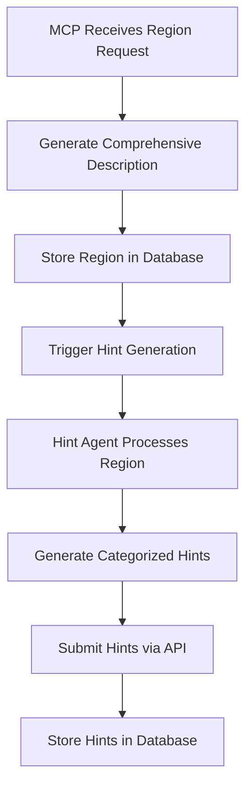

# AI Region Hints Workflow - Updated Architecture Plan

**Date**: August 18, 2025  
**Status**: Updated for Two-Stage AI Workflow  
**Purpose**: Define agent responsibilities and workflow for region description → hints generation

## Overview

This plan outlines a **two-stage AI workflow**:
1. **Region Creation Agent**: Creates regions with comprehensive descriptions via MCP
2. **Hint Generation Agent**: Reads region descriptions and generates categorized hints

This architecture supports both AI-generated and manually-created regions, providing a unified approach to hint generation.

## Stage 1: Region Creation Agent (Your MCP Repository)

### Current MCP Prompt Structure
```python
self.register_prompt(
    "create_region",
    self._create_region_prompt,
    "Generate a detailed wilderness region with rich descriptions and appropriate characteristics",
    [
        {
            "name": "terrain_type",
            "description": "The primary terrain type (forest, mountain, desert, etc.)",
            "required": True
        },
        {
            "name": "environment", 
            "description": "Environmental conditions (temperate, tropical, arctic, etc.)",
            "required": False
        },
        {
            "name": "theme",
            "description": "Optional theme or mood (mysterious, dangerous, peaceful, etc.)",
            "required": False
        },
        {
            "name": "size",
            "description": "Relative size of the area (small, medium, large)",
            "required": False
        }
    ]
)
```

### Enhanced MCP Prompt Structure

```python
self.register_prompt(
    "create_region",
    self._create_region_prompt,
    "Generate a detailed wilderness region with comprehensive descriptions for AI hint generation",
    [
        {
            "name": "terrain_type",
            "description": "The primary terrain type (forest, mountain, desert, wetlands, plains, hills, etc.)",
            "required": True
        },
        {
            "name": "environment",
            "description": "Environmental conditions and climate (temperate, tropical, arctic, arid, humid, etc.)",
            "required": False
        },
        {
            "name": "theme",
            "description": "Thematic mood or character (mysterious, dangerous, peaceful, ancient, wild, magical, etc.)",
            "required": False
        },
        {
            "name": "size",
            "description": "Relative size of the area (small, medium, large, vast)",
            "required": False
        },
        {
            "name": "adjacent_regions",
            "description": "Information about neighboring regions for contextual consistency",
            "required": False
        },
        {
            "name": "special_features",
            "description": "Any special landmarks, ruins, or unique characteristics to include",
            "required": False
        },
        {
            "name": "resource_focus",
            "description": "Primary resources available (timber, minerals, herbs, water, etc.)",
            "required": False
        },
        {
            "name": "danger_level",
            "description": "Relative danger level (safe, moderate, dangerous, extreme)",
            "required": False
        }
    ]
)
```

### Region Creation Agent Responsibilities

#### Primary Outputs
1. **Comprehensive Region Description**: Detailed narrative suitable for hint generation
2. **Structured Environment Data**: Machine-readable environmental parameters
3. **Metadata**: Classification and characteristics for database storage

#### Required Output Format
```json
{
  "name": "The Silverbrook Wetlands",
  "description": "A misty wetland fed by streams flowing from the Lake of Tears toward the coast. Ancient silver-leafed willows grow throughout the marsh, their metallic leaves shimmering in the perpetual mist. The soggy ground is treacherous, with hidden quicksand patches and deep pools that reflect the sky like mirrors. Rare alchemical herbs thrive in the mineral-rich waters, but harvesting them requires careful navigation of the unstable terrain. The wetlands serve as a sanctuary for marsh spirits and water elementals, who guard the sacred groves of silver willows. Travelers often report hearing ethereal singing echoing across the waters, though whether it comes from spirits or the wind through the metal leaves remains a mystery.",
  "terrain_type": "Wetlands",
  "coordinates": {
    "center_x": -45,
    "center_y": 156,
    "bounds": [...]
  },
  "environment": "Misty wetlands with silver-leafed willows, treacherous bog terrain, and supernatural mist. High moisture content creates perpetual fog. Movement is slowed due to marshy ground and hidden quicksand. Rich in alchemical components but dangerous to harvest.",
  "metadata": {
    "theme": "mystical_dangerous",
    "danger_level": "moderate",
    "resource_focus": ["alchemical_herbs", "fresh_water", "willow_wood"],
    "special_features": ["silver_willows", "marsh_spirits", "ethereal_singing"],
    "size": "medium",
    "climate": "temperate_humid"
  }
}
```

#### Enhanced Description Requirements

The `description` field should include:

1. **Geographic Overview** (2-3 sentences)
   - Size, shape, and general layout
   - Primary terrain features
   - Elevation and topography

2. **Vegetation & Flora** (2-3 sentences)
   - Dominant plant life
   - Understory and ground cover
   - Seasonal variations
   - Unique or magical plants

3. **Wildlife & Fauna** (1-2 sentences)
   - Common animals and their behaviors
   - Predators and prey relationships
   - Magical creatures if present

4. **Atmospheric Characteristics** (2-3 sentences)
   - Typical sounds, scents, and visual elements
   - Weather patterns and effects
   - Lighting conditions

5. **Cultural/Mystical Elements** (1-2 sentences)
   - Legends, ruins, or spiritual significance
   - Supernatural phenomena
   - Historical context

6. **Resources & Hazards** (1-2 sentences)
   - Available materials and their accessibility
   - Environmental dangers
   - Movement restrictions

7. **Connections & Context** (1 sentence)
   - How it relates to adjacent regions
   - Primary access points

## Stage 2: Hint Generation Agent (Separate Repository)

### Agent Responsibilities

#### 1. Autonomous Region Discovery
```python
# Pseudo-code for agent workflow
def discover_regions_needing_hints():
    """Find regions that need hint generation"""
    regions = api_client.get_regions_without_hints()
    manual_regions = api_client.get_manual_regions_without_hints()
    return regions + manual_regions

def process_region_queue():
    """Process regions needing hints"""
    for region in discover_regions_needing_hints():
        if region.description:
            hints = generate_hints_for_region(region)
            api_client.submit_region_hints(region.vnum, hints)
        else:
            log_warning(f"Region {region.vnum} lacks description for hint generation")
```

#### 2. Hint Generation Logic
```python
def generate_hints_for_region(region):
    """Generate categorized hints from region description"""
    
    # Parse the comprehensive description
    context = parse_region_description(region.description)
    
    # Generate hints by category
    hints = {}
    
    hints['atmosphere'] = generate_atmospheric_hints(context)
    hints['fauna'] = generate_wildlife_hints(context) 
    hints['flora'] = generate_vegetation_hints(context)
    hints['geography'] = generate_geographic_hints(context)
    hints['sounds'] = generate_audio_hints(context)
    hints['scents'] = generate_olfactory_hints(context)
    hints['weather_influence'] = generate_weather_variants(context)
    hints['seasonal_changes'] = generate_seasonal_variants(context)
    hints['time_of_day'] = generate_temporal_variants(context)
    hints['resources'] = generate_resource_hints(context)
    hints['landmarks'] = generate_landmark_hints(context)
    hints['mystical'] = generate_mystical_hints(context)
    
    return hints
```

#### 3. Hint Categories and Generation Rules

##### **Atmosphere Hints** (3-5 hints per region)
- Extract overall mood and visual character
- Create 2-3 general atmospheric descriptions
- Generate 1-2 weather-specific variants

```python
def generate_atmospheric_hints(context):
    """Generate atmospheric hints from region description"""
    return [
        {
            "text": "Ancient silver-leafed willows tower above the misty marsh, their metallic foliage catching and reflecting what little light penetrates the perpetual fog.",
            "priority": 8,
            "weather_conditions": ["cloudy", "rainy"],
            "seasonal_weight": {"spring": 1.2, "summer": 1.0, "autumn": 1.1, "winter": 0.8}
        },
        {
            "text": "The wetlands stretch endlessly in all directions, a maze of channels and islands where reality seems to blur with the supernatural mist.",
            "priority": 7,
            "weather_conditions": ["clear", "cloudy", "rainy"],
            "time_of_day_weight": {"dawn": 1.3, "dusk": 1.3, "night": 1.1, "day": 0.9}
        }
    ]
```

##### **Flora Hints** (2-4 hints per region)
- Identify plant life from description
- Create seasonal variations
- Include resource implications

```python
def generate_vegetation_hints(context):
    """Generate flora hints focusing on plant life"""
    return [
        {
            "text": "Silver-leafed willows with metallic foliage shimmer throughout the marsh, their unique leaves creating an otherworldly gleam even in the dim light.",
            "priority": 8,
            "resource_triggers": {"vegetation": ">0.6"},
            "seasonal_weight": {"spring": 1.3, "summer": 1.0, "autumn": 1.4, "winter": 0.7}
        },
        {
            "text": "Rare alchemical herbs grow in mineral-rich pools, their vibrant colors standing out against the muted tones of the wetland.",
            "priority": 6,
            "resource_triggers": {"herbs": ">0.4"},
            "weather_conditions": ["clear", "cloudy"]
        }
    ]
```

##### **Fauna Hints** (2-3 hints per region)
- Extract wildlife information
- Include behavioral details
- Add magical creatures if present

##### **Geographic Hints** (2-3 hints per region)
- Describe terrain features
- Include hazards and obstacles
- Reference elevation and topography

##### **Sensory Hints** (2-4 hints per region)
- **Sounds**: Environmental audio elements
- **Scents**: Atmospheric smells and air quality

##### **Temporal Hints** (3-6 hints per region)
- **Weather Variants**: How different weather affects the region
- **Seasonal Changes**: Spring, summer, autumn, winter variations
- **Time of Day**: Dawn, day, dusk, night differences

##### **Resource/Mystical Hints** (1-3 hints per region)
- Available materials and accessibility
- Magical or supernatural elements
- Cultural/historical significance

### API Integration Requirements

#### MCP API Endpoints (Your MCP Repository)
```python
# Endpoint for hint generation agent to query regions
GET /api/regions/without-hints
GET /api/regions/{vnum}/description
POST /api/regions/{vnum}/hints

# Endpoint for storing generated hints
POST /api/region-hints/batch
PUT /api/region-hints/{hint_id}
DELETE /api/region-hints/{hint_id}
```

#### Database API (LuminariMUD Repository)
```python
# Terrain bridge extensions
{
    "command": "get_regions_needing_hints",
    "include_manual": true
}

{
    "command": "submit_region_hints",
    "region_vnum": 1001,
    "hints": [
        {
            "category": "atmosphere",
            "text": "...",
            "priority": 8,
            "weather_conditions": ["clear", "cloudy"],
            "seasonal_weight": {...}
        }
    ]
}
```

## Workflow Implementation

### 1. Initial Setup Phase
1. **Database Schema**: Deploy region description fields and AI hints tables
2. **MCP Enhancement**: Update region creation prompt with comprehensive requirements
3. **API Extensions**: Add hint submission endpoints to terrain bridge
4. **Agent Development**: Create hint generation agent in separate repository

### 2. Region Creation Workflow


### 3. Autonomous Hint Generation
```python
# Hint generation agent main loop
async def main_loop():
    while True:
        # Check for regions needing hints
        regions = await discover_regions_needing_hints()
        
        for region in regions:
            try:
                hints = await generate_hints_for_region(region)
                await submit_hints_to_api(region.vnum, hints)
                await mark_region_processed(region.vnum)
            except Exception as e:
                await log_error(f"Failed to process region {region.vnum}: {e}")
        
        # Wait before next check
        await asyncio.sleep(300)  # 5 minutes
```

## Agent Implementation Guidelines

### Region Creation Agent (MCP Repository)
1. **Enhanced Prompting**: Update prompts to generate comprehensive descriptions
2. **Quality Validation**: Ensure descriptions meet minimum length and content requirements
3. **Metadata Extraction**: Parse generated content to identify key characteristics
4. **Hint Trigger**: Optionally trigger hint generation agent after region creation

### Hint Generation Agent (Separate Repository)
1. **Natural Language Processing**: Parse region descriptions to extract key elements
2. **Categorized Generation**: Create hints for each category with appropriate weighting
3. **Quality Control**: Validate hint quality and appropriateness
4. **Batch Processing**: Efficiently process multiple regions
5. **Error Recovery**: Handle failures gracefully and retry processing

## Testing Strategy

### 1. Unit Testing
- Test individual hint generation functions
- Validate hint categorization accuracy
- Verify API integration points

### 2. Integration Testing  
- Test end-to-end region creation → hint generation workflow
- Validate database consistency
- Test error recovery scenarios

### 3. Quality Assurance
- Human review of generated hints for sample regions
- Consistency checking across similar terrain types
- Performance testing under load

## Success Metrics

### Quantitative Metrics
- **Coverage**: % of regions with complete hint sets
- **Quality Score**: Average hint quality ratings
- **Performance**: Hint generation time per region
- **Usage**: Hint selection frequency in game

### Qualitative Metrics
- **Consistency**: Hints match regional character
- **Variety**: Diverse hint selection prevents repetition
- **Immersion**: Player feedback on description quality

This architecture provides clear separation of concerns while enabling both automated and manual region hint generation, with well-defined agent responsibilities and API contracts.
