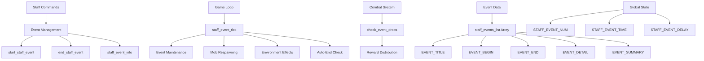
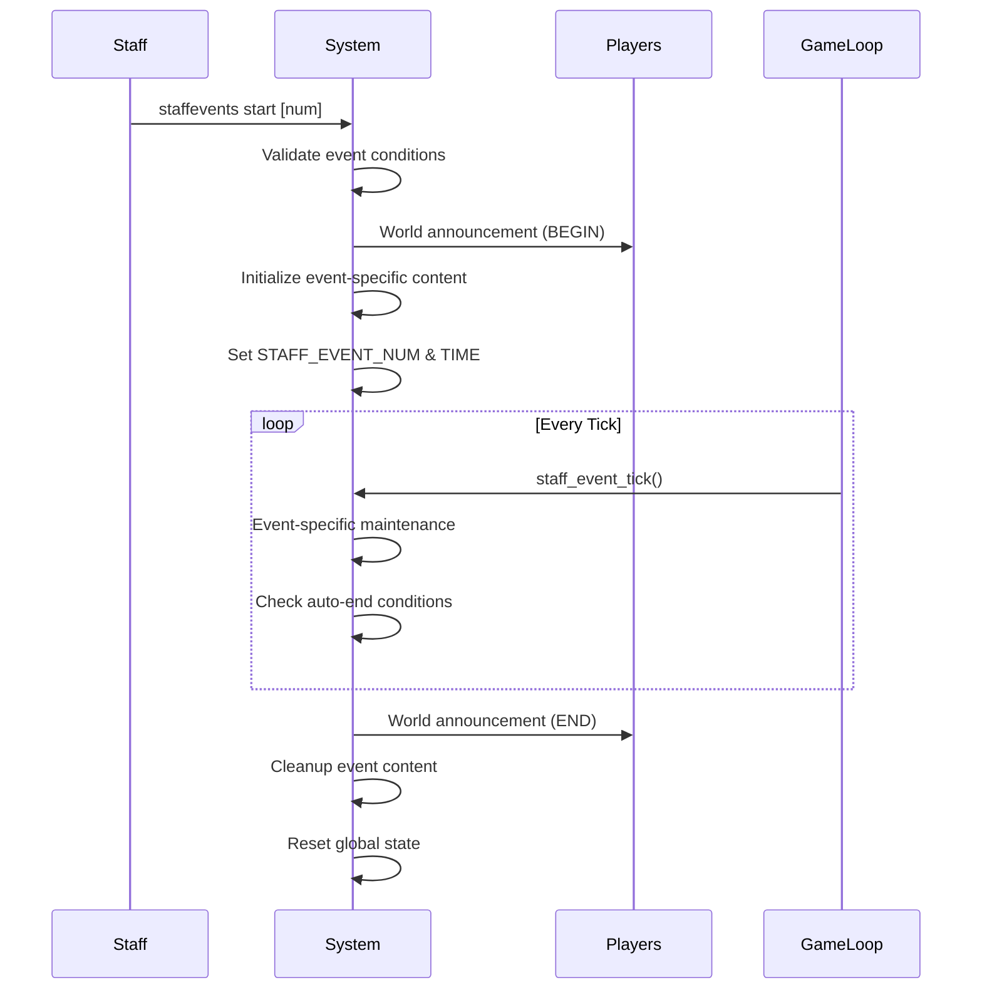

# Staff Event System Documentation

## Table of Contents
1. [System Overview](#system-overview)
2. [Architecture](#architecture)
3. [Event Management](#event-management)
4. [Current Events](#current-events)
5. [Adding New Events](#adding-new-events)
6. [Configuration](#configuration)
7. [Integration Points](#integration-points)
8. [API Reference](#api-reference)
9. [Staff Commands](#staff-commands)
10. [Technical Implementation](#technical-implementation)

---

## System Overview

The **Staff Event System** allows administrators to run special, time-limited events in LuminariMUD. Created by Zusuk in April 2020, this system provides automated event management with start/end mechanics, world announcements, special rewards, and environment modifications.

### Key Features
- **Automated Management**: Events run with minimal staff intervention
- **World Announcements**: Automatic start/end notifications to all players
- **Special Rewards**: Custom drop systems and event-specific prizes
- **Environment Modification**: Dynamic mob loading and object placement
- **Time Management**: Configurable event durations with automatic cleanup
- **Player Integration**: Special combat mechanics during events

### Files
- **Main Implementation**: [`staff_events.c`](../src/staff_events.c)
- **Header Definitions**: [`staff_events.h`](../src/staff_events.h)
- **Documentation**: This file

---

## Architecture



### System Components

1. **Event Data Structure**: Static array containing all event information
2. **Management Functions**: Start, stop, and query event status
3. **Tick System**: Regular maintenance called from game loop
4. **Integration Hooks**: Combat system, wilderness system connections
5. **Command Interface**: Staff command for event control

---

## Event Management

### Event Lifecycle



### Event States

- **UNDEFINED_EVENT (-1)**: No event active
- **Active Event**: `STAFF_EVENT_NUM` contains event ID
- **Cleanup Delay**: `STAFF_EVENT_DELAY` prevents immediate restart

### Global Variables

```c
// Current active event number (-1 if none)
#define STAFF_EVENT_NUM     (game_info.staff_event_num)

// Remaining event time in ticks
#define STAFF_EVENT_TIME    (game_info.staff_event_time)  

// Delay between events for cleanup
#define STAFF_EVENT_DELAY   (game_info.staff_event_delay)

// Check if any event is active
#define IS_STAFF_EVENT      (STAFF_EVENT_NUM >= 0)
```

---

## Current Events

### 1. Jackalope Hunt (`JACKALOPE_HUNT = 0`)

**Overview**: A wilderness hunting event where players track down special jackalopes for rewards.

**Mechanics**:
- **Duration**: ~24 hours (1200 ticks)
- **Location**: Hardbuckler Region wilderness
- **Coordinates**: X(597-703), Y(-63 to 185)
- **Mob Types**: 3 difficulty tiers with level restrictions

**Jackalope Types**:
- **Easy Jackalope** (vnum 11391): Level ≤10 players
- **Medium Jackalope** (vnum 11392): Level ≤20 players  
- **Hard Jackalope** (vnum 11393): All levels

**Rewards**:
- **Jackalope Hide** (vnum 11366): Standard drop from kills
- **Pristine Horn** (vnum 11368): 5% rare drop
- **Hunting Horn** (vnum 11365): Grand prize for winner
- **Great Hunt Ribbon** (vnum 11369): Participation prize

**Special Features**:
- Automatic respawning maintains 300 of each type
- Level-restricted drops prevent farming
- NPC Fullstaff (vnum 11449) provides quest context
- Prize exchange system via Pristine Horn Token (vnum 11363)

### 2. The Prisoner Event (`THE_PRISONER_EVENT = 1`)

**Overview**: High-stakes raid event focusing on The Prisoner boss encounter.

**Mechanics**:
- **Duration**: ~24 hours (1200 ticks)  
- **Location**: Garden of Avernus (via portal)
- **Portal**: Manifests at Mosswood Elder (room 145202)
- **Special Rules**: No XP penalty on death

**Features**:
- **Portal Management**: Auto-creates/removes portal (vnum 132399)
- **Atmospheric Effects**: Random world messages every ~16 ticks
- **Enhanced Rewards**: Maximized treasure drops from The Prisoner
- **Raid Prevention**: Cannot restart if prisoner killed this boot

**Atmospheric Messages** (7 variants):
1. Green haze and power flares
2. Booms and echoes  
3. Outer plane emanations
4. Ground shaking
5. Mental energy blasts
6. Chaotic magic manifestations
7. Gravity shifts

---

## Adding New Events

### Step 1: Define Event Constants

Add to [`staff_events.h`](../src/staff_events.h):

```c
// Add after existing event defines
#define YOUR_NEW_EVENT 2

// Update total count
#define NUM_STAFF_EVENTS 3

// Add event-specific defines
#define YOUR_MOB_VNUM 12345
#define YOUR_OBJECT_VNUM 12346
```

### Step 2: Add Event Data

Add to `staff_events_list` array in [`staff_events.c`](../src/staff_events.c):

```c
{/* YOUR_NEW_EVENT */
 /* title - EVENT_TITLE */
 "\tCYour Event Title\tn",
 
 /* event start message - EVENT_BEGIN */
 "\tWYour event has begun!\tn",
 
 /* event end message - EVENT_END */  
 "\tRYour event has ended!\tn",
 
 /* event info message - EVENT_DETAIL */
 "\tgDetailed description of your event...\tn",
 
 /* event summary/conclusion - EVENT_SUMMARY */
 "\tgThank you for participating...\tn"
},
```

### Step 3: Implement Event Logic

Add cases to relevant functions:

**Start Logic** (`start_staff_event`):
```c
case YOUR_NEW_EVENT:
    // Custom initialization
    // Load mobs, objects, set duration
    break;
```

**Tick Logic** (`staff_event_tick`):
```c
case YOUR_NEW_EVENT:
    // Ongoing maintenance
    // Respawn mobs, environmental effects
    break;
```

**End Logic** (`end_staff_event`):
```c
case YOUR_NEW_EVENT:
    // Cleanup
    // Remove mobs, objects
    break;
```

**Reward Logic** (`check_event_drops`):
```c
case YOUR_NEW_EVENT:
    // Handle special drops
    break;
```

### Step 4: Testing

1. Compile and test basic start/stop functionality
2. Verify tick maintenance works correctly  
3. Test reward system integration
4. Validate cleanup on event end
5. Test edge cases (crashes, reboots during event)

---

## Configuration

### Timing Constants

```c
#define STAFF_EVENT_DELAY_CNST 6    // Minimum delay between events (ticks)
#define SECS_PER_MUD_HOUR 75        // Real seconds per game hour
```

### Jackalope Hunt Settings

```c
#define NUM_JACKALOPE_EACH 300      // Mobs per difficulty tier
#define P_HORN_RARITY 5             // Pristine horn drop rate (%)

// Spawn boundaries
#define JACKALOPE_NORTH_Y 185
#define JACKALOPE_SOUTH_Y -63  
#define JACKALOPE_WEST_X 597
#define JACKALOPE_EAST_X 703
```

### Event Duration

Default duration is 1200 ticks (~24 hours). Override in `start_staff_event()`:

```c
STAFF_EVENT_TIME = 480; // ~4.8 hours
```

---

## Integration Points

### Game Loop Integration

Called from [`limits.c`](../src/limits.c) `point_update()`:

```c
// Regular maintenance - every tick
staff_event_tick();
```

### Combat System Integration  

Called from [`fight.c`](../src/fight.c) when mobs die:

```c
// Handle event-specific drops
check_event_drops(killer, victim);

// Special prisoner event handling
if (IS_STAFF_EVENT && STAFF_EVENT_NUM == THE_PRISONER_EVENT)
    end_staff_event(STAFF_EVENT_NUM);
```

### Wilderness System Integration

Events can spawn mobs in wilderness coordinates:

```c
void wild_mobile_loader(int mobile_vnum, int x_coord, int y_coord);
```

### Database Integration

Events can integrate with player file variables:

```c
#define STAFFRAN_PVAR_JACKALOPE 0  // Player file variable index
```

---

## API Reference

### Core Functions

#### `int start_staff_event(int event_num)`
**Purpose**: Initialize and start a staff event  
**Parameters**: `event_num` - Event index (0-based)  
**Returns**: `NUM_STAFF_EVENTS` on success, `event_num` on failure  
**Side Effects**: Sets global state, announces to world, initializes event content

#### `void end_staff_event(int event_num)`  
**Purpose**: End an active staff event and cleanup  
**Parameters**: `event_num` - Event index to end  
**Side Effects**: Cleans up content, announces to world, resets global state

#### `void staff_event_info(struct char_data *ch, int event_num)`
**Purpose**: Display detailed information about an event  
**Parameters**: `ch` - Character to send info to, `event_num` - Event index  
**Access**: Players see basic info, staff see additional details

#### `void list_staff_events(struct char_data *ch)`
**Purpose**: List all available events with indices  
**Parameters**: `ch` - Character to send list to

#### `void staff_event_tick()`
**Purpose**: Regular maintenance function called each game tick  
**Side Effects**: Handles respawning, environment effects, auto-end conditions

### Utility Functions

#### `void check_event_drops(struct char_data *killer, struct char_data *victim)`
**Purpose**: Handle special drops when event mobs are killed  
**Integration**: Called from combat system

#### `void wild_mobile_loader(int mobile_vnum, int x_coord, int y_coord)`
**Purpose**: Load a mobile at wilderness coordinates  
**Parameters**: Mobile vnum and target coordinates

#### `int mob_ingame_count(int mobile_vnum)`
**Purpose**: Count instances of a mobile in the game  
**Returns**: Number of mobs found

#### `void mob_ingame_purge(int mobile_vnum)`
**Purpose**: Remove all instances of a mobile from the game  
**Use**: Event cleanup

---

## Staff Commands

### `staffevents` Command

**Syntax**: `staffevents [action] [event_number]`

**Player Access** (No arguments):
- Shows info about currently active event
- Message if no event active

**Staff Access**:

#### List Events
```
staffevents
```
Shows all available events with indices.

#### Start Event  
```
staffevents start 0
```
Starts Jackalope Hunt event. Validates:
- No event currently active
- No cleanup delay active  
- Event-specific conditions

#### End Event
```
staffevents end 0  
```
Immediately ends the specified event.

#### Event Information
```
staffevents info 1
```
Shows detailed information about The Prisoner event.

### Command Validation

- **Permission**: `LVL_STAFF` required for management
- **Event Numbers**: Must be 0 ≤ event_num < `NUM_STAFF_EVENTS`
- **State Checking**: Prevents starting during active events or cleanup delays
- **Event Conditions**: Some events have specific start requirements

---

## Technical Implementation

### Data Structures

#### Event Data Array
```c
const char *staff_events_list[NUM_STAFF_EVENTS][STAFF_EVENT_FIELDS] = {
    {/* Event data */}
};
```

**Fields**:
- `EVENT_TITLE`: Display name
- `EVENT_BEGIN`: Start announcement  
- `EVENT_END`: End announcement
- `EVENT_DETAIL`: Detailed description
- `EVENT_SUMMARY`: Conclusion message

#### Global State Variables
Stored in `game_info` structure:
- `staff_event_num`: Current event (-1 if none)
- `staff_event_time`: Remaining ticks  
- `staff_event_delay`: Cleanup delay counter

### Memory Management

**Static Data**: Event definitions are compile-time constants  
**Dynamic Objects**: Mobs and objects created via standard MUD functions  
**Cleanup**: Automatic extraction on event end

### Performance Considerations

**Tick Function**: Called every game pulse (~0.1 seconds)
- Lightweight operations only
- Conditional execution based on event type
- Random chance gates for expensive operations

**Mob Management**: 
- Efficient counting via character list traversal
- Batch operations for spawning
- Cleanup purges all instances

### Error Handling

**Validation**:
- Array bounds checking on event numbers
- NULL pointer checks for characters and objects
- Room validation for wilderness loading

**Graceful Degradation**:
- Missing objects logged but don't crash
- Invalid coordinates fall back to available rooms
- Event continues if individual operations fail

### Thread Safety

**Single-Threaded**: LuminariMUD uses single-threaded architecture
- No concurrency concerns
- Simple state management
- Predictable execution order

---

## Security Considerations

### Permission Checks
- Staff-level access required for event management
- Player commands limited to information display
- Input validation on all parameters

### Resource Management  
- Mob count limits prevent spawn flooding
- Event duration limits prevent permanent events
- Cleanup delay prevents rapid restart abuse

### Data Integrity
- Bounds checking on all array access
- Validation of vnums before object creation
- Safe cleanup that handles missing objects

---

## Troubleshooting

### Common Issues

**Event Won't Start**:
1. Check if another event is active: `staffevents`
2. Verify cleanup delay: Look for "delay of X ticks" message  
3. Event-specific conditions (e.g., prisoner already killed)

**Mobs Not Spawning**:
1. Check wilderness system functionality
2. Verify mob vnums exist in database
3. Check coordinate boundaries are valid

**Drops Not Working**:
1. Verify `check_event_drops()` is called from combat
2. Check object vnums exist
3. Validate level restrictions for jackalope drops

**Event Won't End**:
1. Manually end with `staffevents end [num]`
2. Check for infinite loops in tick function
3. Verify STAFF_EVENT_TIME is decrementing

### Debug Information

**Current State**:
```
staffevents info [num]
```

**Log Messages**:
- Object creation failures logged to SYSERR
- Check mudlog for error messages

**Code Inspection**:
- Review tick function for event-specific logic
- Verify array bounds and null checks
- Check integration points in combat/limits

---

## Future Enhancements

### Potential Improvements

1. **Dynamic Event System**: Load events from files instead of hardcoded arrays
2. **Scheduling System**: Automatic event scheduling based on calendar
3. **Player Tracking**: Individual participation metrics and rewards  
4. **Event Chains**: Sequential events with dependencies
5. **Configuration Files**: Runtime-configurable parameters
6. **Event Templates**: Easier creation of similar event types
7. **Statistics**: Historical data collection and reporting

### Architectural Considerations

- **Database Integration**: Store event history and player participation
- **Scripting Support**: DG Script integration for complex behaviors  
- **Web Interface**: External event management via web portal
- **API Extensions**: Support for external event triggers
- **Modular Design**: Plugin-style event loading system

---

*This documentation covers LuminariMUD Staff Event System v1.0 as of 2025. For updates or questions, consult the development team.*